# 1장. 관측성이란 무엇인가

## 학습 목표

- 모니터링과 관측성의 본질적 차이를 이해한다
- 장애 탐지와 장애 분석이 왜 다른 역량인지 설명할 수 있다
- 현대 분산 시스템에서 관측성이 필수인 이유를 안다
- Telemetry 데이터의 세 가지 축(Metrics, Logs, Traces)을 구분한다
- Observability 성숙도 모델을 통해 현재 조직의 수준을 평가할 수 있다

---

## 1.1 모니터링과 관측성의 차이

### 모니터링 (Monitoring)

**"알려진 문제를 감시하는 것"**

모니터링은 사전에 정의한 조건에 대해 시스템 상태를 확인하는 행위다. CPU 사용률이 90%를 넘으면 알림을 보내고, 디스크 사용량이 80%를 초과하면 경고하는 식이다.

모니터링의 핵심은 **"미리 알고 있는 문제"**에 대한 감시다. 운영팀이 "이 수치가 이 범위를 벗어나면 문제다"라고 사전에 정의해 둔 규칙에 기반한다. 따라서 모니터링은 예측 가능한 장애에는 매우 효과적이지만, 예상하지 못한 유형의 장애가 발생하면 속수무책이 된다.

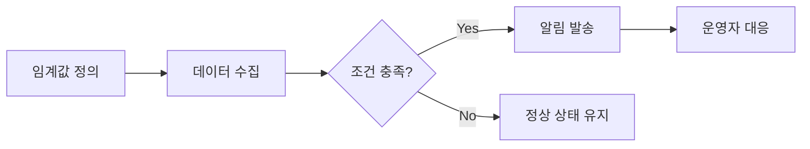

모니터링의 핵심 특성:

- **사전 정의**: 무엇을 볼지 미리 결정해야 한다
- **대시보드 중심**: 미리 만들어둔 화면으로 상태를 확인한다
- **임계값 기반**: 특정 수치를 넘으면 반응한다
- **known-known에 강하다**: 예상한 장애에는 잘 대응한다

#### 모니터링의 한계: Rumsfeldian Matrix

모니터링의 한계를 이해하려면 Donald Rumsfeld의 유명한 분류법을 빌려올 수 있다:

| 분류 | 설명 | 모니터링 대응 |
|------|------|--------------|
| **Known-Known** | 알고 있고, 감시하고 있는 것 | 대시보드 + 알림으로 대응 가능 |
| **Known-Unknown** | 존재는 알지만 값을 모르는 것 | 메트릭 수집으로 파악 가능 |
| **Unknown-Known** | 인지하지 못하지만 데이터에 있는 것 | 데이터는 있으나 보지 않고 있음 |
| **Unknown-Unknown** | 존재조차 모르는 것 | **대응 불가** |

모니터링은 Known-Known과 Known-Unknown까지만 커버한다. 현대 분산 시스템에서 가장 치명적인 장애는 Unknown-Unknown 영역에서 발생한다.

### 관측성 (Observability)

**"시스템의 외부 출력을 통해 내부 상태를 이해하는 능력"**

관측성은 제어 이론(Control Theory)에서 온 개념이다. 1960년대 헝가리 수학자 Rudolf Kálmán이 정의한 원래 의미는 "시스템의 외부 출력만으로 내부 상태를 완전히 추론할 수 있는가"이다. 예를 들어, 자동차 계기판(외부 출력)만 보고 엔진 내부에서 무슨 일이 일어나고 있는지(내부 상태) 완전히 파악할 수 있다면, 그 시스템은 관측성이 높다고 말한다.

소프트웨어 엔지니어링에서의 관측성은 **예상하지 못한 질문에도 답할 수 있는 능력**이다. 핵심 차이는 여기에 있다. 모니터링이 "미리 정한 질문에 답하는 것"이라면, 관측성은 "아직 모르는 질문을 던지고 답을 찾아가는 것"이다.

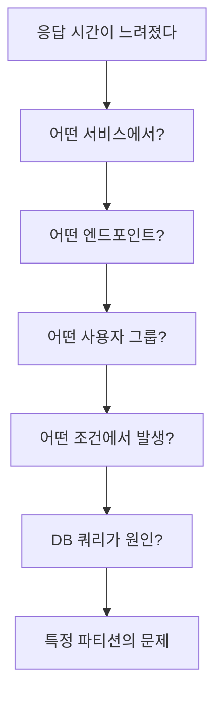

관측성이 높은 시스템에서는 위와 같이 **drill-down** 방식으로 문제의 근본 원인까지 도달할 수 있다. 이 과정에서 묻는 질문들은 사전에 정의된 것이 아니라, 앞선 답변을 보고 즉석에서 만들어진다.

관측성의 핵심 특성:

- **탐색적**: 데이터를 자유롭게 탐색하며 원인을 추적한다
- **고차원 데이터**: 다양한 차원(dimension)의 데이터를 조합한다
- **상관관계 분석**: 여러 신호를 연결하여 인과관계를 파악한다
- **unknown-unknown에 강하다**: 처음 보는 장애도 분석 가능하다

### 비교 정리

| 구분 | 모니터링 | 관측성 |
|------|---------|--------|
| 질문 방식 | 미리 정의한 질문 | 즉석에서 새로운 질문 |
| 대응 범위 | known-known, known-unknown | unknown-unknown 포함 |
| 접근 방식 | 대시보드 확인 | 데이터 탐색 및 추적 |
| 데이터 활용 | 집계된 메트릭 위주 | 고차원 원시 데이터 |
| 비유 | 건강검진 (정기 항목 체크) | 의사의 진단 능력 (증상으로 원인 추론) |
| 시스템 요구 | 메트릭 수집 + 알림 | Metrics + Logs + Traces + Correlation |


**핵심**: 모니터링은 관측성의 부분집합이다. 관측성이 높은 시스템은 모니터링도 잘 되지만, 모니터링만으로는 관측성이 확보되지 않는다.


---

## 1.2 장애 탐지와 장애 분석

### 장애 탐지 (Detection)

장애가 발생했음을 **인지**하는 단계다. "무언가 잘못되고 있다"는 사실을 알아채는 것이 목적이며, 원인을 파악하는 것은 이 단계의 범위가 아니다.

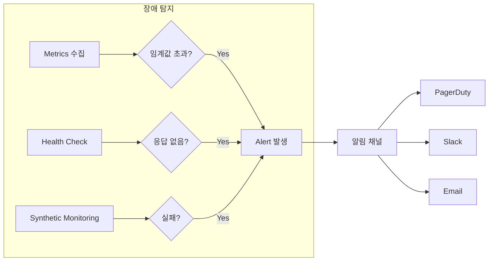

장애 탐지의 대표적인 방법들:

| 방법 | 동작 방식 | 예시 |
|------|----------|------|
| **임계값 알림** | 메트릭이 정해진 범위를 벗어나면 발생 | 5xx 에러율 > 5% |
| **Health Check** | 주기적으로 서비스 생존 여부 확인 | `/health` 엔드포인트 호출 |
| **Synthetic Monitoring** | 외부에서 실제 사용자처럼 요청 | 매 30초마다 주문 API 호출 |
| **Anomaly Detection** | 통계적 이상 패턴 감지 | 평소 대비 트래픽 3 표준편차 이탈 |

장애 탐지에서 가장 중요한 것은 **MTTD(Mean Time To Detect)**다. 장애가 발생한 시점부터 인지하기까지 걸리는 시간이다. MTTD가 짧을수록 빠른 대응이 가능하다.

### 장애 분석 (Analysis / Diagnosis)

장애의 **근본 원인(Root Cause)**을 찾는 단계다. 탐지가 "불이 났다!"라면, 분석은 "어디서, 왜 불이 났는지"를 밝혀내는 소방관의 조사에 해당한다.

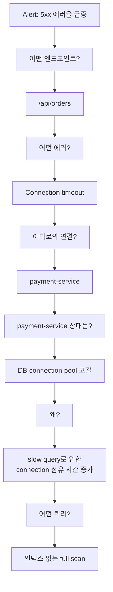

장애 분석에 필요한 것:

- **Logs**: 에러 메시지, 스택 트레이스, 상세 맥락
- **Traces**: 요청의 전체 경로와 각 구간의 소요 시간
- **High-cardinality 데이터**: 특정 사용자, 특정 요청까지 drill-down

### MTTD와 MTTR

장애 대응의 전체 타임라인을 이해하면, 탐지와 분석이 왜 구분되는 역량인지 명확해진다.

```mermaid
gantt
    title 장애 대응 타임라인
    dateFormat X
    axisFormat %s

    section MTTD
    탐지까지 소요 시간    :active, 0, 5
    section MTTA
    담당자 확인까지       :active, 5, 8
    section MTTR
    분석 및 복구         :active, 8, 20
```

| 지표 | 의미 | 개선 방법 |
|------|------|----------|
| **MTTD** (Mean Time To Detect) | 장애 발생 → 인지 | 알림 규칙 정교화, Synthetic Monitoring |
| **MTTA** (Mean Time To Acknowledge) | 인지 → 담당자 확인 | On-call 프로세스, Escalation 정책 |
| **MTTR** (Mean Time To Resolve) | 인지 → 복구 완료 | **관측성 향상**, Runbook 정비 |


MTTR에서 가장 많은 시간을 차지하는 것이 "원인 분석" 구간이다. 모니터링은 MTTD를 줄이고, 관측성은 MTTR 전체를 줄인다. 이것이 관측성의 핵심 가치다.


---

## 1.3 현대 시스템의 복잡성

### Monolith에서 Microservices로




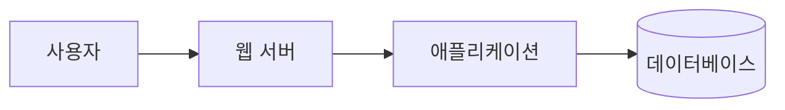

- 구성 요소가 적다
- 장애 지점이 명확하다
- 로그 하나만 봐도 흐름을 파악할 수 있다
- 한 서버에서 모든 것이 실행되므로 `grep`만으로 디버깅이 가능하다




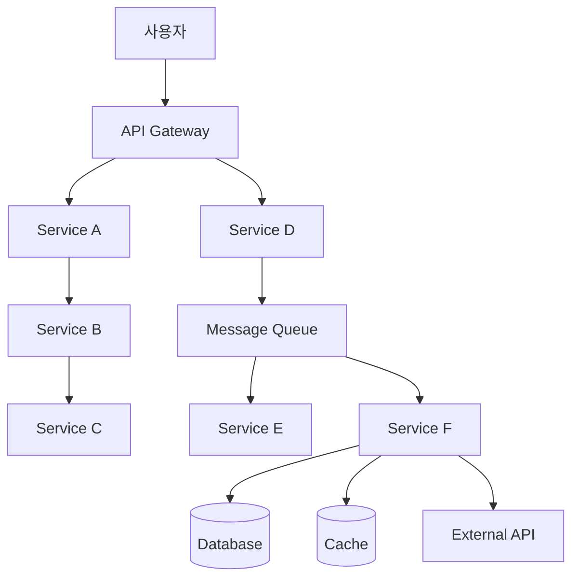

- 하나의 요청이 수십 개 서비스를 거친다
- 네트워크 호출이 폭발적으로 증가한다
- 장애 원인이 전혀 다른 서비스에 있을 수 있다
- 간헐적 장애(intermittent failure)가 빈번하다




### 왜 모니터링만으로는 부족한가

Monolith에서는 서버 3대의 CPU, 메모리, 디스크만 감시하면 대부분의 문제를 감지할 수 있었다. 하지만 50개의 Microservice가 각각 3개의 Pod로 실행되고 있다면? 150개의 인스턴스에서 발생하는 문제를 개별 대시보드로 추적하는 것은 불가능에 가깝다.

더 어려운 것은 **서비스 간 상호작용에서 발생하는 문제**다. Service A 자체는 정상이고, Service B 자체도 정상인데, A에서 B로의 특정 요청 패턴에서만 문제가 발생하는 경우가 있다. 이런 **창발적 장애(emergent failure)**는 개별 서비스 모니터링으로는 절대 발견할 수 없다.

### 복잡성을 만드는 요소들

| 요소 | 설명 | 왜 모니터링이 부족한가 | 필요한 관측성 |
|------|------|---------------------|-------------|
| **Microservices** | 서비스 간 네트워크 호출 증가 | 개별 서비스는 정상이나 상호작용에서 장애 발생 | Distributed Tracing |
| **Containers / K8s** | 인스턴스가 동적으로 생성/소멸 | IP가 바뀌고, Pod가 사라지면 로그도 사라짐 | 중앙 집중식 로그 수집 |
| **Polyglot** | 서비스마다 다른 언어/프레임워크 | 로그 포맷, 메트릭 체계가 제각각 | OpenTelemetry 표준화 |
| **Event-Driven** | 비동기 메시지 기반 통신 | 요청-응답 추적이 끊김 | Context Propagation |
| **Multi-Cloud** | 여러 클라우드/리전에 분산 | 관측 데이터가 분산되어 통합 뷰 불가 | 통합 관측 플랫폼 |

### 실제 장애 시나리오로 보는 차이

**시나리오**: 주문 완료 페이지 로딩이 간헐적으로 10초 이상 걸린다는 CS 접수




- 대시보드를 확인하니 모든 서비스의 CPU, 메모리 정상
- 에러율도 정상 범위
- 평균 응답 시간도 정상
- 결론: **"재현이 안 됩니다" → CS 종료**




1. p99 응답 시간 메트릭에서 특정 시간대에 spike 확인 **(Metrics)**
2. 해당 시간대의 느린 요청들의 Trace를 조회 **(Traces)**
3. payment-service → external-pg 구간에서 95% 시간 소요 확인 **(Traces)**
4. 해당 구간의 로그에서 `connection pool exhausted, waiting for available connection` 발견 **(Logs)**
5. connection pool 사이즈(10)가 동시 요청량(peak 50)에 비해 부족한 것이 원인
6. 결론: **connection pool 사이즈 조정으로 30분 만에 해결**





같은 장애인데 관측성 유무에 따라 "재현 불가"와 "30분 만에 근본 원인 파악"이라는 극적인 차이가 발생한다.


---

## 1.4 Telemetry 데이터

Telemetry란 시스템에서 자동으로 수집되어 원격으로 전송되는 측정 데이터를 말한다. 어원은 그리스어 tele(원격) + metron(측정)이다. 관측성을 구현하기 위한 세 가지 핵심 데이터 유형이 있으며, 이를 **Three Pillars of Observability**라고 부른다.

### Metrics (메트릭)

**"수치로 표현되는 시계열 데이터"**

```
http_requests_total{method="GET", status="200", path="/api/users"} 15234
http_request_duration_seconds{quantile="0.99"} 0.85
node_memory_MemAvailable_bytes 8589934592
```

Metrics는 특정 시점의 시스템 상태를 숫자로 표현한다. 시간이 지남에 따라 이 숫자들이 어떻게 변하는지를 추적하는 것이 시계열(time-series) 데이터다.

특징:

- **저비용 저장**: 타임스탬프 + 숫자 조합이라 저장 공간이 매우 적다
- **빠른 집계**: 수학적 연산(합계, 평균, 백분위)이 가능하다
- **알림에 적합**: 숫자 기반이므로 임계값 비교가 용이하다
- **추세 파악**: 시간에 따른 변화 트렌드를 시각화할 수 있다
- **"무엇이 얼마나"** 에 답한다

약점:

- **맥락 부족**: "에러율이 5%다"는 알 수 있지만, "왜 5%인가"는 알 수 없다
- **집계로 인한 정보 손실**: 평균값 뒤에 숨은 개별 이상치를 놓칠 수 있다

대표 도구: **Prometheus**, VictoriaMetrics, Datadog, CloudWatch

### Logs (로그)

**"특정 시점에 발생한 이벤트의 구조화된 기록"**

```json
{
  "timestamp": "2026-06-12T10:23:45.123Z",
  "level": "ERROR",
  "service": "payment-service",
  "instance": "payment-7d4b8c6f9-x2k4m",
  "trace_id": "abc123def456",
  "span_id": "span789",
  "message": "Failed to process payment",
  "error": "Connection refused: db-primary:5432",
  "user_id": "user-789",
  "order_id": "order-456",
  "amount": 45000,
  "retry_count": 3
}
```

Logs는 시스템에서 발생한 개별 이벤트를 텍스트로 기록한다. 가장 오래된 관측 수단이면서도 여전히 디버깅에서 가장 많이 사용된다.

특징:

- **풍부한 맥락**: 에러 메시지, 스택 트레이스, 관련 데이터를 모두 담을 수 있다
- **이벤트 단위**: 하나의 로그가 하나의 사건을 설명한다
- **감사(Audit) 용도**: 누가, 언제, 무엇을 했는지 추적 가능
- **"무슨 일이 왜 일어났는가"** 에 답한다

약점:

- **저장 비용**: 텍스트 전체를 저장하므로 비용이 높다 (Metrics 대비 10~100배)
- **검색 비용**: 대량의 로그에서 원하는 정보를 찾는 것이 느리다
- **구조화 필요**: 비구조화 로그(`printf` 스타일)는 분석이 어렵다

대표 도구: **Loki**, Elasticsearch, Fluentd, Fluentbit

### Traces (트레이스)

**"하나의 요청이 시스템을 통과하는 전체 경로"**

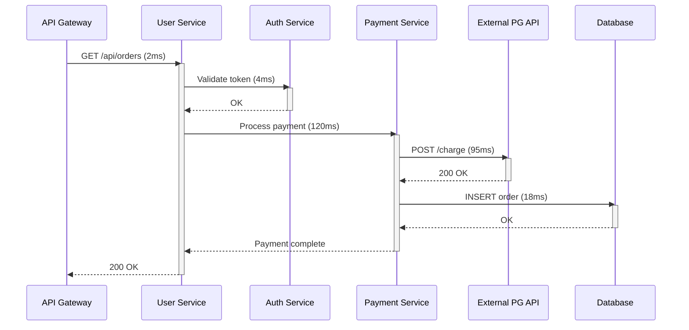

하나의 Trace는 여러 개의 **Span**으로 구성된다. 각 Span은 하나의 작업 단위(함수 호출, HTTP 요청, DB 쿼리 등)를 나타내며, 부모-자식 관계로 연결되어 전체 호출 트리를 구성한다.

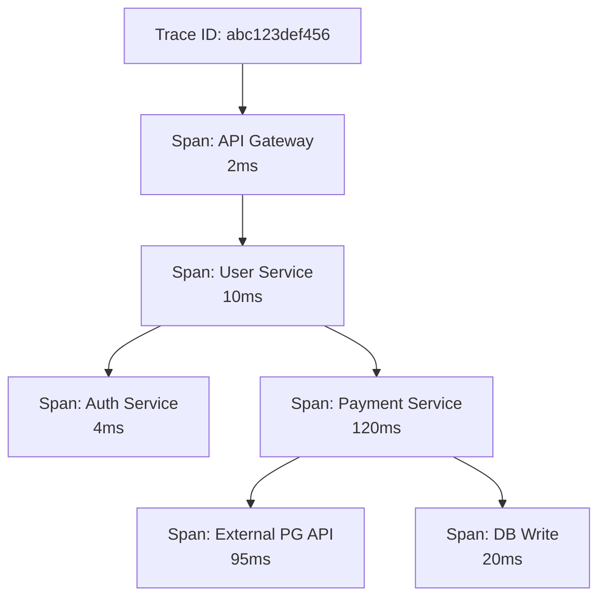

특징:

- **요청 여정 시각화**: 하나의 요청이 어떤 서비스를 어떤 순서로 거치는지 보여준다
- **병목 식별**: 전체 시간 중 어디서 가장 오래 걸리는지 한눈에 파악
- **서비스 의존관계**: 어떤 서비스가 어떤 서비스에 의존하는지 드러남
- **"어디서 얼마나 걸렸는가"** 에 답한다

약점:

- **저장 비용**: 모든 요청을 저장하면 비용이 폭발하므로 Sampling이 필요
- **계측 비용**: 모든 서비스에 Tracing 코드를 넣어야 한다
- **비동기 추적의 어려움**: Message Queue를 거치는 경우 Context 전파가 까다롭다

대표 도구: **Tempo**, Jaeger, Zipkin

### 세 축의 관계

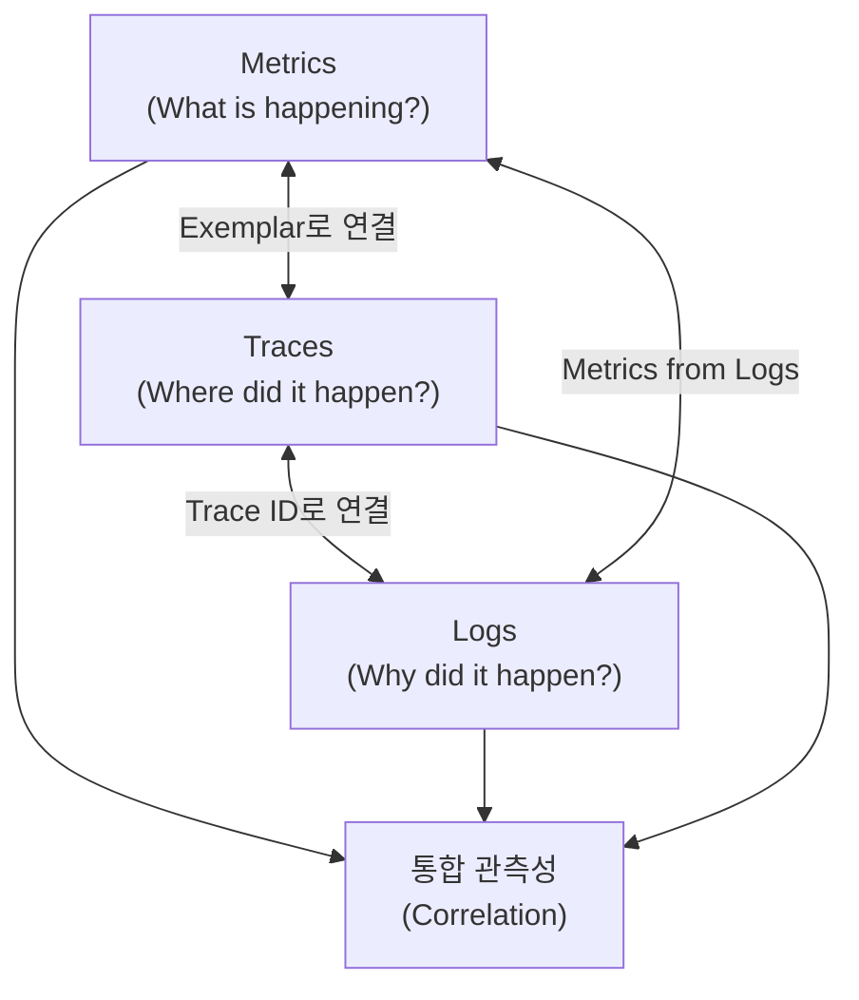

각 데이터 유형은 단독으로도 가치가 있지만, 서로 연결될 때 시너지가 극대화된다:

| 질문 | 데이터 | 사용 예시 |
|------|--------|----------|
| 에러율이 올라갔나? | **Metrics** | Grafana 대시보드에서 에러율 그래프 확인 |
| 어떤 에러가 발생했나? | **Logs** | Loki에서 에러 로그 검색 |
| 어떤 서비스에서 느려졌나? | **Traces** | Tempo에서 느린 Trace 조회 |
| 에러가 발생한 요청의 전체 경로는? | **Traces** + **Logs** | Trace ID로 로그와 Trace를 함께 조회 |
| 느린 요청이 전체 성능에 미치는 영향은? | **Metrics** + **Traces** | Exemplar로 메트릭에서 Trace로 이동 |
| 특정 에러가 어떤 조건에서 발생하는가? | **Logs** + **Metrics** | 로그에서 패턴 추출 → 메트릭화 |


세 가지 데이터를 **Correlation**(상관관계)으로 연결할 때 진정한 관측성이 완성된다. 이를 위해 **Trace ID**를 Metrics, Logs, Traces 전체에 공유하는 것이 핵심이다. 이 내용은 [Part 15. Correlation](../part15/72.Correlation-설계.md)에서 깊이 다룬다.


### Three Pillars를 넘어서

최근에는 Three Pillars 외에도 관측성 데이터로 포함시키는 것들이 있다:

- **Events**: 배포, 설정 변경 등 시스템에 가해진 변경 사항
- **Profiles**: CPU/메모리 사용 패턴을 코드 레벨에서 분석 (Continuous Profiling)
- **Real User Monitoring (RUM)**: 실제 사용자의 브라우저에서 수집되는 성능 데이터

이들은 Three Pillars를 보완하며, 더 완전한 관측성을 제공한다.

---

## 1.5 Observability 성숙도 모델

조직의 관측성 수준을 5단계로 평가할 수 있다. 각 단계는 이전 단계를 포함하며, 점진적으로 발전해 나간다.

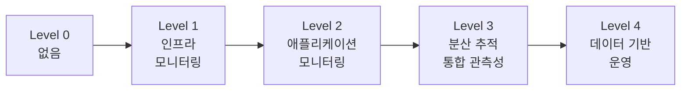

### Level 0: 없음 (No Observability)

- 모니터링 시스템 부재
- 서버에 직접 SSH 접속해서 `tail -f` 로 로그 확인
- 장애는 고객이 먼저 발견한다
- 장애 복구 시간(MTTR)이 수 시간 ~ 수일
- "지금 서비스가 정상인지" 확인할 방법이 없다


**이 단계의 위험**: 장애를 인지하는 시점이 이미 비즈니스 피해가 발생한 후다. 복구에 필요한 정보도 없어 "일단 재시작"이 유일한 대응이 된다.


### Level 1: 인프라 모니터링 (Reactive Monitoring)

- **도구**: CloudWatch, Zabbix, Nagios
- CPU, 메모리, 디스크, 네트워크 등 인프라 메트릭 수집
- 인프라 수준의 임계값 알림
- 서버 단위의 대시보드


**한계**: "서버는 살아있는데 서비스는 느리다"를 설명하지 못한다. 애플리케이션 레벨의 문제(느린 쿼리, 메모리 누수, 잘못된 비즈니스 로직)는 인프라 메트릭에 즉시 반영되지 않는다.


### Level 2: 애플리케이션 모니터링 (Proactive Monitoring)

- **도구**: Prometheus + Grafana, ELK Stack
- 서비스별 에러율, 응답 시간, 처리량(throughput) 추적
- 구조화된 로그 수집 및 중앙화
- 알림 규칙이 정교해짐 (Golden Signals 기반)
- 단일 서비스 내부 문제는 빠르게 파악 가능


**한계**: 서비스 간 경계를 넘는 문제를 추적하기 어렵다. "Service A의 에러가 Service B의 타임아웃 때문인데, Service B는 Service C의 느린 응답 때문이다"와 같은 연쇄 관계를 파악하려면 각 서비스의 로그를 수동으로 대조해야 한다.


### Level 3: 분산 추적 (Distributed Observability)

- **도구**: OpenTelemetry + Prometheus + Loki + Tempo + Grafana
- Metrics + Logs + Traces 통합
- Trace ID로 세 축의 데이터를 연결
- 서비스 간 요청 흐름을 end-to-end로 추적 가능
- 장애의 근본 원인을 빠르게 식별
- SLI/SLO 기반 운영 시작

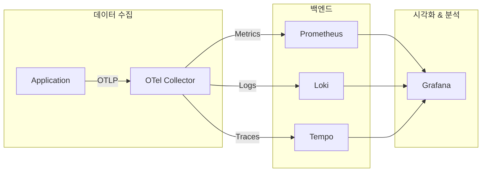


**이 단계가 관측성의 실질적 시작점**이다. 대부분의 조직이 여기를 목표로 삼는다.


### Level 4: 데이터 기반 운영 (Data-Driven Operations)

- **도구**: 위 도구 + 자동화 + AIOps
- Error Budget 기반 배포 결정: "Error Budget이 남아있으면 위험한 배포도 진행"
- 이상 탐지(Anomaly Detection) 자동화
- Capacity Planning에 관측 데이터 활용
- Postmortem 문화 정착: 모든 장애를 데이터 기반으로 회고
- 관측성 데이터가 비즈니스 의사결정에 활용됨
- Self-healing: 특정 조건에서 자동 복구 (auto-scaling, circuit breaker)


**이 단계의 특징**: 관측성이 "장애 대응 도구"를 넘어 "비즈니스 운영 도구"가 된다. 관측 데이터를 기반으로 "이 기능을 출시해도 되는가?", "서버를 줄여도 되는가?"와 같은 의사결정을 내린다.


### 성숙도 자가 진단

다음 질문에 답해보자. "예"가 많을수록 성숙도가 높다:

**Level 1 (인프라)**
1. 서버의 CPU, 메모리, 디스크 상태를 실시간으로 확인할 수 있는가?
2. 인프라 이상 시 자동으로 알림이 오는가?

**Level 2 (애플리케이션)**
3. 각 서비스의 에러율, 응답 시간, 처리량을 추적하고 있는가?
4. 구조화된 로그를 중앙에서 검색할 수 있는가?

**Level 3 (분산 추적)**
5. 하나의 요청이 거치는 모든 서비스의 경로를 볼 수 있는가?
6. Metrics에서 이상을 발견했을 때 관련 Logs와 Traces로 바로 이동할 수 있는가?
7. SLO가 정의되어 있고, Error Budget을 추적하고 있는가?

**Level 4 (데이터 기반)**
8. Error Budget 소진율에 따라 배포 속도를 조절하고 있는가?
9. 장애 Postmortem에서 관측 데이터를 근거로 개선안을 도출하는가?
10. Capacity Planning에 관측 데이터를 활용하는가?

---

## 핵심 정리

1. **모니터링은 관측성의 부분집합**이다. 모니터링은 known-known을, 관측성은 unknown-unknown까지 다룬다.

2. **장애 탐지와 장애 분석은 다른 역량**이다. 탐지는 알림(MTTD)으로, 분석은 데이터 탐색(MTTR)으로 이루어진다.

3. **현대 분산 시스템**은 Microservices, Container, Event-Driven 등의 복잡성으로 인해 모니터링만으로는 부족하다.

4. **Telemetry의 세 축**: Metrics(무엇이 얼마나), Logs(무슨 일이 왜), Traces(어디서 얼마나 걸렸나).

5. 세 축을 **Correlation으로 연결**할 때 진정한 관측성이 완성된다. Trace ID가 이를 가능하게 하는 핵심 메커니즘이다.

6. **성숙도 모델**로 현재 수준을 진단하고, Level 3(분산 추적 통합)을 1차 목표로 단계적으로 개선해 나간다.

---

## 다음 장 예고

[2장](2.SRE와-관측성.md)에서는 **SRE와 관측성**을 다룬다. SLI, SLO, SLA, Error Budget 등 SRE의 핵심 개념과 Golden Signals, RED Method, USE Method를 학습한다. 관측성이 "무엇을 볼 수 있는가"라면, SRE는 "무엇을 봐야 하는가"에 답한다.
