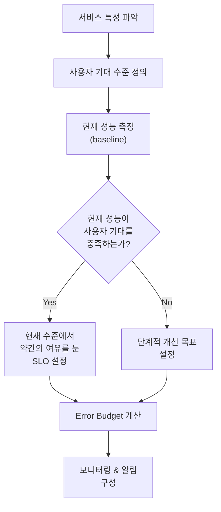
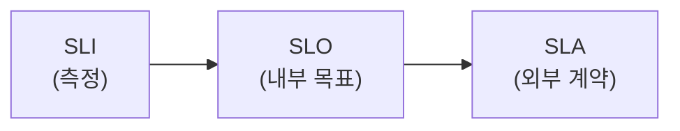
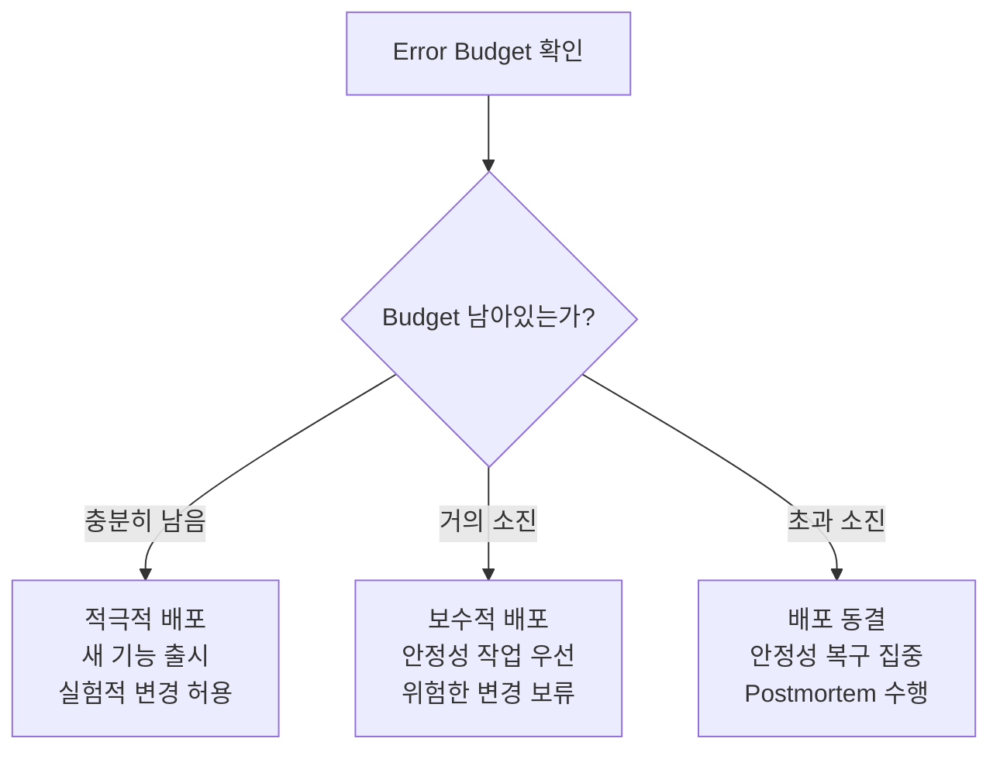
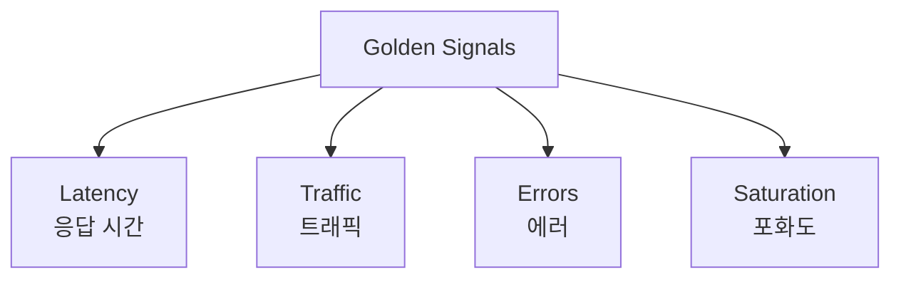
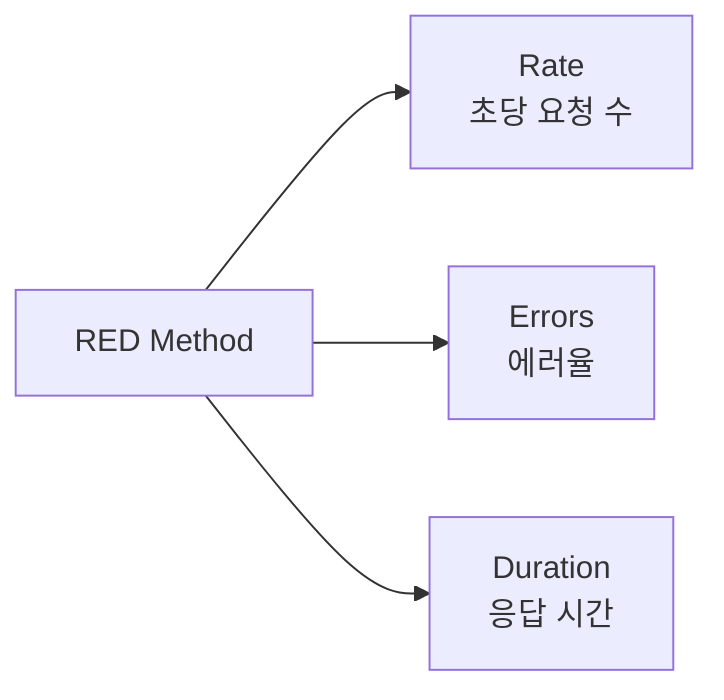
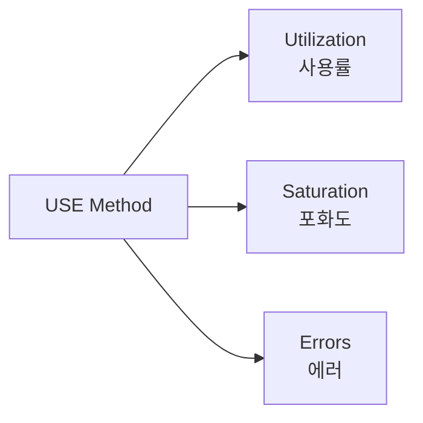
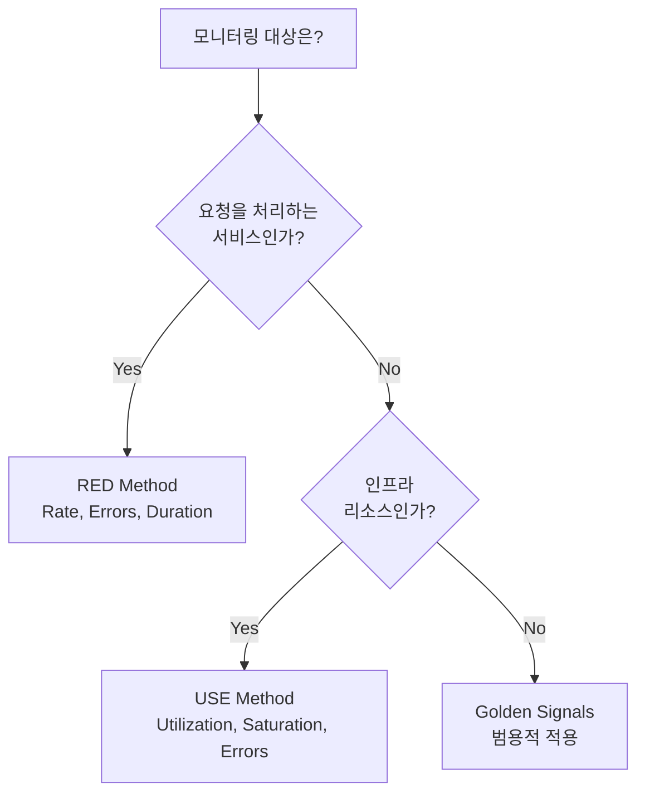
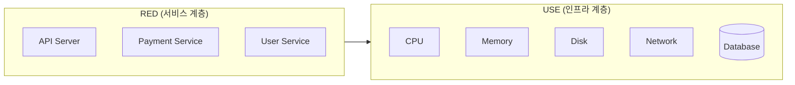

# 2장. SRE와 관측성

## 학습 목표

- SLI, SLO, SLA의 관계와 각각의 역할을 이해한다
- Error Budget의 개념과 운영 방식을 설명할 수 있다
- Golden Signals, RED Method, USE Method의 차이와 적용 대상을 구분한다
- 관측성 데이터를 기반으로 SLO를 설계하는 관점을 갖는다

---

## 2.1 SRE란 무엇인가

**Site Reliability Engineering(SRE)**은 Google이 2003년에 시작한 운영 철학이자 엔지니어링 분야다. 핵심 아이디어는 단순하다:


**"100% 가용성은 목표가 아니다."** 완벽한 신뢰성을 추구하는 대신, 비즈니스가 수용할 수 있는 수준의 신뢰성을 정량적으로 정의하고, 그 범위 안에서 빠르게 변화한다.


SRE는 관측성과 밀접하게 연결된다. [1장](1.관측성이란-무엇인가.md)에서 관측성이 "무엇을 볼 수 있는가"였다면, SRE는 **"무엇을 봐야 하는가"**에 답한다. 아무리 관측성이 높아도 잘못된 지표를 보고 있으면 의미가 없다.

### SRE의 핵심 원칙

| 원칙 | 설명 |
|------|------|
| **신뢰성은 가장 중요한 기능** | 사용자가 시스템을 사용할 수 없으면, 다른 모든 기능은 무의미하다 |
| **100%는 잘못된 목표** | 99.9% → 99.99%로 올리는 비용은 기하급수적으로 증가한다 |
| **정량적 의사결정** | "느린 것 같다"가 아니라 "p99 latency가 SLO를 3% 초과했다"로 판단한다 |
| **Toil 제거** | 반복적이고 자동화 가능한 운영 작업을 줄여 엔지니어링에 집중한다 |

---

## 2.2 SLI (Service Level Indicator)

**SLI는 서비스 품질을 측정하는 정량적 지표다.**

"우리 서비스가 얼마나 잘 동작하고 있는가?"를 숫자로 표현한 것이다. SLI는 항상 **0~100% 사이의 비율(ratio)**로 표현한다.

```
SLI = (좋은 이벤트 수) / (전체 이벤트 수) × 100%
```

### 대표적인 SLI 유형




사용자 요청 중 성공적으로 처리된 비율.

```
Availability = (전체 요청 - 5xx 에러) / 전체 요청 × 100%
```

**Prometheus 쿼리 예시:**

```promql
sum(rate(http_requests_total{status!~"5.."}[5m]))
/
sum(rate(http_requests_total[5m]))
```




요청 중 임계값 이내에 응답된 비율.

```
Latency SLI = (응답 시간 < 300ms인 요청) / 전체 요청 × 100%
```

**Prometheus 쿼리 예시:**

```promql
sum(rate(http_request_duration_seconds_bucket{le="0.3"}[5m]))
/
sum(rate(http_request_duration_seconds_count[5m]))
```




시스템이 처리하는 초당 요청 수. 비율이 아닌 절대값으로 측정하되, SLO에서는 "최소 처리량 이상을 유지한 시간 비율"로 변환한다.

```promql
sum(rate(http_requests_total[5m]))
```




### 좋은 SLI의 조건

| 조건 | 설명 | 나쁜 예 |
|------|------|---------|
| **사용자 경험을 반영** | 서버 CPU가 아니라 사용자가 체감하는 품질 | CPU 사용률 < 80% |
| **비율로 표현** | 0~100% 사이의 값 | 평균 응답 시간 200ms |
| **측정 가능** | 실제로 데이터를 수집할 수 있어야 함 | "사용자 만족도" |
| **의미 있는 구간** | 변화가 비즈니스 영향과 연결됨 | 99.999%와 99.9999%의 차이를 구분 |


**흔한 실수**: 평균(mean) 응답 시간을 SLI로 사용하는 것. 평균은 이상치를 숨긴다. p99가 10초여도 평균은 200ms일 수 있다. SLI는 항상 **비율** 또는 **백분위**로 정의해야 한다.


---

## 2.3 SLO (Service Level Objective)

**SLO는 SLI의 목표값이다.**

"이 SLI를 어느 수준 이상으로 유지하겠다"는 내부 목표다. SLO는 팀이 자체적으로 정하며, 외부 계약이 아닌 **엔지니어링 의사결정의 기준**이다.

```
SLO 예시:
- Availability SLO: 99.9% (월간)
- Latency SLO: 요청의 99%가 300ms 이내에 응답 (월간)
```

### SLO가 중요한 이유

SLO가 없으면 팀은 두 가지 극단에 빠진다:

1. **과도한 신뢰성 추구**: 99.999%를 목표로 모든 리소스를 안정성에 투입 → 새 기능 개발 중단
2. **신뢰성 무시**: "빠르게 출시하자"만 반복 → 장애 빈발, 사용자 이탈

SLO는 이 사이의 **균형점**을 정량적으로 제공한다.

### 가용성 수준별 허용 다운타임

| SLO | 월간 허용 다운타임 | 연간 허용 다운타임 | 난이도 |
|-----|-------------------|-------------------|--------|
| 99% | 7시간 18분 | 3일 15시간 | 낮음 |
| 99.9% | 43분 49초 | 8시간 46분 | 보통 |
| 99.95% | 21분 55초 | 4시간 23분 | 높음 |
| 99.99% | 4분 23초 | 52분 36초 | 매우 높음 |
| 99.999% | 26초 | 5분 16초 | 극도로 높음 |


**99.9%와 99.99%의 차이**는 0.09%p에 불과하지만, 허용 다운타임은 43분 → 4분으로 10배 줄어든다. 이 차이를 달성하기 위한 비용과 복잡도도 10배 이상 증가한다. SLO를 높이는 것은 공짜가 아니다.


### SLO 설정 가이드



**실전 팁:**

1. 처음에는 **현재 성능 기준 SLO**로 시작한다 (현실적 목표)
2. 최소 **2주간 baseline**을 측정한 후 SLO를 결정한다
3. SLO는 **분기마다 재검토**한다
4. 내부/외부 서비스에 **다른 SLO**를 적용할 수 있다

---

## 2.4 SLA (Service Level Agreement)

**SLA는 서비스 제공자와 고객 간의 공식 계약이다.**

SLO를 위반하면 팀 내부에서 대응하지만, SLA를 위반하면 **비즈니스 영향**(환불, 크레딧, 계약 해지)이 발생한다.

### SLI → SLO → SLA의 관계



| 구분 | SLI | SLO | SLA |
|------|-----|-----|-----|
| **정의** | 무엇을 측정하는가 | 얼마나 잘 해야 하는가 | 못 지키면 어떤 일이 발생하는가 |
| **대상** | 엔지니어링 팀 | 엔지니어링 팀 + 경영진 | 고객 |
| **법적 구속력** | 없음 | 없음 | **있음** |
| **예시** | 요청 성공률 | 99.9% 이상 유지 | 99.9% 미만 시 크레딧 제공 |


**SLA는 항상 SLO보다 느슨하게 설정한다.** SLO 99.9%라면 SLA는 99.5%로 설정하는 식이다. SLO를 위반했을 때 내부적으로 대응할 시간을 확보하기 위해서다. SLO = SLA로 설정하면, SLO 위반 = 즉시 비즈니스 피해가 된다.


### 실제 SLA 예시

<details>
<summary>AWS, GCP, Azure의 SLA 비교</summary>

| 서비스 | SLA |
|--------|-----|
| AWS EC2 | 99.99% |
| AWS S3 | 99.9% |
| GCP Compute Engine | 99.99% |
| Azure Virtual Machines | 99.9% (단일) / 99.99% (가용성 집합) |

클라우드 제공자의 SLA 위반 시 보통 서비스 크레딧(다음 달 비용 할인) 형태로 보상한다. 실제 비즈니스 손실을 보상하지는 않기 때문에, 자체 서비스의 SLO는 클라우드 SLA보다 충분히 보수적으로 설정해야 한다.

</details>

---

## 2.5 Error Budget

**Error Budget은 "허용 가능한 실패의 양"이다.**

SLO가 99.9%라면, 0.1%만큼의 실패가 허용된다. 이 0.1%가 바로 Error Budget이다.

```
Error Budget = 1 - SLO

SLO 99.9% → Error Budget 0.1%
월간 요청 100만 건 → 허용 실패 1,000건
```

### Error Budget의 역할

Error Budget은 **개발 속도와 안정성 사이의 균형을 정량화**한다.






- 새로운 기능을 적극적으로 배포한다
- 실험적인 변경(새 DB, 아키텍처 변경)을 시도할 수 있다
- 개발 속도를 높인다

**핵심**: Error Budget은 "실패해도 되는 권한"이다. 남아있다면 활용하지 않는 것이 오히려 낭비다.




- 새 기능 배포를 중단하거나 크게 줄인다
- 안정성 개선 작업에 집중한다 (성능 최적화, 버그 수정, 테스트 강화)
- 장애 원인을 분석하고 재발 방지 조치를 수행한다

**핵심**: Budget 소진은 "벌"이 아니다. "지금은 안정성에 집중할 때"라는 객관적 신호다.




### Error Budget 소진율 (Burn Rate)

단순히 Budget이 남았는지 여부보다, **얼마나 빠르게 소진되고 있는가**(Burn Rate)가 더 중요하다.

```
Burn Rate = 실제 에러율 / 허용 에러율
```

| Burn Rate | 의미 | 대응 |
|-----------|------|------|
| **1x** | 정확히 SLO 경계에서 운영 중 | 정상 운영, 주의 관찰 |
| **< 1x** | Budget이 쌓이고 있음 | 적극적 배포 가능 |
| **2x** | Budget이 2배 속도로 소진 | 주의 필요, 원인 조사 |
| **10x** | Budget이 10배 속도로 소진 | 즉시 대응 필요 (P1 장애 수준) |
| **1000x** | 사실상 전면 장애 | 전원 호출, 즉시 복구 |


Burn Rate 기반 알림은 기존 임계값 알림보다 훨씬 정교하다. "에러율 5% 초과" 같은 단순 알림 대신, "이 속도면 8시간 뒤에 월간 Error Budget이 바닥난다"는 예측 기반 알림이 가능하다. 이 내용은 [22장 Alerting](../part5/22.Alerting.md)에서 자세히 다룬다.


---

## 2.6 Golden Signals

Google SRE 팀이 정의한 **모든 서비스에서 모니터링해야 할 4가지 핵심 신호**다. "무엇을 측정해야 할지 모르겠다면, 이 4가지부터 시작하라"는 가이드라인이다.



### 1. Latency (응답 시간)

요청을 처리하는 데 걸리는 시간이다.

```promql
# p50 (중앙값)
histogram_quantile(0.5, rate(http_request_duration_seconds_bucket[5m]))

# p99
histogram_quantile(0.99, rate(http_request_duration_seconds_bucket[5m]))
```


**성공한 요청과 실패한 요청의 Latency를 분리해서 측정해야 한다.** 에러 응답이 빠르게 반환되면(예: 즉시 500 응답) 전체 Latency가 낮아 보이는 착시가 발생한다.


### 2. Traffic (트래픽)

시스템에 들어오는 요청의 양이다.

```promql
# 초당 HTTP 요청 수
sum(rate(http_requests_total[5m]))

# 서비스별 트래픽
sum(rate(http_requests_total[5m])) by (service)
```

트래픽 자체는 "좋다/나쁘다"가 아니지만, 다른 신호를 해석하는 **맥락**을 제공한다. Latency가 올라갔을 때 트래픽도 함께 올랐다면 용량 문제이고, 트래픽은 그대로인데 Latency만 올랐다면 코드나 의존성 문제일 가능성이 높다.

### 3. Errors (에러)

실패한 요청의 비율이다.

```promql
# 5xx 에러율
sum(rate(http_requests_total{status=~"5.."}[5m]))
/
sum(rate(http_requests_total[5m]))
```

에러는 두 가지로 나뉜다:

- **명시적 에러**: HTTP 5xx, gRPC 에러 코드 등 명확한 실패
- **암묵적 에러**: 200 OK지만 잘못된 데이터 반환, 또는 SLO 기준 초과 응답 시간

### 4. Saturation (포화도)

리소스가 얼마나 "가득 찼는가"를 나타낸다.

```promql
# CPU 포화도
1 - avg(rate(node_cpu_seconds_total{mode="idle"}[5m]))

# 메모리 포화도
1 - (node_memory_MemAvailable_bytes / node_memory_MemTotal_bytes)

# DB connection pool 포화도
(active_connections / max_connections)
```


포화도는 **선행 지표(leading indicator)**다. Latency나 Error가 올라가기 전에 Saturation이 먼저 올라간다. 포화도가 80%를 넘기 전에 대응해야 한다. 80%를 넘으면 성능이 비선형적으로 급격히 저하된다.


---

## 2.7 RED Method

**RED Method**는 Tom Wilkie(Grafana Labs)가 Golden Signals를 **마이크로서비스 환경에 최적화**하여 단순화한 방법이다. 모든 서비스에 동일하게 적용할 수 있어 대시보드 표준화에 유리하다.



| 지표 | 정의 | PromQL |
|------|------|--------|
| **Rate** | 초당 처리 요청 수 | `sum(rate(http_requests_total[5m]))` |
| **Errors** | 초당 실패 요청 수 | `sum(rate(http_requests_total{status=~"5.."}[5m]))` |
| **Duration** | 요청 처리 시간 분포 | `histogram_quantile(0.99, rate(http_request_duration_seconds_bucket[5m]))` |

### RED Method의 핵심


**RED는 "사용자 관점"의 메트릭이다.** 사용자는 서버의 CPU 사용률을 모른다. 사용자가 체감하는 것은 "요청이 처리되는가(Rate)", "에러가 나는가(Errors)", "얼마나 걸리는가(Duration)"뿐이다.


RED Method는 **요청을 처리하는 서비스**(API 서버, 웹 서버, 마이크로서비스)에 적합하다. 데이터베이스, 캐시, 큐와 같은 리소스에는 USE Method가 더 적합하다.

---

## 2.8 USE Method

**USE Method**는 Brendan Gregg(Netflix)가 제안한 **인프라 리소스 분석 방법론**이다.



| 지표 | 정의 | 측정 대상 |
|------|------|----------|
| **Utilization** | 리소스가 사용 중인 시간 비율 | CPU 70% 사용 중 |
| **Saturation** | 리소스를 초과하여 대기 중인 작업의 양 | CPU run queue에 5개 대기 |
| **Errors** | 리소스에서 발생한 에러 | 디스크 I/O 에러, 네트워크 패킷 드롭 |

### 리소스별 USE 체크리스트

| 리소스 | Utilization | Saturation | Errors |
|--------|------------|------------|--------|
| **CPU** | CPU 사용률 | Load average, Run queue | Machine check exceptions |
| **Memory** | 메모리 사용률 | Swap 사용량, OOM 횟수 | ECC 에러 |
| **Disk I/O** | Disk busy % | I/O wait queue depth | Read/Write 에러 |
| **Network** | 대역폭 사용률 | TCP retransmit, drop | Interface 에러 |
| **DB Connection** | Active / Max | Waiting connections | Connection 에러 |

---

## 2.9 RED vs USE vs Golden Signals









| 구분 | Golden Signals | RED Method | USE Method |
|------|---------------|------------|------------|
| **출처** | Google SRE | Tom Wilkie (Grafana) | Brendan Gregg (Netflix) |
| **적용 대상** | 모든 서비스 | 요청 기반 서비스 | 인프라 리소스 |
| **관점** | 서비스 전체 | 사용자 경험 | 리소스 상태 |
| **지표 수** | 4개 | 3개 | 3개 |
| **대시보드** | 서비스 개요 | 마이크로서비스별 | 호스트/노드별 |




### 실전 적용 예시

하나의 시스템에서 RED와 USE를 함께 사용하는 것이 이상적이다:



- **RED**로 "사용자가 느끼는 문제"를 먼저 감지한다 (에러율 증가, 응답 시간 증가)
- **USE**로 "그 문제의 인프라 원인"을 파악한다 (CPU 포화, 메모리 부족, DB 커넥션 고갈)


RED가 **"증상"**을 감지하고, USE가 **"원인"**을 지목한다. 이 두 가지를 조합하면 Golden Signals의 4가지 신호를 자연스럽게 커버하게 된다.


---

## 핵심 정리

1. **SLI**는 서비스 품질을 측정하는 비율 지표다. 사용자 경험을 반영하는 것이 핵심이다.

2. **SLO**는 SLI의 내부 목표값이다. 현재 baseline을 측정한 후 현실적으로 설정하고, 분기마다 재검토한다.

3. **SLA**는 외부 고객과의 계약이다. 항상 SLO보다 느슨하게 설정하여 내부 대응 여유를 확보한다.

4. **Error Budget**은 개발 속도와 안정성의 균형을 정량화한다. Budget이 남으면 적극적 배포, 소진되면 안정화에 집중한다.

5. **Golden Signals**(Latency, Traffic, Errors, Saturation)는 모든 서비스의 기본 모니터링 항목이다.

6. **RED Method**는 요청 기반 서비스에, **USE Method**는 인프라 리소스에 적용한다. 둘을 함께 사용하면 증상과 원인을 모두 커버할 수 있다.

---

## 다음 장 예고

[3장](3.시계열-데이터-이해.md)에서는 **시계열 데이터**를 다룬다. SLI를 측정하고 SLO를 추적하려면 시계열 데이터베이스의 동작 원리를 이해해야 한다. Cardinality, Sampling, Aggregation, Retention, Downsampling 등 메트릭 데이터를 효율적으로 다루는 방법을 학습한다.
