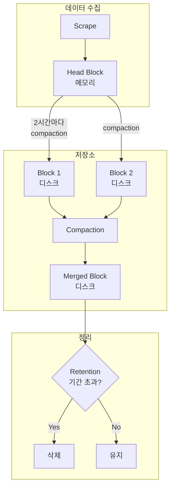
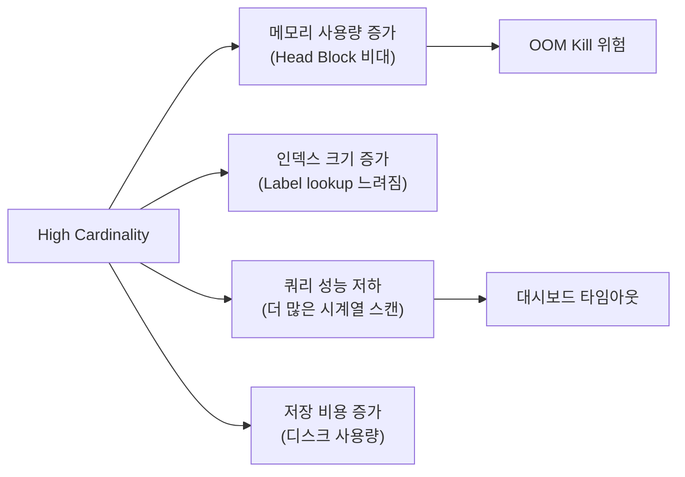
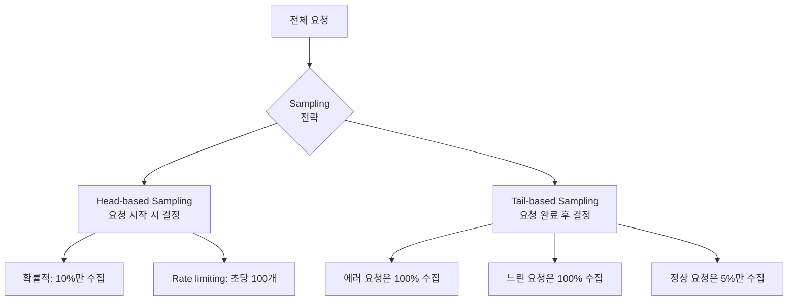
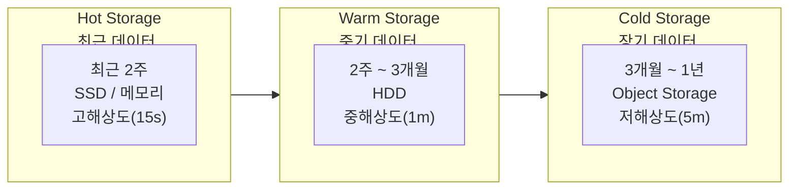

# 3장. 시계열 데이터 이해

## 학습 목표

- 시계열 데이터의 구조와 시계열 데이터베이스의 동작 원리를 이해한다
- Cardinality가 시스템 성능에 미치는 영향을 설명할 수 있다
- Sampling, Aggregation, Retention, Downsampling의 개념과 트레이드오프를 안다
- 시계열 데이터의 압축 원리를 이해한다

---

## 3.1 시계열 데이터란

**시계열 데이터(Time-Series Data)**는 시간 순서대로 정렬된 데이터 포인트의 연속이다.

```
타임스탬프              메트릭 이름                                    값
─────────────────────────────────────────────────────────────────────────
2026-06-13T10:00:00Z   http_requests_total{service="api",status="200"}  1523
2026-06-13T10:00:15Z   http_requests_total{service="api",status="200"}  1541
2026-06-13T10:00:30Z   http_requests_total{service="api",status="200"}  1558
2026-06-13T10:00:45Z   http_requests_total{service="api",status="200"}  1572
```

하나의 시계열(time series)은 **메트릭 이름 + 고유한 Label 조합**으로 식별된다. 위 예시에서 `http_requests_total{service="api",status="200"}`이 하나의 시계열이고, `{service="api",status="500"}`은 별개의 시계열이다.

### 시계열 데이터의 특성

| 특성 | 설명 |
|------|------|
| **쓰기 집중(Write-Heavy)** | 수천 개의 시계열이 15초 간격으로 데이터를 생성한다 |
| **최신 데이터 접근 빈도 높음** | 최근 1시간 데이터를 조회하는 빈도가 압도적으로 높다 |
| **순차 쓰기(Sequential Write)** | 타임스탬프 순서대로 기록되므로 랜덤 쓰기가 거의 없다 |
| **업데이트 없음(Append-Only)** | 과거 데이터를 수정하지 않는다 |
| **자연 만료** | 오래된 데이터는 가치가 줄어들어 삭제 가능하다 |

이러한 특성 때문에 관계형 데이터베이스(MySQL, PostgreSQL)로 시계열 데이터를 다루면 성능이 크게 떨어진다. 시계열에 특화된 데이터베이스가 필요한 이유다.

---

## 3.2 시계열 데이터베이스 (TSDB)

**TSDB(Time-Series Database)**는 시계열 데이터의 특성에 최적화된 데이터베이스다.

### RDBMS vs TSDB




```sql
CREATE TABLE metrics (
    id BIGINT AUTO_INCREMENT,
    timestamp DATETIME,
    metric_name VARCHAR(255),
    labels JSON,
    value DOUBLE,
    PRIMARY KEY (id),
    INDEX idx_time (timestamp),
    INDEX idx_name (metric_name)
);
```

- 범용적이지만 시계열에 비효율적
- 인덱스 관리 오버헤드가 크다
- 데이터 압축이 제한적
- 대량 쓰기 시 성능 저하




```
┌─────────────────────────────────────────────┐
│ Series: http_requests_total{service="api"}  │
│                                             │
│ t0=1523, t1=1541, t2=1558, t3=1572, ...    │
│ (delta encoding + compression)              │
└─────────────────────────────────────────────┘
```

- 시계열 특성에 최적화된 저장 구조
- 동일 시계열의 데이터를 연속 저장 (locality)
- 높은 압축률 (delta encoding, gorilla compression)
- 초당 수백만 데이터 포인트 쓰기 가능




### 대표적인 TSDB

| TSDB | 특징 | 사용 사례 |
|------|------|----------|
| **Prometheus** | Pull 기반 수집, 로컬 저장, PromQL | Kubernetes 모니터링의 사실상 표준 |
| **VictoriaMetrics** | Prometheus 호환, 고성능, 저비용 저장 | 대규모 메트릭 장기 보관 |
| **InfluxDB** | Push 기반, 자체 쿼리 언어(Flux) | IoT, 시계열 분석 |
| **TimescaleDB** | PostgreSQL 확장, SQL 호환 | SQL 생태계 활용이 필요한 경우 |
| **Mimir** | Grafana Labs, 멀티테넌시 | 대규모 SaaS 환경 |

### Prometheus의 로컬 TSDB 구조

Prometheus는 자체 TSDB를 내장하고 있다. 데이터가 어떻게 저장되는지 이해하면 운영 시 성능 문제를 진단하는 데 도움이 된다.



| 구성 요소 | 역할 |
|----------|------|
| **Head Block** | 최근 2시간의 데이터를 메모리에 보관. 쓰기와 최신 데이터 조회가 가장 빠르다 |
| **Block** | 2시간 단위로 디스크에 기록된 불변(immutable) 데이터 |
| **WAL** | Write-Ahead Log. 메모리 데이터 손실 방지를 위한 복구용 로그 |
| **Compaction** | 작은 Block들을 합쳐 더 큰 Block으로 만들어 쿼리 효율을 높인다 |


Prometheus의 메모리 사용량은 **Head Block의 크기**에 비례한다. Head Block은 활성 시계열 수 × 2시간 분량의 데이터를 메모리에 보관하므로, 시계열 수(Cardinality)가 메모리 사용량을 직접 결정한다.


---

## 3.3 Cardinality

**Cardinality(카디널리티)**는 고유한 시계열의 총 개수다. 관측성 시스템에서 가장 중요한 성능 변수이며, 가장 흔한 장애 원인이기도 하다.

### Cardinality 계산

시계열 수는 Label 값의 조합으로 결정된다:

```
http_requests_total{method, status, path, instance}
```

| Label | 가능한 값 | 개수 |
|-------|----------|------|
| method | GET, POST, PUT, DELETE | 4 |
| status | 200, 201, 400, 404, 500, 502, 503 | 7 |
| path | /api/users, /api/orders, ... | 50 |
| instance | pod-1, pod-2, ..., pod-10 | 10 |

```
총 시계열 수 = 4 × 7 × 50 × 10 = 14,000
```

하나의 메트릭에서만 14,000개의 시계열이 생성된다. 메트릭이 100개라면 최대 140만 개의 시계열이 가능하다.

### High Cardinality의 원인


다음 Label을 메트릭에 추가하면 Cardinality가 폭발한다. 절대 하지 말아야 할 안티 패턴이다.


| 안티 패턴 | 왜 위험한가 | 대안 |
|----------|-----------|------|
| **user_id** | 사용자 수만큼 시계열 생성 (수백만) | Logs에 기록, Exemplar로 연결 |
| **request_id** | 요청마다 고유 → 무한 증가 | Trace ID로 추적 |
| **email** | 사용자 수만큼 증가 | 절대 Label로 사용하지 않음 |
| **URL path (동적)** | `/users/123`, `/users/456` → 무한 | path template으로 정규화: `/users/:id` |
| **timestamp** | 모든 데이터 포인트가 고유 | 이미 시계열 자체가 시간 정보를 담고 있음 |
| **error message** | 에러 종류만큼 증가 | error_code로 분류 |

### Cardinality가 시스템에 미치는 영향



**실제 사례**: Label에 `user_id`를 추가한 후 Prometheus 메모리 사용량이 2GB → 48GB로 증가하여 OOM Kill 발생. 해당 Label을 제거하고 재시작하여 복구.

### Cardinality 관리 전략

1. **Label 추가 전에 Cardinality를 계산한다**: 가능한 값의 수를 곱한다
2. **무한 증가하는 값은 Label로 사용하지 않는다**: user_id, request_id, IP 등
3. **정규화한다**: `/users/123` → `/users/:id`
4. **모니터링한다**: Prometheus 자체의 `prometheus_tsdb_head_series` 메트릭을 추적한다

```promql
# 현재 활성 시계열 수
prometheus_tsdb_head_series

# 메트릭별 시계열 수 상위 10개
topk(10, count by (__name__) ({__name__!=""}))
```


Cardinality 관리는 [4장 메트릭 설계](../part2/4.메트릭-설계.md)에서 Label 설계 원칙과 함께 더 깊이 다룬다.


---

## 3.4 Sampling

**Sampling(샘플링)**은 데이터의 일부만 수집하거나 저장하는 기법이다. 주로 Traces에서 사용되지만, Metrics와 Logs에서도 개념을 이해해야 한다.

### Metrics에서의 Scrape Interval

Prometheus는 일정 주기(Scrape Interval)로 타겟을 수집한다. 이것이 Metrics의 Sampling이다.




- 대부분의 운영 환경에서 권장
- 충분한 해상도로 추세를 파악 가능
- 저장 비용과 정밀도의 균형




- 짧은 spike를 놓치지 않아야 할 때
- 저장 비용 3배 증가
- HPA(Horizontal Pod Autoscaler) 등 빠른 반응이 필요한 경우




- 장기 트렌드만 필요한 메트릭에 적합
- 짧은 장애를 놓칠 수 있음
- 비용 절감이 우선인 환경





Scrape Interval을 너무 짧게 설정하면 타겟 서비스에 부하를 줄 수 있다. 특히 메트릭 수가 많은 서비스(수천 개 시계열)에서 5초 간격으로 수집하면, scrape 자체가 성능 병목이 될 수 있다.


### Traces에서의 Sampling

모든 요청의 Trace를 저장하면 비용이 폭발한다. 초당 10,000 요청을 처리하는 서비스에서 모든 Trace를 저장하면 하루에 수백 GB가 될 수 있다.



| 전략 | 동작 | 장점 | 단점 |
|------|------|------|------|
| **Head-based** | 요청 시작 시 수집 여부 결정 | 구현이 단순, 오버헤드 적음 | 에러/느린 요청을 놓칠 수 있음 |
| **Tail-based** | 요청 완료 후 결과를 보고 결정 | 중요한 요청을 놓치지 않음 | 구현 복잡, 메모리 필요 |


**실전 권장**: Tail-based Sampling으로 에러 요청과 느린 요청(p99 이상)은 100% 수집하고, 정상 요청은 1~10%만 수집한다. 이렇게 하면 디버깅에 필요한 데이터는 놓치지 않으면서 저장 비용을 90% 이상 줄일 수 있다.


---

## 3.5 Aggregation

**Aggregation(집계)**은 여러 시계열의 데이터를 하나로 합치는 연산이다. 시계열 데이터에서 가장 빈번하게 사용되는 연산이며, 제대로 이해하지 못하면 잘못된 결론을 내리게 된다.

### 공간 집계 (Spatial Aggregation)

같은 시점에서 **여러 시계열**을 합친다. "모든 Pod의 요청 수를 합산"하는 것이 공간 집계다.

```promql
# 개별 Pod의 요청 수
http_requests_total{service="api", pod="pod-1"}  →  523
http_requests_total{service="api", pod="pod-2"}  →  487
http_requests_total{service="api", pod="pod-3"}  →  501

# 공간 집계: Pod를 무시하고 서비스 단위로 합산
sum by (service) (http_requests_total{service="api"})  →  1511
```

### 시간 집계 (Temporal Aggregation)

하나의 시계열에서 **일정 시간 범위**의 데이터를 합친다. "지난 5분간의 평균 요청률"이 시간 집계다.

```promql
# 지난 5분간의 초당 요청 수 (rate = 시간 집계)
rate(http_requests_total{service="api"}[5m])

# 지난 1시간의 평균값
avg_over_time(cpu_usage{instance="server-1"}[1h])
```

### 집계 함수의 위험: 평균의 함정


**평균(avg)은 거짓말을 한다.** 두 개의 서로 다른 상황이 같은 평균값을 만들 수 있다.


```
시나리오 A: 응답 시간이 균일
  100ms, 100ms, 100ms, 100ms, 100ms
  → 평균: 100ms ✅ 사용자 경험 양호

시나리오 B: 응답 시간이 불균일
  10ms, 10ms, 10ms, 10ms, 460ms
  → 평균: 100ms ❌ 한 명이 460ms를 경험

시나리오 C: 극단적 불균일
  1ms, 1ms, 1ms, 1ms, 496ms
  → 평균: 100ms ❌ 한 명이 거의 0.5초를 경험
```

세 시나리오 모두 평균은 100ms이지만, 사용자 경험은 완전히 다르다. 이것이 SLI에서 평균 대신 **백분위(percentile)**를 사용해야 하는 이유다.

```promql
# 나쁜 예: 평균 응답 시간
avg(http_request_duration_seconds)

# 좋은 예: p99 응답 시간 (상위 1%의 경험)
histogram_quantile(0.99, rate(http_request_duration_seconds_bucket[5m]))
```

---

## 3.6 Retention

**Retention(보존 기간)**은 데이터를 얼마나 오래 보관할 것인가의 문제다.

### Retention 전략

모든 데이터를 영원히 보관하는 것은 비용적으로 불가능하다. 데이터의 가치는 시간이 지남에 따라 감소한다.



| 기간 | 용도 | 해상도 | 저장소 |
|------|------|--------|--------|
| **최근 2주** | 장애 대응, 실시간 모니터링 | 15초 (원본) | SSD / 메모리 |
| **2주 ~ 3개월** | 트렌드 분석, 주간/월간 비교 | 1분 (Downsampling) | HDD / Block Storage |
| **3개월 ~ 1년** | Capacity Planning, 계절 패턴 | 5분 (Downsampling) | Object Storage (S3) |
| **1년 이상** | 보관 의무가 있는 경우만 | 1시간 이상 | Archive Storage |

### Prometheus Retention 설정

```yaml
# Prometheus 시작 옵션
--storage.tsdb.retention.time=15d    # 시간 기반: 15일
--storage.tsdb.retention.size=50GB   # 크기 기반: 50GB 초과 시 오래된 데이터 삭제
```


Prometheus는 로컬 저장소만 사용하므로 장기 보관에 한계가 있다. 장기 보관이 필요하면 **Remote Write**로 VictoriaMetrics, Mimir, Thanos 등에 데이터를 전송해야 한다. 이 내용은 [41장 Prometheus 연동](../part9/41.Prometheus-연동.md)에서 다룬다.


---

## 3.7 Downsampling

**Downsampling(다운샘플링)**은 시간 해상도를 낮춰 데이터 크기를 줄이는 기법이다.

### 동작 원리

15초 간격의 원본 데이터를 5분 간격으로 Downsampling하면, 데이터 포인트 수가 20분의 1로 줄어든다.

```
원본 (15초 간격, 1시간 = 240개 포인트):
10:00:00=45, 10:00:15=47, 10:00:30=42, 10:00:45=48, 10:01:00=44, ...

Downsampling (5분 간격, 1시간 = 12개 포인트):
10:00=avg(45.5), 10:05=avg(43.2), 10:10=avg(46.1), ...
```

### Downsampling 시 보존해야 할 값

단순 평균만 저장하면 정보가 크게 손실된다. 좋은 Downsampling은 여러 집계값을 함께 보존한다:

| 보존값 | 용도 |
|--------|------|
| **min** | 해당 구간의 최솟값. 최상의 성능을 파악 |
| **max** | 해당 구간의 최댓값. spike를 놓치지 않기 위해 필수 |
| **avg** | 해당 구간의 평균값. 일반적인 추세 파악 |
| **count** | 해당 구간의 데이터 포인트 수. rate 계산에 필요 |
| **sum** | 해당 구간의 합계. Counter 메트릭에 필요 |


VictoriaMetrics는 Downsampling 시 min, max, avg를 자동으로 보존한다. Prometheus 자체에는 Downsampling 기능이 없으며, Thanos나 Mimir를 사용해야 한다.


---

## 3.8 Compression

**시계열 데이터는 압축이 매우 잘 된다.** 시계열 데이터의 특성(순차적, 값 변화가 작음)을 활용한 전용 압축 알고리즘이 있다.

### Delta Encoding

연속된 값 대신 **차이(delta)**만 저장한다. 시계열 데이터는 인접한 값의 차이가 작으므로 매우 효과적이다.

```
원본 타임스탬프:
1718265600, 1718265615, 1718265630, 1718265645

Delta Encoding:
1718265600, +15, +15, +15

Double Delta (delta의 delta):
1718265600, 15, 0, 0
```

타임스탬프가 정확히 15초 간격이면 Double Delta 이후 대부분의 값이 0이 되어 극단적으로 압축된다.

### Gorilla Compression (XOR Encoding)

Facebook이 2015년에 발표한 시계열 전용 압축 알고리즘이다. Prometheus와 VictoriaMetrics 모두 이 방식을 사용한다.

값(float64)에 대해 이전 값과의 **XOR**을 저장한다:

```
원본 값:
45.2, 45.3, 45.1, 45.4

XOR (이전 값과):
45.2,  45.2 XOR 45.3,  45.3 XOR 45.1,  45.1 XOR 45.4

XOR 결과에서 0이 아닌 비트만 저장 → 대부분 몇 비트만 필요
```

### 압축 효율

| 데이터 유형 | 비압축 크기 | 압축 후 크기 | 압축률 |
|------------|-----------|-------------|--------|
| 타임스탬프 (15초 간격) | 8 bytes/point | ~0.06 bytes/point | **99%** |
| Float64 값 (변화 작음) | 8 bytes/point | ~1.37 bytes/point | **83%** |
| **합계** | **16 bytes/point** | **~1.43 bytes/point** | **91%** |


시계열 데이터 포인트 하나당 약 **1~2 bytes**로 저장된다. 이는 100만 개의 시계열을 15초 간격으로 30일 보관해도 약 **230GB** 수준이라는 의미다. 시계열 전용 압축 덕분에 대규모 메트릭 저장이 현실적으로 가능해졌다.


### 용량 산정 공식

```
저장 용량 = 시계열 수 × (86400 / scrape_interval) × 일수 × 포인트당 바이트

예시: 100만 시계열, 15초 간격, 30일, 1.5 bytes/point
= 1,000,000 × 5,760 × 30 × 1.5
= 259.2 GB
```

---

## 핵심 정리

1. **시계열 데이터**는 쓰기 집중, 순차 쓰기, Append-Only 특성을 가지며, 이에 최적화된 TSDB를 사용해야 한다.

2. **Cardinality**는 관측성 시스템의 가장 중요한 성능 변수다. Label에 고유 식별자(user_id, request_id)를 넣지 않는 것이 핵심 원칙이다.

3. **Sampling**은 비용과 정밀도의 트레이드오프다. Traces에서는 Tail-based Sampling으로 중요한 요청을 놓치지 않으면서 비용을 줄인다.

4. **Aggregation**에서 평균은 거짓말을 한다. SLI에는 백분위(percentile)를 사용해야 한다.

5. **Retention**은 Hot → Warm → Cold 계층으로 나누어, 최신 데이터는 고해상도로, 오래된 데이터는 저해상도로 보관한다.

6. **Downsampling**은 해상도를 낮춰 저장 비용을 줄이되, min/max/avg를 보존하여 정보 손실을 최소화한다.

7. **Compression**은 Delta Encoding + Gorilla Compression으로 포인트당 1~2 bytes까지 압축 가능하다.

---

## 다음 장 예고

[4장](../part2/4.메트릭-설계.md)에서는 **메트릭 설계**를 다룬다. 이 장에서 배운 Cardinality, Aggregation 개념을 바탕으로, 실전에서 좋은 메트릭을 어떻게 설계하는지 — 네이밍 규칙, Label 설계 원칙, 안티 패턴 — 을 학습한다.
