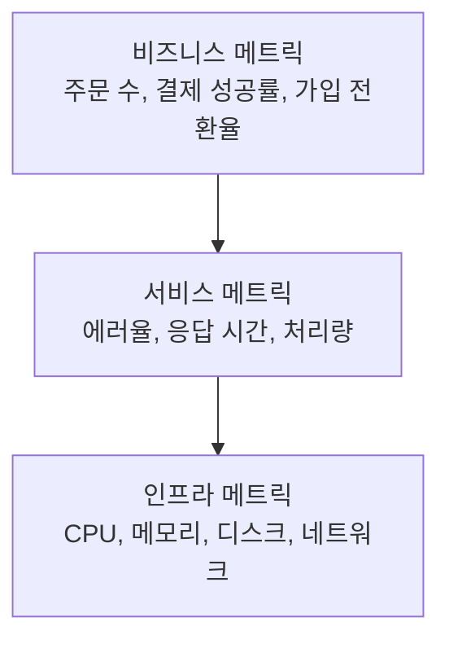
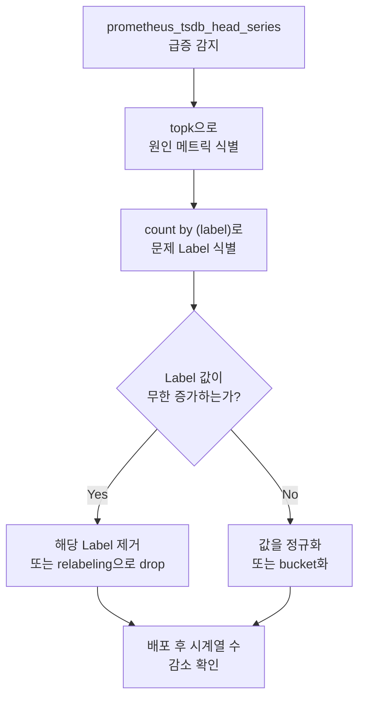

# 4장. 메트릭 설계

## 학습 목표

- 좋은 메트릭과 나쁜 메트릭의 차이를 판단할 수 있다
- Prometheus 메트릭 네이밍 규칙을 적용할 수 있다
- Label 설계 원칙을 이해하고 Cardinality를 통제할 수 있다
- 실무에서 자주 발생하는 메트릭 설계 안티 패턴을 피할 수 있다

---

## 4.1 좋은 메트릭이란

메트릭은 시스템의 상태를 숫자로 표현한 것이다. 하지만 모든 숫자가 좋은 메트릭은 아니다. **좋은 메트릭은 의사결정을 이끌어내는 메트릭**이다.

### 좋은 메트릭의 4가지 조건

| 조건 | 설명 | 예시 |
|------|------|------|
| **Actionable** | 값을 보고 구체적인 행동을 취할 수 있다 | 에러율 5% 초과 → 원인 조사 시작 |
| **Relevant** | 비즈니스 또는 운영 목표와 연결된다 | 주문 처리 성공률 → 매출과 직결 |
| **Comparable** | 시간/환경/서비스 간 비교가 가능하다 | 이번 주 p99 vs 지난 주 p99 |
| **Understandable** | 이름만 보고 의미를 파악할 수 있다 | `http_request_duration_seconds` |

### 메트릭의 계층

모든 메트릭이 같은 중요도를 가지지 않는다. 계층적으로 설계해야 대시보드와 알림을 효과적으로 구성할 수 있다.






사용자와 비즈니스에 직접 영향을 주는 메트릭이다. 경영진과 PM이 관심을 갖는다.

```
order_completed_total              # 완료된 주문 수
payment_success_rate               # 결제 성공률
user_signup_total                  # 신규 가입 수
cart_abandonment_rate              # 장바구니 이탈률
```




서비스가 얼마나 잘 동작하는지를 나타낸다. SRE와 백엔드 엔지니어가 관심을 갖는다. [2장](../part1/2.SRE와-관측성.md)의 RED Method가 여기에 해당한다.

```
http_requests_total                # Rate
http_request_duration_seconds      # Duration
http_requests_errors_total         # Errors
```




시스템 리소스의 상태를 나타낸다. 인프라/플랫폼 엔지니어가 관심을 갖는다. [2장](../part1/2.SRE와-관측성.md)의 USE Method가 여기에 해당한다.

```
node_cpu_seconds_total             # CPU 사용
node_memory_MemAvailable_bytes     # 가용 메모리
node_disk_io_time_seconds_total    # 디스크 I/O
```





장애 대응 시 **위에서 아래로** 내려간다. 비즈니스 메트릭(주문 수 감소) → 서비스 메트릭(에러율 증가) → 인프라 메트릭(DB CPU 포화). 이 흐름이 자연스러운 대시보드를 설계하는 것이 핵심이다.


---

## 4.2 메트릭 네이밍

Prometheus 생태계에서는 일관된 네이밍 규칙이 확립되어 있다. 이 규칙을 따르면 메트릭 이름만으로 의미와 타입을 유추할 수 있다.

### 네이밍 규칙

```
<namespace>_<name>_<unit>_<suffix>
```

| 구성 요소 | 설명 | 예시 |
|----------|------|------|
| **namespace** | 애플리케이션 또는 도메인 | `http`, `node`, `payment` |
| **name** | 측정 대상 | `requests`, `duration`, `pool_size` |
| **unit** | 단위 (기본 단위 사용) | `seconds`, `bytes`, `total` |
| **suffix** | 메트릭 타입을 나타내는 접미사 | `_total`, `_bucket`, `_info` |

### 단위 규칙


**항상 기본 단위(base unit)를 사용한다.** 밀리초가 아니라 초, 킬로바이트가 아니라 바이트. Prometheus 생태계의 모든 도구가 기본 단위를 전제로 동작한다.


| 측정 대상 | 기본 단위 | 좋은 예 | 나쁜 예 |
|----------|----------|---------|---------|
| 시간 | seconds | `request_duration_seconds` | `request_duration_ms` |
| 데이터 크기 | bytes | `response_size_bytes` | `response_size_kb` |
| 온도 | celsius | `cpu_temperature_celsius` | `cpu_temp` |
| 비율 | ratio (0~1) | `cache_hit_ratio` | `cache_hit_percent` |

### 접미사 규칙

| 접미사 | 메트릭 타입 | 예시 |
|--------|-----------|------|
| `_total` | Counter | `http_requests_total` |
| `_bucket` | Histogram (자동 생성) | `http_request_duration_seconds_bucket` |
| `_sum` | Histogram/Summary (자동 생성) | `http_request_duration_seconds_sum` |
| `_count` | Histogram/Summary (자동 생성) | `http_request_duration_seconds_count` |
| `_info` | 메타데이터 (항상 값이 1) | `build_info` |
| `_created` | Counter 생성 시각 | `http_requests_created` |

### 좋은 이름 vs 나쁜 이름

| 나쁜 이름 | 문제점 | 좋은 이름 |
|----------|--------|----------|
| `requests` | namespace 없음, 단위 없음 | `http_requests_total` |
| `latency` | 단위 없음, 무엇의 latency인지 불명 | `http_request_duration_seconds` |
| `cpu` | 너무 모호 | `process_cpu_seconds_total` |
| `api_response_time_ms` | ms 사용 | `api_response_duration_seconds` |
| `HTTPRequestCount` | camelCase 사용 | `http_request_total` |
| `http.requests.total` | 점(.) 사용 | `http_requests_total` |


Prometheus 메트릭 이름은 **snake_case**만 사용한다. 대문자, camelCase, 점(.), 하이픈(-)은 사용하지 않는다. 정규식으로 표현하면 `[a-zA-Z_:][a-zA-Z0-9_:]*`이지만, 관례적으로 소문자 + 언더스코어만 쓴다.


---

## 4.3 Label 설계

Label은 메트릭에 차원(dimension)을 부여한다. 동일한 메트릭 이름이라도 Label 조합에 따라 서로 다른 시계열이 된다.

```
http_requests_total{method="GET", status="200", path="/api/users"}
http_requests_total{method="POST", status="201", path="/api/orders"}
```

### Label 설계 원칙

**1. Label 값은 유한하고 예측 가능해야 한다**

```
# 좋은 Label: 값의 가짓수가 제한됨
method="GET"          # 4~7개
status="200"          # 10~20개
region="ap-northeast-2"  # 수 개

# 나쁜 Label: 값이 무한히 증가
user_id="user-12345"   # 사용자 수만큼 증가
request_id="req-abc"   # 요청마다 고유
ip="192.168.1.123"     # IP 수만큼 증가
```

**2. Label 추가 전에 Cardinality를 계산한다**

```
새 Label을 추가하면:
기존 시계열 수 × 새 Label의 가능한 값 수 = 새로운 시계열 수

기존: 1,000개 시계열
+ region Label (3개 값) → 3,000개 ← 괜찮음
+ pod Label (50개 값) → 50,000개 ← 주의
+ user_id Label (100만 값) → 10억개 ← 시스템 다운
```

**3. 함께 집계할 것만 같은 메트릭에 넣는다**

```
# 좋은 예: method별 집계가 의미 있음
http_requests_total{method="GET"}
http_requests_total{method="POST"}
sum by (method) (rate(http_requests_total[5m]))  # 유용한 쿼리

# 나쁜 예: 별도 메트릭이어야 함
system_metric{type="cpu_usage"}
system_metric{type="memory_usage"}
# → cpu_usage와 memory_usage는 별도 메트릭으로 분리해야 함
```

**4. 선택적 Label은 피한다**

```
# 나쁜 예: 일부 요청에만 존재하는 Label
http_requests_total{method="GET", cache_status="hit"}
http_requests_total{method="GET"}  # cache_status 없음 → 별개의 시계열!
```

### Label vs Log Field

모든 정보를 Label에 넣을 필요가 없다. Label과 Log의 역할을 구분해야 한다.

| 정보 | Label (메트릭) | Log Field | 이유 |
|------|---------------|-----------|------|
| HTTP method | ✅ | ✅ | 유한한 값, 집계에 유용 |
| HTTP status code | ✅ | ✅ | 유한한 값, 에러율 계산에 필수 |
| service name | ✅ | ✅ | 유한한 값, 서비스별 비교에 필수 |
| user_id | ❌ | ✅ | 무한 증가, 개별 사용자 추적은 Log/Trace |
| request body | ❌ | ✅ | 고유 값, 디버깅 시에만 필요 |
| error message | ❌ | ✅ | 무한 다양, error_code Label로 분류 |
| trace_id | ❌ | ✅ | 모든 요청마다 고유 (Exemplar 활용) |


**경험 법칙**: "이 값으로 `group by`해서 대시보드를 만들 것인가?" 답이 Yes면 Label, No면 Log에 남긴다.


---

## 4.4 Cardinality 관리

[3장](../part1/3.시계열-데이터-이해.md)에서 Cardinality의 개념을 배웠다. 이 절에서는 실전에서 Cardinality를 모니터링하고 통제하는 방법을 다룬다.

### Cardinality 모니터링

```promql
# 전체 활성 시계열 수
prometheus_tsdb_head_series

# 메트릭 이름별 시계열 수 (상위 10개 문제 메트릭 찾기)
topk(10, count by (__name__) ({__name__!=""}))

# 특정 메트릭의 Label별 카디널리티
count by (path) (http_requests_total)
```

### Cardinality 폭발 대응

Cardinality가 급증했을 때의 대응 절차:



### Relabeling으로 Label 제거

Prometheus scrape 설정에서 불필요한 Label을 수집 시점에 제거할 수 있다:

```yaml
scrape_configs:
  - job_name: 'api-server'
    metric_relabel_configs:
      # path Label에서 동적 ID를 정규화
      - source_labels: [path]
        regex: '/users/[0-9]+'
        target_label: path
        replacement: '/users/:id'

      # 특정 고 cardinality 메트릭 자체를 drop
      - source_labels: [__name__]
        regex: 'debug_.*'
        action: drop
```

### Cardinality Budget

팀 내에서 Cardinality Budget을 정해두면 무분별한 Label 추가를 방지할 수 있다:

| 규모 | 권장 활성 시계열 수 | Prometheus 메모리 |
|------|-------------------|-----------------|
| 소규모 (서비스 < 10) | < 10만 | 2~4 GB |
| 중규모 (서비스 10~50) | < 100만 | 8~16 GB |
| 대규모 (서비스 50+) | < 1,000만 | 32~64 GB |


활성 시계열이 **1,000만 개**를 넘으면 단일 Prometheus로는 한계에 도달한다. 이 시점에서 Sharding이나 VictoriaMetrics 전환을 고려해야 한다.


---

## 4.5 안티 패턴

실무에서 반복적으로 발생하는 메트릭 설계 실수를 정리한다.

### 안티 패턴 1: 만능 메트릭

```
# 나쁜 예: 하나의 메트릭에 모든 것을 때려넣음
app_metric{type="request_count", service="api"}
app_metric{type="error_count", service="api"}
app_metric{type="latency_p99", service="api"}
app_metric{type="cpu_usage", service="api"}
```

**문제**: 다른 단위(개수, 초, 퍼센트)의 데이터가 하나의 메트릭에 혼재. `sum(app_metric)`이 의미 없는 값이 된다.

**해결**: 측정 대상별로 별도 메트릭을 만든다.

```
http_requests_total{service="api"}
http_request_duration_seconds{service="api"}
process_cpu_seconds_total{service="api"}
```

### 안티 패턴 2: Label에 고유 식별자

```
# 나쁜 예
http_requests_total{user_id="u-123456", session_id="sess-abc"}
```

**문제**: [3장](../part1/3.시계열-데이터-이해.md)에서 다룬 Cardinality 폭발.

**해결**: 고유 식별자는 Log에 기록하고, Exemplar로 Trace와 연결한다.

### 안티 패턴 3: 메트릭으로 로그를 대체

```
# 나쁜 예: 에러 메시지를 Label로
http_errors_total{error="Connection refused: payment-db:5432 after 3 retries"}
http_errors_total{error="Timeout waiting for response from auth-service (30s)"}
```

**문제**: 에러 메시지는 무한히 다양 → Cardinality 폭발.

**해결**: 에러를 코드로 분류하고, 상세 메시지는 Log에 남긴다.

```
http_errors_total{error_code="connection_refused", target="payment-db"}
http_errors_total{error_code="timeout", target="auth-service"}
```

### 안티 패턴 4: 불필요하게 세분화된 Label

```
# 나쁜 예: 절대 개별 조회하지 않을 Label
http_requests_total{
  method="GET",
  status="200",
  path="/api/users",
  pod="api-7d4b8c6f9-x2k4m",    # pod 이름은 transient
  node="node-3",                  # node별 집계가 필요한가?
  container_id="abc123",          # 거의 사용하지 않음
  namespace="production"          # 환경이 하나라면 불필요
}
```

**해결**: 대시보드와 알림에서 실제로 `group by`하는 Label만 남긴다.

### 안티 패턴 5: Gauge를 Counter처럼 사용

```
# 나쁜 예: 누적 카운트를 Gauge로
active_requests_total_since_start  # Gauge인데 값이 계속 증가

# 좋은 예
http_requests_total   # Counter: rate()로 초당 요청률 계산
http_active_requests  # Gauge: 현재 처리 중인 요청 수
```


Counter와 Gauge의 차이와 올바른 사용법은 [5장 메트릭 타입](5.메트릭-타입.md)에서 자세히 다룬다.


---

## 핵심 정리

1. **좋은 메트릭**은 Actionable, Relevant, Comparable, Understandable해야 한다.

2. **네이밍**은 `<namespace>_<name>_<unit>` 형식으로, 항상 기본 단위(seconds, bytes)를 사용한다.

3. **Label**은 유한한 값만 사용하고, 추가 전에 Cardinality를 계산한다. "group by할 것인가?"가 판단 기준이다.

4. **Cardinality**는 `prometheus_tsdb_head_series`와 `topk`로 모니터링하고, relabeling으로 통제한다.

5. **안티 패턴**: 만능 메트릭, Label에 고유 식별자, 메트릭으로 로그 대체, 불필요한 세분화, 타입 혼동을 피한다.

---

## 다음 장 예고

[5장](5.메트릭-타입.md)에서는 **메트릭 타입**을 다룬다. Counter, Gauge, Histogram, Summary의 동작 원리와 올바른 사용법, 그리고 Prometheus 2.40에서 도입된 Native Histogram을 학습한다.
