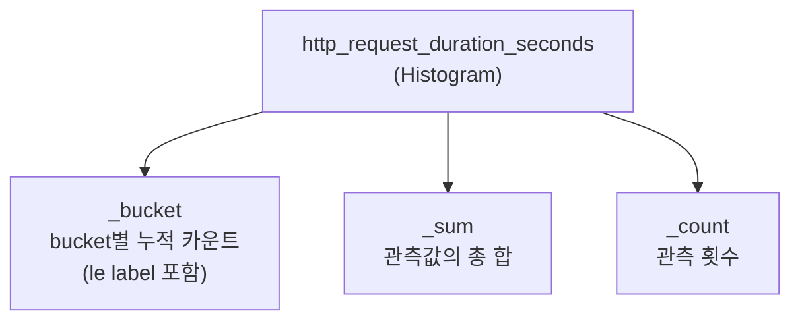
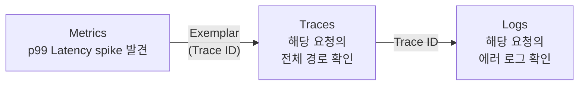
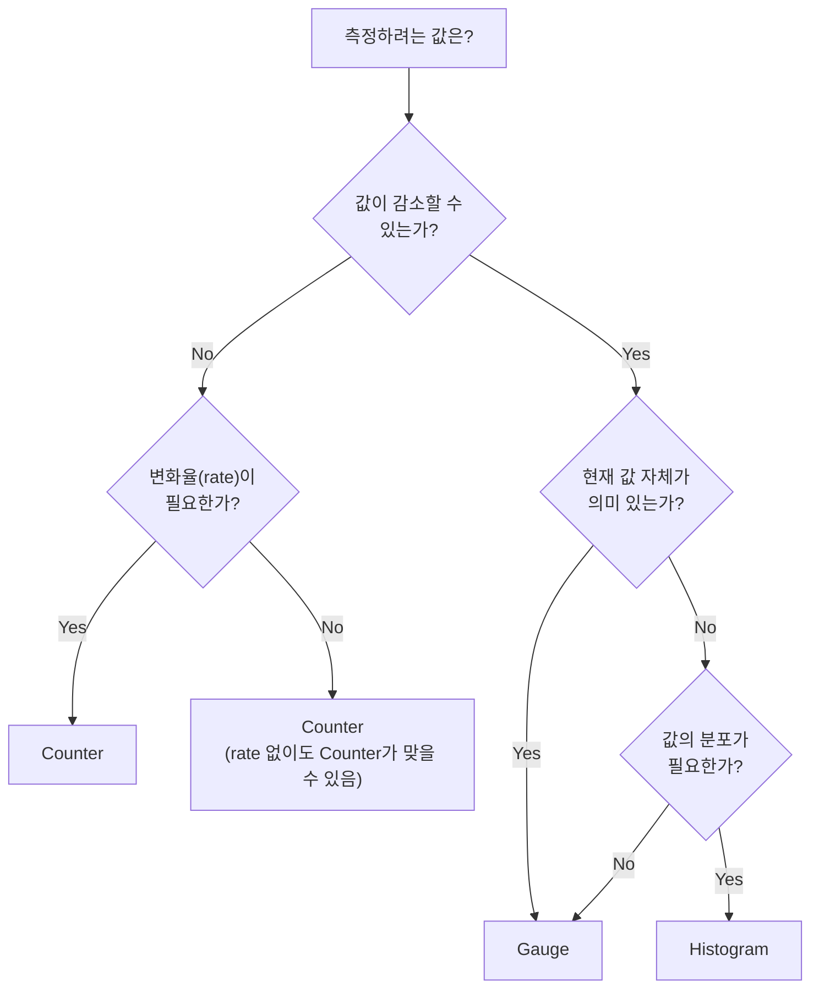

# 5장. 메트릭 타입

## 학습 목표

- Counter, Gauge, Histogram, Summary 4가지 메트릭 타입의 동작 원리를 이해한다
- 상황에 맞는 메트릭 타입을 선택할 수 있다
- Histogram의 bucket 설계와 `histogram_quantile` 함수의 원리를 안다
- Native Histogram과 Exemplar의 개념을 이해한다

---

## 5.1 Counter

**단조 증가(monotonically increasing)하는 누적값이다.**

Counter는 오직 증가하거나, 프로세스 재시작 시 0으로 리셋된다. 절대 감소하지 않는다. "지금까지 총 몇 번 일어났는가"를 추적한다.

```
# 시간에 따른 Counter 값
t0: http_requests_total = 1000
t1: http_requests_total = 1015    (+15)
t2: http_requests_total = 1042    (+27)
t3: http_requests_total = 0       (프로세스 재시작)
t4: http_requests_total = 23      (+23)
```

### Counter의 핵심: rate()

Counter의 원시값 자체는 의미가 없다. "총 15,234번 요청이 들어왔다"는 정보는 쓸모가 적다. 중요한 것은 **변화율(rate)**이다.

```promql
# 초당 요청 수 (최근 5분 기준)
rate(http_requests_total[5m])

# 5분간 총 증가량
increase(http_requests_total[5m])
```


`rate()`는 Counter 리셋을 자동으로 처리한다. 값이 1042에서 0으로 떨어져도, rate()는 이를 프로세스 재시작으로 인식하고 올바른 변화율을 계산한다.


### Counter 사용 예시

```
http_requests_total{method="GET", status="200"}
http_request_duration_seconds_sum                # 요청 처리 시간의 누적 합
errors_total{type="timeout"}
process_cpu_seconds_total                        # CPU 사용 시간 누적
network_receive_bytes_total                      # 수신 바이트 누적
```

### Counter를 써야 하는 경우

- 요청 수, 에러 수, 바이트 전송량 등 **누적되는 값**
- `rate()`로 "초당 몇 건"을 계산하고 싶을 때
- 값이 절대 감소하지 않을 때

---

## 5.2 Gauge

**임의로 증가하거나 감소하는 현재 값이다.**

Gauge는 특정 시점의 스냅샷이다. 온도계처럼 현재 상태를 나타낸다.

```
# 시간에 따른 Gauge 값
t0: temperature_celsius = 42.5
t1: temperature_celsius = 43.1    (증가)
t2: temperature_celsius = 41.8    (감소)
t3: temperature_celsius = 42.0    (증가)
```

### Gauge 사용 예시

```
node_memory_MemAvailable_bytes     # 현재 가용 메모리
http_active_requests               # 현재 처리 중인 요청 수
go_goroutines                      # 현재 고루틴 수
kube_pod_status_ready              # Pod가 Ready 상태인지 (0 or 1)
queue_length                       # 현재 큐 길이
```

### Gauge에 유용한 함수

```promql
# 현재 값 그대로 사용
node_memory_MemAvailable_bytes

# 지난 1시간 동안의 최댓값
max_over_time(http_active_requests[1h])

# 지난 1시간 동안의 변화량 (delta)
delta(temperature_celsius[1h])

# 선형 회귀 기반 예측: 4시간 후 디스크 사용량
predict_linear(node_filesystem_avail_bytes[6h], 4*3600)
```


Gauge에 `rate()`를 사용하면 안 된다. `rate()`는 Counter 전용이다. Gauge의 변화율을 보려면 `deriv()`나 `delta()`를 사용한다.


---

## 5.3 Counter vs Gauge 구분법




| 질문 | Counter | Gauge |
|------|---------|-------|
| 값이 감소할 수 있는가? | ❌ No | ✅ Yes |
| `rate()`로 변화율을 볼 것인가? | ✅ Yes | ❌ No |
| 프로세스 재시작 시 0이 되는가? | ✅ Yes | 의미 없음 |
| "현재 상태"를 나타내는가? | ❌ No | ✅ Yes |
| "지금까지 총 몇 번"을 세는가? | ✅ Yes | ❌ No |




| 메트릭 | 타입 | 이유 |
|--------|------|------|
| 총 요청 수 | **Counter** | 누적, 감소 없음 |
| 현재 활성 연결 수 | **Gauge** | 증감 가능 |
| 총 에러 수 | **Counter** | 누적, 감소 없음 |
| CPU 사용률 | **Gauge** | 현재 값, 증감 가능 |
| 총 전송 바이트 | **Counter** | 누적 |
| 큐 대기 메시지 수 | **Gauge** | 현재 값, 증감 가능 |
| 프로세스 시작 시각 | **Gauge** | 특정 시점의 값 (unix timestamp) |




---

## 5.4 Histogram

**값의 분포를 측정한다.** 요청 응답 시간, 응답 크기 등 "값이 어떤 범위에 얼마나 분포하는가"를 알고 싶을 때 사용한다.

### 동작 원리

Histogram은 미리 정의된 **bucket(구간)**에 관측값을 분류한다.

```
# bucket 정의: 50ms, 100ms, 200ms, 500ms, 1s, +Inf
# 요청 10개: 45ms, 82ms, 95ms, 150ms, 210ms, 310ms, 480ms, 520ms, 890ms, 1200ms

http_request_duration_seconds_bucket{le="0.05"}   = 1   (45ms)
http_request_duration_seconds_bucket{le="0.1"}    = 3   (45, 82, 95ms)
http_request_duration_seconds_bucket{le="0.2"}    = 4   (+ 150ms)
http_request_duration_seconds_bucket{le="0.5"}    = 7   (+ 210, 310, 480ms)
http_request_duration_seconds_bucket{le="1"}      = 9   (+ 520, 890ms)
http_request_duration_seconds_bucket{le="+Inf"}   = 10  (+ 1200ms)
http_request_duration_seconds_sum                  = 4.002  (전체 합)
http_request_duration_seconds_count                = 10     (전체 개수)
```


bucket은 **누적(cumulative)**이다. `le="0.1"`은 "0.1초 이하인 요청 수"이며, `le="0.05"` 값을 포함한다. 이것이 `histogram_quantile()` 함수가 동작하는 핵심 원리다.


### Histogram이 자동 생성하는 시계열

하나의 Histogram 메트릭은 3종류의 시계열을 생성한다:



| 시계열 | 용도 |
|--------|------|
| `_bucket{le="..."}` | 백분위 계산 (`histogram_quantile`) |
| `_sum` | 평균 계산 (`_sum / _count`) |
| `_count` | 요청 수 = Counter와 동일 (`rate(_count)`) |

### histogram_quantile 함수

```promql
# p99 응답 시간
histogram_quantile(0.99, rate(http_request_duration_seconds_bucket[5m]))

# p50 (중앙값) 응답 시간
histogram_quantile(0.5, rate(http_request_duration_seconds_bucket[5m]))

# 평균 응답 시간
rate(http_request_duration_seconds_sum[5m])
/
rate(http_request_duration_seconds_count[5m])
```

### Bucket 설계

bucket을 어떻게 설정하느냐에 따라 quantile의 정확도가 달라진다.




Prometheus 클라이언트의 기본값:

```
{.005, .01, .025, .05, .1, .25, .5, 1, 2.5, 5, 10}
```

범용적이지만, 특정 서비스에는 맞지 않을 수 있다.




대부분의 HTTP API는 10ms~5s 범위:

```
{.01, .025, .05, .1, .25, .5, 1, 2.5, 5}
```

SLO가 "99%의 요청이 300ms 이내"라면, 300ms 부근에 bucket을 촘촘하게 배치한다:

```
{.05, .1, .15, .2, .25, .3, .4, .5, 1, 2, 5}
```




배치 작업은 초~분 단위:

```
{1, 5, 10, 30, 60, 120, 300, 600}
```





**bucket 수 = 시계열 수**다. bucket이 15개면 하나의 Histogram 메트릭이 `_bucket` × 15 + `_sum` + `_count` = 17개의 시계열을 생성한다. Label과 조합되면 Cardinality가 급증할 수 있다.


---

## 5.5 Summary

**Histogram과 비슷하지만, 클라이언트 측에서 직접 quantile을 계산한다.**

```
# Summary가 직접 계산한 quantile
http_request_duration_seconds{quantile="0.5"}   = 0.12
http_request_duration_seconds{quantile="0.9"}   = 0.35
http_request_duration_seconds{quantile="0.99"}  = 0.89
http_request_duration_seconds_sum               = 4.002
http_request_duration_seconds_count             = 10
```

### Histogram vs Summary

| 구분 | Histogram | Summary |
|------|-----------|---------|
| **quantile 계산** | 서버(Prometheus)에서 근사 계산 | 클라이언트에서 정확 계산 |
| **집계 가능** | ✅ 여러 인스턴스 합산 가능 | ❌ quantile은 합산 불가 |
| **Cardinality** | bucket 수에 비례 | quantile 수에 비례 |
| **설정** | bucket 경계 사전 정의 | quantile + 허용 오차 정의 |
| **클라이언트 비용** | 낮음 (bucket 카운트만) | 높음 (sliding window 유지) |


**거의 항상 Histogram을 사용한다.** Summary의 가장 큰 단점은 여러 인스턴스의 quantile을 합산할 수 없다는 것이다. Pod가 3개인 서비스의 "전체 p99"를 구하려면 Histogram이 필수다. Summary는 레거시 코드나 특수한 경우에만 사용한다.


---

## 5.6 Native Histogram

**Prometheus 2.40에서 실험적으로 도입된 차세대 Histogram이다.**

기존 Histogram의 가장 큰 문제인 **bucket 수 × Cardinality = 시계열 폭발**을 해결한다.

### 기존 Histogram의 문제

```
# bucket 10개 × method 4개 × status 5개 × path 20개
= 10 × 4 × 5 × 20 = 4,000개 시계열 (하나의 메트릭에서!)
```

### Native Histogram의 해결

Native Histogram은 bucket 경계를 사전 정의하지 않고, **지수적(exponential) bucket**을 자동으로 사용한다. 하나의 시계열에 전체 분포 정보가 담긴다.




```
_bucket{le="0.1"}  = 523     # 시계열 1
_bucket{le="0.5"}  = 1204    # 시계열 2
_bucket{le="1.0"}  = 1587    # 시계열 3
_bucket{le="+Inf"} = 1612    # 시계열 4
_sum               = 892.3   # 시계열 5
_count             = 1612    # 시계열 6
→ 6개의 시계열
```




```
http_request_duration_seconds = <단일 시계열에 전체 분포 인코딩>
→ 1개의 시계열
```

- bucket 수에 관계없이 1개의 시계열
- 분포의 정밀도를 동적으로 조절
- 저장 효율이 크게 향상





Native Histogram은 아직 실험적(experimental) 기능이다. 프로덕션 사용 전에 Prometheus 버전과 호환성을 확인해야 한다. Grafana의 시각화 지원도 지속적으로 개선되고 있다.


---

## 5.7 Exemplar

**Exemplar는 메트릭 데이터 포인트에 Trace ID를 연결하는 메커니즘이다.**

메트릭에서 이상을 발견했을 때, 해당 데이터 포인트를 만든 구체적인 요청의 Trace로 바로 이동할 수 있다.



### Exemplar 동작

```
# 일반 Histogram bucket
http_request_duration_seconds_bucket{le="1.0"} = 1587

# Exemplar가 포함된 bucket
http_request_duration_seconds_bucket{le="1.0"} = 1587
  # Exemplar: {trace_id="abc123"} 0.89 1718265615.000
  #           → trace_id abc123인 요청이 0.89초 걸렸다
```

Grafana에서 Histogram 패널의 데이터 포인트 위에 Exemplar를 점으로 표시한다. 해당 점을 클릭하면 Tempo(Trace 백엔드)로 이동하여 전체 Trace를 볼 수 있다.


Exemplar는 Metrics → Traces를 연결하는 핵심 메커니즘이다. [1장](../part1/1.관측성이란-무엇인가.md)에서 다룬 Three Pillars의 Correlation을 실현하는 구체적인 기술이다. 자세한 내용은 [73장 Exemplar](../part15/73.Exemplar.md)에서 다룬다.


---

## 5.8 메트릭 타입 선택 가이드



### 빠른 참조표

| 측정 대상 | 타입 | 이유 |
|----------|------|------|
| HTTP 요청 수 | **Counter** | 누적, rate()로 RPS 계산 |
| HTTP 응답 시간 | **Histogram** | 분포(p50, p99) 필요 |
| 현재 활성 요청 수 | **Gauge** | 증감 가능, 현재 값 |
| 에러 발생 수 | **Counter** | 누적, rate()로 에러율 계산 |
| CPU 사용률 | **Gauge** | 현재 값, 증감 가능 |
| 응답 크기 | **Histogram** | 분포 확인 필요 |
| 큐 메시지 수 | **Gauge** | 현재 값, 증감 가능 |
| DB 쿼리 시간 | **Histogram** | 분포(p50, p99) 필요 |
| GC 횟수 | **Counter** | 누적 |
| GC 소요 시간 | **Histogram** | 분포 필요 |

---

## 핵심 정리

1. **Counter**: 단조 증가하는 누적값. `rate()`로 변화율을 계산한다. 절대 감소하지 않는 값에만 사용한다.

2. **Gauge**: 증감 가능한 현재 값. 메모리 사용량, 활성 연결 수 등 스냅샷에 사용한다.

3. **Histogram**: 값의 분포를 bucket으로 측정한다. `histogram_quantile()`로 백분위를 계산한다. bucket 수가 Cardinality에 직접 영향을 준다.

4. **Summary**: 클라이언트에서 quantile을 직접 계산한다. 여러 인스턴스 합산이 불가하므로 대부분 Histogram을 사용한다.

5. **Native Histogram**: bucket 수에 관계없이 1개 시계열. Cardinality 문제를 근본적으로 해결한다.

6. **Exemplar**: Metrics에서 Traces로의 연결 고리. Histogram 데이터 포인트에 Trace ID를 첨부한다.

---

## 다음 장 예고

[6장](6.애플리케이션-계측.md)에서는 **애플리케이션 계측**을 다룬다. 4장과 5장에서 배운 메트릭 설계와 타입을 실제 코드에 적용하는 방법 — 계측 전략, 비즈니스 메트릭, 시스템 메트릭, 프론트엔드 메트릭 — 을 학습한다.
