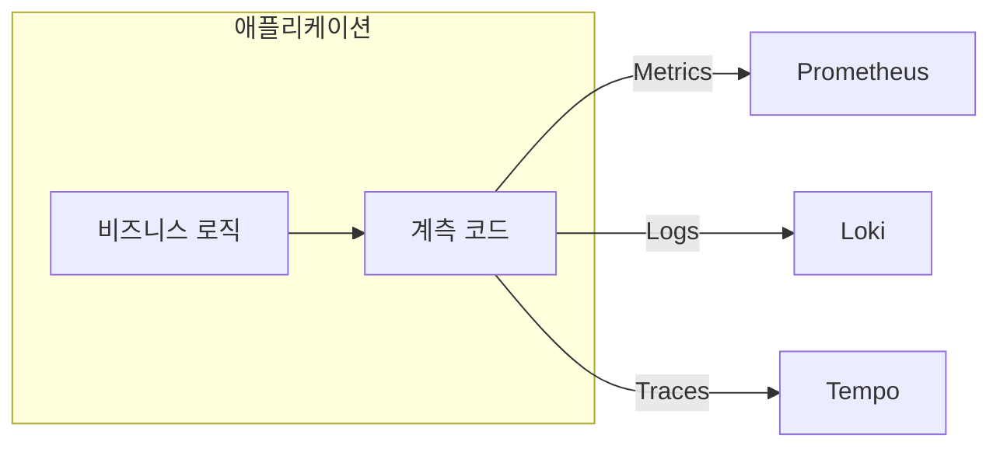
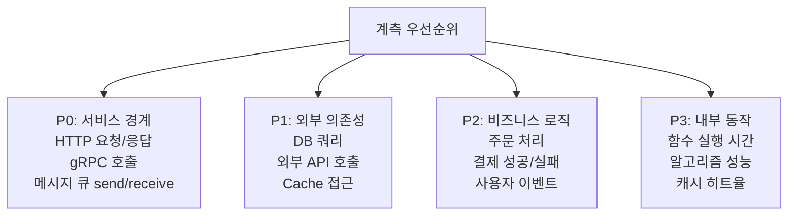
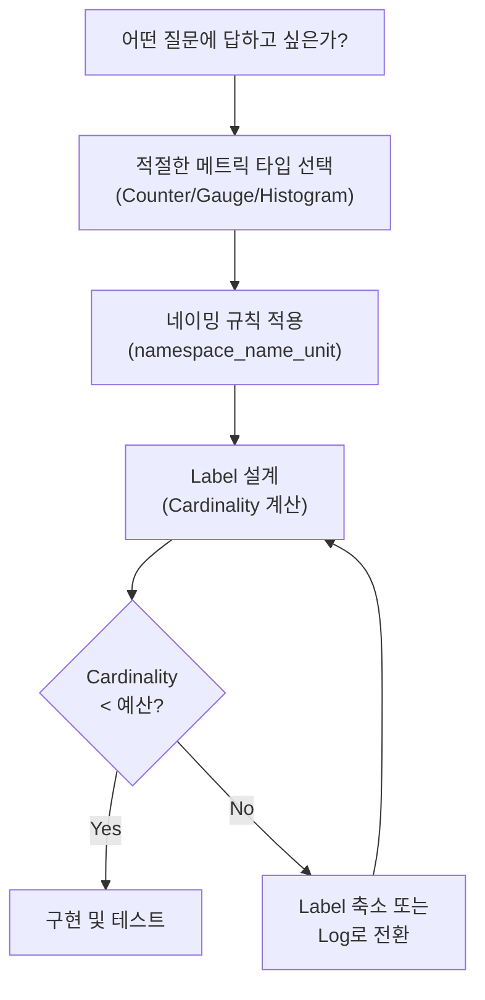

# 6장. 애플리케이션 계측

## 학습 목표

- 계측(Instrumentation)의 전략과 접근 방식을 이해한다
- 비즈니스 메트릭, 시스템 메트릭, 커스텀 메트릭의 설계와 구현 방법을 안다
- 프론트엔드 메트릭의 특성과 수집 방법을 이해한다
- 과도한 계측과 부족한 계측 사이의 균형을 잡을 수 있다

---

## 6.1 계측이란

**계측(Instrumentation)**은 애플리케이션 코드에 관측 데이터를 수집하는 코드를 삽입하는 행위다. 관측성의 모든 데이터는 결국 계측에서 시작된다.



### 계측의 두 가지 방식




프레임워크나 라이브러리가 자동으로 메트릭, 로그, 트레이스를 생성한다. 코드 변경 없이(또는 최소한의 설정으로) 기본적인 관측 데이터를 수집할 수 있다.

**장점:**
- 빠른 도입 (코드 변경 최소)
- 표준화된 메트릭 (Semantic Convention 준수)
- 유지보수 부담 적음

**단점:**
- 비즈니스 로직에 특화된 메트릭 수집 불가
- 블랙박스: 내부 동작을 세밀하게 제어하기 어려움
- 불필요한 데이터도 수집될 수 있음

**예시:**
- OpenTelemetry Auto Instrumentation
- Prometheus 클라이언트의 기본 프로세스 메트릭
- Spring Boot Actuator




개발자가 직접 코드에 계측 코드를 작성한다. 비즈니스 로직에 맞는 정밀한 관측 데이터를 수집할 수 있다.

**장점:**
- 비즈니스 메트릭 수집 가능
- 필요한 데이터만 정밀하게 수집
- 커스텀 Span, Label 설계 가능

**단점:**
- 개발 시간 필요
- 코드 침투성이 높음 (비즈니스 로직에 계측 코드가 섞임)
- 표준에서 벗어날 위험

**예시:**
```typescript
orderCounter.inc({ status, payment_method: paymentMethod });
```





**실전 전략**: Auto Instrumentation으로 기본 메트릭(HTTP, DB, Runtime)을 확보하고, Manual Instrumentation으로 비즈니스 메트릭을 추가한다. 둘은 대립이 아니라 보완 관계다.


---

## 6.2 계측 전략

### 무엇을 계측할 것인가

모든 것을 계측하면 노이즈만 늘어나고, 너무 적게 계측하면 장애 시 답을 찾을 수 없다. [2장](../part1/2.SRE와-관측성.md)의 RED/USE Method를 기준으로 우선순위를 정한다.



| 우선순위 | 대상 | 이유 |
|---------|------|------|
| **P0** | 서비스 경계 (인바운드/아웃바운드) | RED 메트릭의 기반. 이것 없이는 SLI 측정 불가 |
| **P1** | 외부 의존성 (DB, Cache, 외부 API) | 병목의 80%가 여기서 발생 |
| **P2** | 비즈니스 로직 | 비즈니스 영향을 직접 측정 |
| **P3** | 내부 함수/알고리즘 | 성능 최적화 시에만 필요 |


P0과 P1은 **모든 서비스에 반드시 적용**해야 한다. P2는 비즈니스 중요도에 따라 선택적으로, P3는 성능 이슈가 있을 때만 적용한다. "나중에 추가하지"는 장애 시 후회로 돌아온다.


### 서비스 경계 계측 (P0)

서비스의 인바운드(들어오는 요청)와 아웃바운드(나가는 요청) 경계에서 RED 메트릭을 수집한다.

```typescript
import { Counter, Histogram, Registry } from 'prom-client';

const register = new Registry();

const httpRequestsTotal = new Counter({
  name: 'http_requests_total',
  help: 'Total number of HTTP requests',
  labelNames: ['method', 'status', 'path'],
  registers: [register],
});

const httpRequestDuration = new Histogram({
  name: 'http_request_duration_seconds',
  help: 'HTTP request duration in seconds',
  labelNames: ['method', 'path'],
  buckets: [0.01, 0.025, 0.05, 0.1, 0.25, 0.5, 1, 2.5, 5],
  registers: [register],
});

// Express middleware
function metricsMiddleware(req, res, next) {
  const start = process.hrtime.bigint();

  res.on('finish', () => {
    const duration = Number(process.hrtime.bigint() - start) / 1e9;
    const path = normalizePath(req.route?.path || req.path);

    httpRequestsTotal.inc({
      method: req.method,
      status: res.statusCode.toString(),
      path,
    });
    httpRequestDuration.observe({ method: req.method, path }, duration);
  });

  next();
}
```

---

## 6.3 비즈니스 메트릭

비즈니스 메트릭은 기술 지표가 아닌 **비즈니스 성과**를 직접 측정한다. SRE와 개발팀이 "서비스가 정상인가?"를 판단하는 가장 직접적인 지표다.

### 이커머스 예시

```typescript
import { Counter, Histogram, Registry } from 'prom-client';

const register = new Registry();

const orderTotal = new Counter({
  name: 'order_completed_total',
  help: 'Total completed orders',
  labelNames: ['payment_method', 'status'], // "success", "failed"
  registers: [register],
});

const orderAmount = new Histogram({
  name: 'order_amount_krw',
  help: 'Order amount in KRW',
  labelNames: ['payment_method'],
  buckets: [5000, 10000, 30000, 50000, 100000, 300000, 500000, 1000000],
  registers: [register],
});

const cartSize = new Histogram({
  name: 'cart_items_count',
  help: 'Number of items in cart at checkout',
  buckets: [1, 2, 3, 5, 10, 20],
  registers: [register],
});

interface Order {
  paymentMethod: string;
  amount: number;
  items: unknown[];
}

async function processOrder(order: Order): Promise<void> {
  // 비즈니스 로직...

  try {
    // ... 주문 처리
    orderTotal.inc({ payment_method: order.paymentMethod, status: 'success' });
    orderAmount.observe({ payment_method: order.paymentMethod }, order.amount);
    cartSize.observe(order.items.length);
  } catch (err) {
    orderTotal.inc({ payment_method: order.paymentMethod, status: 'failed' });
    throw err;
  }
}
```

### 비즈니스 메트릭 설계 팁

| 메트릭 | 타입 | Label | 활용 |
|--------|------|-------|------|
| `order_completed_total` | Counter | payment_method, status | 주문 성공률, 결제 수단별 비교 |
| `order_amount_krw` | Histogram | payment_method | 주문 금액 분포, 평균 주문 금액 |
| `user_signup_total` | Counter | channel | 채널별 가입 전환율 |
| `search_results_count` | Histogram | category | 검색 결과 수 분포 (0이면 검색 실패) |
| `payment_processing_duration_seconds` | Histogram | provider | PG사별 결제 처리 시간 |


비즈니스 메트릭은 **PM, 경영진과 함께 설계**하는 것이 이상적이다. "어떤 숫자를 보고 의사결정을 하시나요?"라는 질문에서 시작하면 좋은 비즈니스 메트릭이 나온다.


---

## 6.4 시스템 메트릭

시스템 메트릭은 애플리케이션의 런타임 상태를 나타낸다. 대부분 Auto Instrumentation으로 수집 가능하다.

### Runtime 메트릭

`prom-client`의 `collectDefaultMetrics()`로 수집:

```typescript
import { collectDefaultMetrics, Registry } from 'prom-client';

const register = new Registry();
collectDefaultMetrics({ register });

// 노출되는 메트릭:
// nodejs_heap_size_total_bytes
// nodejs_heap_size_used_bytes
// nodejs_external_memory_bytes
// nodejs_active_handles_total
// nodejs_active_requests_total
// nodejs_eventloop_lag_seconds
// process_cpu_seconds_total
// process_resident_memory_bytes
```

### 외부 의존성 메트릭

서비스가 의존하는 외부 시스템(DB, Cache, 외부 API)에 대한 메트릭은 장애 원인 파악의 핵심이다.

```typescript
import { Histogram, Gauge, Registry } from 'prom-client';

const register = new Registry();

const dbQueryDuration = new Histogram({
  name: 'db_query_duration_seconds',
  help: 'Database query duration',
  labelNames: ['operation', 'table'], // operation: select, insert, update, delete
  buckets: [0.001, 0.005, 0.01, 0.025, 0.05, 0.1, 0.25, 0.5, 1],
  registers: [register],
});

const dbConnectionPoolSize = new Gauge({
  name: 'db_connection_pool_size',
  help: 'Current DB connection pool status',
  labelNames: ['state'], // active, idle, waiting
  registers: [register],
});

const externalAPIRequestDuration = new Histogram({
  name: 'external_api_request_duration_seconds',
  help: 'External API call duration',
  labelNames: ['service', 'endpoint', 'status'],
  buckets: [0.05, 0.1, 0.25, 0.5, 1, 2.5, 5, 10],
  registers: [register],
});
```


**DB connection pool 메트릭을 반드시 수집하라.** 실무 장애의 상당 수가 connection pool 고갈에서 발생한다. active, idle, waiting 상태를 Gauge로 추적하고, waiting이 0보다 크면 알림을 설정해야 한다.


---

## 6.5 커스텀 메트릭

표준 메트릭으로 커버되지 않는 서비스 고유의 동작을 측정한다.

### 설계 프로세스



### 커스텀 메트릭 예시: 캐시

```typescript
import { Counter, Gauge, Histogram, Registry } from 'prom-client';

const register = new Registry();

const cacheOperations = new Counter({
  name: 'cache_operations_total',
  help: 'Total cache operations',
  labelNames: ['operation', 'result'], // operation: get/set/delete, result: hit/miss/error
  registers: [register],
});

const cacheItemCount = new Gauge({
  name: 'cache_items_current',
  help: 'Current number of items in cache',
  registers: [register],
});

const cacheTTLRemaining = new Histogram({
  name: 'cache_ttl_remaining_seconds',
  help: 'Remaining TTL of accessed cache items',
  buckets: [0, 1, 5, 10, 30, 60, 300, 600, 3600],
  registers: [register],
});
```

활용할 수 있는 PromQL:

```promql
# 캐시 히트율
sum(rate(cache_operations_total{result="hit"}[5m]))
/
sum(rate(cache_operations_total{operation="get"}[5m]))

# 캐시 미스율 추세 (히트율의 반대)
1 - (
  sum(rate(cache_operations_total{result="hit"}[5m]))
  /
  sum(rate(cache_operations_total{operation="get"}[5m]))
)
```

---

## 6.6 프론트엔드 메트릭

프론트엔드 메트릭은 **실제 사용자가 체감하는 성능**을 측정한다. 백엔드 메트릭만으로는 "서버 응답은 50ms인데 페이지 로딩이 3초 걸린다"는 문제를 파악할 수 없다.

### Web Vitals

Google이 정의한 사용자 경험의 핵심 지표다:

| 지표 | 의미 | 좋은 값 | 나쁜 값 |
|------|------|---------|---------|
| **LCP** (Largest Contentful Paint) | 가장 큰 콘텐츠가 렌더링되는 시간 | < 2.5s | > 4.0s |
| **INP** (Interaction to Next Paint) | 사용자 상호작용 후 화면 반응 시간 | < 200ms | > 500ms |
| **CLS** (Cumulative Layout Shift) | 레이아웃이 얼마나 불안정하게 이동하는가 | < 0.1 | > 0.25 |

### 프론트엔드 메트릭 수집

```typescript
// Web Vitals 수집 → OpenTelemetry로 전송
import { onLCP, onINP, onCLS } from 'web-vitals';

function sendMetric(metric) {
  // OpenTelemetry Collector로 전송
  const attributes = {
    'metric.name': metric.name,
    'metric.value': metric.value,
    'metric.rating': metric.rating,  // "good", "needs-improvement", "poor"
    'page.url': window.location.pathname,
    'user_agent.browser': getBrowser(),
  };

  // OTLP로 전송하거나 /metrics 엔드포인트로 POST
  fetch('/api/metrics', {
    method: 'POST',
    body: JSON.stringify(attributes),
  });
}

onLCP(sendMetric);
onINP(sendMetric);
onCLS(sendMetric);
```

### 프론트엔드 메트릭의 특성


프론트엔드 메트릭은 백엔드 메트릭과 근본적으로 다르다:

- **수집 환경이 통제 불가**: 사용자의 네트워크, 디바이스, 브라우저가 모두 다르다
- **Sampling이 필수**: 모든 페이지뷰의 메트릭을 수집하면 비용이 폭발한다
- **Outlier가 정상**: 3G 네트워크의 LCP 10초는 버그가 아니라 환경의 한계다
- **RUM(Real User Monitoring)과 Synthetic의 구분**: RUM은 실제 사용자, Synthetic은 제어된 환경


프론트엔드 Observability는 [Part 7](../part7/29.Browser-Instrumentation.md)에서 상세히 다룬다.

---

## 6.7 계측의 균형

### 과도한 계측의 증상

- 시계열 수가 통제 불능으로 증가
- Prometheus 메모리 사용량이 지속적으로 증가
- 대시보드에 패널이 수십 개이지만 실제로 보는 것은 3~4개
- 알림이 너무 많아 무시하기 시작 (Alert Fatigue)

### 부족한 계측의 증상

- 장애 발생 시 "원인을 모르겠다"가 자주 나옴
- Postmortem에서 "이 메트릭이 있었으면 더 빨리 찾았을 텐데"가 반복
- 서비스 경계의 에러율이나 응답 시간을 모름
- DB 쿼리 시간을 측정하지 않아 느린 쿼리를 발견하지 못함

### 균형 잡기 체크리스트

| 항목 | 있는가? |
|------|---------|
| 모든 인바운드 HTTP/gRPC의 Rate, Errors, Duration | ☐ |
| 모든 외부 의존성(DB, Cache, API)의 Duration과 Error | ☐ |
| Connection Pool 상태 (active, idle, waiting) | ☐ |
| 핵심 비즈니스 이벤트 (주문, 결제, 가입) | ☐ |
| Runtime 메트릭 (메모리, GC, Goroutine/Thread) | ☐ |
| 프론트엔드 Web Vitals (LCP, INP, CLS) | ☐ |


위 체크리스트를 모두 충족하면 대부분의 장애를 30분 이내에 원인까지 파악할 수 있다. 이것이 **Level 2~3 관측성 성숙도**의 기본 요건이다.


---

## 핵심 정리

1. **Auto Instrumentation**으로 기본 메트릭을 확보하고, **Manual Instrumentation**으로 비즈니스 메트릭을 추가한다.

2. **계측 우선순위**: P0(서비스 경계) → P1(외부 의존성) → P2(비즈니스 로직) → P3(내부 동작).

3. **비즈니스 메트릭**은 PM/경영진과 함께 설계한다. "어떤 숫자로 의사결정하나?"가 출발점이다.

4. **DB connection pool 메트릭**은 반드시 수집한다. 실무 장애의 상당수가 여기서 발생한다.

5. **프론트엔드 메트릭**(Web Vitals)은 백엔드 메트릭으로 대체할 수 없다. 사용자 체감 성능을 직접 측정해야 한다.

6. **과도한 계측도 부족한 계측도 문제**다. RED/USE를 기준으로 필요한 것만 정확하게 계측한다.

---

## 다음 장 예고

[7장](../part3/7.Prometheus-아키텍처.md)에서는 **Prometheus 아키텍처**를 다룬다. 지금까지 설계하고 구현한 메트릭을 실제로 수집, 저장, 쿼리하는 Prometheus의 내부 구조 — Scrape Manager, TSDB, Rule Engine, Remote Write — 를 학습한다.
