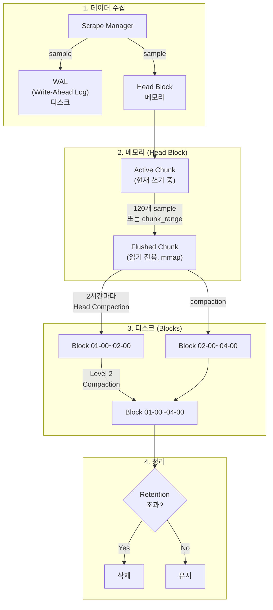
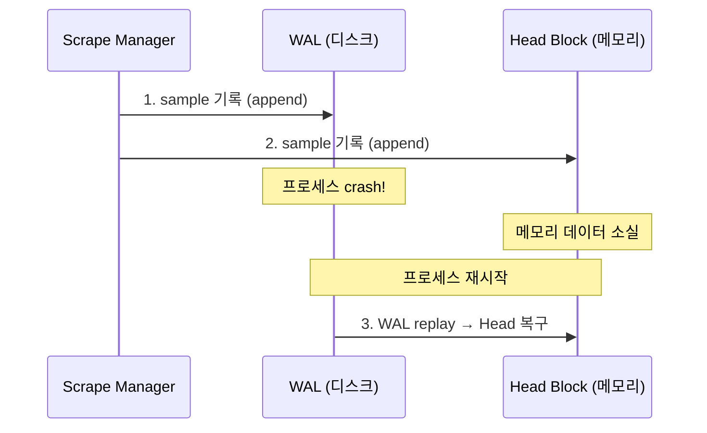
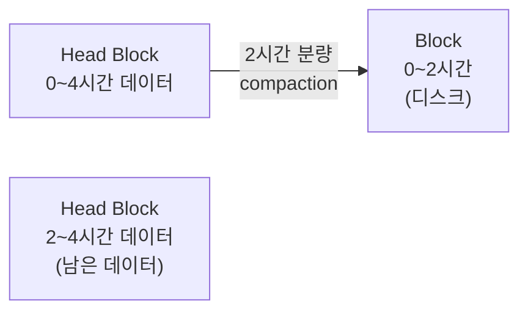
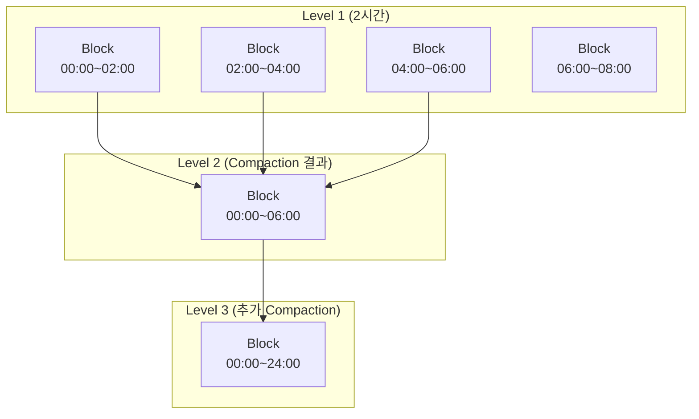
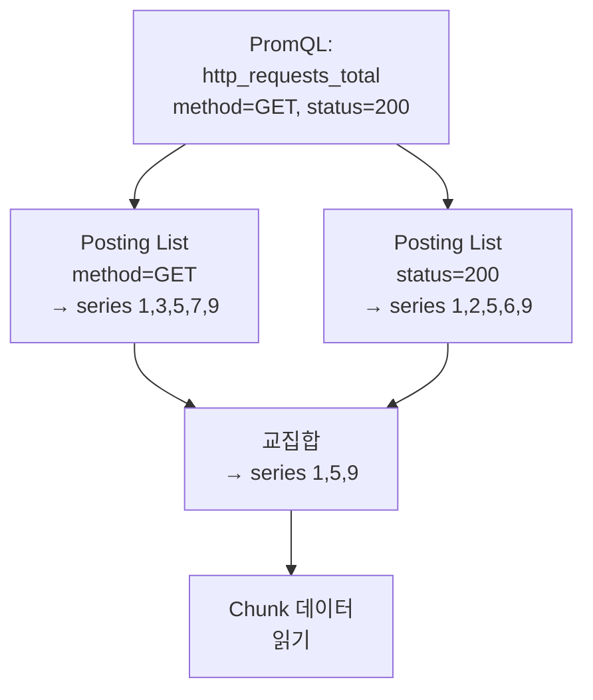

# 10장. TSDB 내부 구조

## 학습 목표

- Prometheus TSDB의 데이터 흐름(Ingestion → Memory → Disk)을 이해한다
- WAL, Head Block, Chunk, Block, Compaction의 역할과 관계를 설명할 수 있다
- Index 구조를 통해 PromQL 쿼리가 어떻게 시계열을 찾는지 안다
- TSDB 상태를 모니터링하고 문제를 진단할 수 있다

---

## 10.1 TSDB 전체 데이터 흐름



---

## 10.2 WAL (Write-Ahead Log)

**WAL은 데이터 유실을 방지하는 복구용 로그다.** 모든 sample은 메모리(Head Block)에 쓰기 전에 먼저 WAL에 기록된다.

### 왜 WAL이 필요한가

Head Block은 메모리에 있으므로 프로세스가 죽으면 데이터가 사라진다. WAL에 먼저 기록해두면 재시작 시 WAL을 replay하여 Head Block을 복구할 수 있다.



### WAL 구조

```
data/
└── wal/
    ├── 00000001    # segment 파일 (128MB)
    ├── 00000002
    ├── 00000003
    └── checkpoint.00000002/   # checkpoint
        ├── 00000000
        └── 00000001
```

| 구성 요소 | 설명 |
|----------|------|
| **Segment** | 128MB 단위의 순차 기록 파일. 가장 최신 segment만 쓰기 가능 |
| **Checkpoint** | Head Block에서 이미 디스크 Block으로 flush된 데이터의 WAL을 정리한 것. 재시작 시 replay 시간을 줄인다 |

### 실습: WAL 확인

```bash
# WAL 디렉토리 확인
docker exec prometheus ls -la /prometheus/wal/

# WAL 크기 확인
docker exec prometheus du -sh /prometheus/wal/
```


WAL 크기가 비정상적으로 클 경우 (수 GB 이상), checkpoint가 제대로 동작하지 않고 있을 수 있다. 이 경우 Prometheus 재시작 시 WAL replay에 수 분이 걸릴 수 있다.


---

## 10.3 Head Block

**Head Block은 최근 데이터를 메모리에 보관하는 구조다.** 모든 쓰기와 최신 데이터 쿼리가 여기서 이루어진다.

### Chunk

Head Block 내의 각 시계열은 **Chunk**라는 단위로 데이터를 저장한다.

```
시계열: http_requests_total{method="GET", status="200"}

  Active Chunk (메모리, 쓰기 가능)
  ┌─────────────────────────────────────┐
  │ t=100:v=1523, t=115:v=1541, ...     │  ← 현재 쓰기 중
  └─────────────────────────────────────┘

  Flushed Chunks (mmap, 읽기 전용)
  ┌─────────────────────────────────────┐
  │ t=0:v=0, t=15:v=12, ... t=7200:v=.. │  ← 이전 chunk
  └─────────────────────────────────────┘
```

| 상태 | 위치 | 접근 방식 |
|------|------|----------|
| **Active Chunk** | 순수 메모리 (heap) | 직접 읽기/쓰기 |
| **Flushed Chunk** | 디스크 + mmap | OS가 필요 시 메모리에 로드 |

하나의 Chunk는 최대 **120개의 sample** 또는 설정된 시간 범위(기본 2시간 내)를 담는다. Chunk가 가득 차면 Flushed 상태로 전환되고 새 Active Chunk가 생성된다.

### Head Compaction

Head Block의 데이터가 2시간 분량에 도달하면, **Head Compaction**이 발생한다:



1. 0~2시간 범위의 Flushed Chunk를 디스크 Block으로 기록
2. 해당 범위의 WAL checkpoint 생성
3. Head Block에는 2~4시간 범위의 데이터만 남음

### 실습: Head Block 상태 확인

```promql
# 현재 Head Block의 시계열 수
prometheus_tsdb_head_series

# Head Block의 chunk 수
prometheus_tsdb_head_chunks

# Head Block이 사용하는 메모리 (bytes)
prometheus_tsdb_head_chunks_storage_size_bytes

# 초당 수집 sample 수
rate(prometheus_tsdb_head_samples_appended_total[5m])

# Head Block의 시간 범위 (min/max timestamp)
prometheus_tsdb_head_min_time
prometheus_tsdb_head_max_time
```


**메모리 사용량 추정**: Head Block의 메모리 ≈ 활성 시계열 수 × 시계열당 약 1~4KB. 100만 시계열이면 약 1~4GB. 이 값은 `prometheus_tsdb_head_chunks_storage_size_bytes`로 정확히 확인할 수 있다.


---

## 10.4 Block

**Block은 디스크에 저장되는 불변(immutable) 데이터 단위다.** 한번 기록되면 수정되지 않으며, Compaction에 의해 다른 Block과 합쳐질 수 있다.

### Block 디렉토리 구조

```
data/
├── 01HQRS...  (Block ID = ULID)
│   ├── meta.json       # 블록 메타데이터 (시간 범위, 시계열 수 등)
│   ├── index           # Label → 시계열 매핑 인덱스
│   ├── chunks/
│   │   ├── 000001      # 압축된 시계열 데이터
│   │   └── 000002
│   └── tombstones      # 삭제 표시 (delete API 사용 시)
├── 01HQRT...
│   ├── meta.json
│   ├── index
│   ├── chunks/
│   └── tombstones
└── wal/
```

### meta.json 예시

```json
{
  "ulid": "01HQRS4BGQZ8RJXG9P3XCKN3HV",
  "minTime": 1718236800000,
  "maxTime": 1718244000000,
  "stats": {
    "numSamples": 15234567,
    "numSeries": 85432,
    "numChunks": 256789
  },
  "compaction": {
    "level": 1,
    "sources": ["01HQRS4BGQZ8RJXG9P3XCKN3HV"]
  },
  "version": 1
}
```

### 실습: Block 확인

```bash
# Block 디렉토리 목록
docker exec prometheus ls -la /prometheus/

# 특정 Block의 메타데이터 확인
docker exec prometheus cat /prometheus/01HQRS.../meta.json | python3 -m json.tool

# Block별 크기 확인
docker exec prometheus du -sh /prometheus/01*/
```

```promql
# 현재 Block 수
prometheus_tsdb_blocks_loaded

# 전체 저장 크기
prometheus_tsdb_storage_blocks_bytes
```

---

## 10.5 Compaction

**Compaction은 작은 Block들을 합쳐 더 큰 Block으로 만드는 과정이다.** 쿼리 효율을 높이고 중복을 제거한다.



### Compaction의 효과

| 효과 | 설명 |
|------|------|
| **쿼리 성능 향상** | 여러 Block을 읽는 대신 하나의 큰 Block만 읽으면 됨 |
| **인덱스 최적화** | 인덱스가 합쳐져 lookup이 빨라짐 |
| **삭제 데이터 정리** | tombstone으로 표시된 데이터가 실제로 제거됨 |
| **저장 공간 절약** | 중복 인덱스 엔트리 제거 |

### Compaction 모니터링

```promql
# Compaction 발생 횟수
prometheus_tsdb_compactions_total

# Compaction 실패 횟수 (0이 아니면 문제)
prometheus_tsdb_compactions_failed_total

# Compaction 소요 시간
prometheus_tsdb_compaction_duration_seconds
```


Compaction은 CPU와 디스크 I/O를 사용한다. 시계열 수가 매우 많은 환경(수백만)에서는 Compaction이 수 분간 성능에 영향을 줄 수 있다. `prometheus_tsdb_compaction_duration_seconds`를 모니터링하여 비정상적으로 긴 Compaction을 감지한다.


---

## 10.6 Index 구조

**Index는 Label 조합으로 시계열을 빠르게 찾기 위한 역인덱스(Inverted Index)**다.

### 역인덱스 동작 원리

```
PromQL: http_requests_total{method="GET", status="200"}

Step 1: "method=GET"에 해당하는 시계열 ID 집합
  → {1, 3, 5, 7, 9, 11, ...}

Step 2: "status=200"에 해당하는 시계열 ID 집합
  → {1, 2, 5, 6, 9, 10, ...}

Step 3: 교집합 (AND)
  → {1, 5, 9, ...}

Step 4: 해당 시계열의 Chunk 데이터 읽기
```



### Index 구성 요소

| 구성 요소 | 설명 |
|----------|------|
| **Symbol Table** | 모든 Label 이름과 값의 문자열 테이블 (중복 제거) |
| **Posting List** | 각 Label 값 → 해당 시계열 ID 목록 |
| **Series** | 시계열 ID → Label 집합 + Chunk 위치 매핑 |

### Cardinality가 Index에 미치는 영향

Label 값의 가짓수(Cardinality)가 높으면:
- Posting List의 엔트리 수가 증가
- Symbol Table 크기 증가
- 교집합 연산 시 비교할 시계열 수 증가
- **결과적으로 쿼리 속도 저하 + 메모리 사용량 증가**


이것이 [4장](../part2/4.메트릭-설계.md)에서 Cardinality 관리를 강조한 근본적인 이유다. High Cardinality는 단순히 "시계열 수가 많다"가 아니라, **인덱스 크기 증가 → 쿼리 성능 저하 → 메모리 폭발**로 이어지는 연쇄 문제를 일으킨다.


---

## 10.7 실습: TSDB 내부 들여다보기

### Prometheus TSDB CLI 도구

Prometheus는 `promtool`이라는 CLI 도구를 내장하고 있다.

```bash
# TSDB의 Block 정보 확인
docker exec prometheus promtool tsdb list /prometheus

# TSDB 통계
docker exec prometheus promtool tsdb analyze /prometheus
```

### TSDB 상태 API

Prometheus의 HTTP API로도 TSDB 상태를 확인할 수 있다:

```bash
# TSDB 상태 (Head Block 정보, Cardinality 상위 Label 등)
curl -s http://localhost:9090/api/v1/status/tsdb | python3 -m json.tool
```

응답 예시에서 주목할 항목:

```json
{
  "headStats": {
    "numSeries": 856,
    "numLabelPairs": 4523,
    "chunkCount": 12456,
    "minTime": 1718236800000,
    "maxTime": 1718244000000
  },
  "seriesCountByMetricName": [
    { "name": "node_cpu_seconds_total", "value": 64 },
    { "name": "node_network_receive_bytes_total", "value": 12 }
  ],
  "labelValueCountByLabelName": [
    { "name": "__name__", "value": 423 },
    { "name": "cpu", "value": 8 }
  ],
  "seriesCountByLabelValuePair": [
    { "name": "job=node-exporter", "value": 800 }
  ]
}
```

### TSDB 메트릭 대시보드 쿼리

Grafana에서 다음 PromQL로 TSDB 모니터링 패널을 만들어보자:

```promql
# 시계열 수 추이
prometheus_tsdb_head_series

# 초당 수집 속도
rate(prometheus_tsdb_head_samples_appended_total[5m])

# Head Block 메모리
prometheus_tsdb_head_chunks_storage_size_bytes

# WAL 크기
prometheus_tsdb_wal_storage_size_bytes

# Block 수
prometheus_tsdb_blocks_loaded

# Compaction 소요 시간
prometheus_tsdb_compaction_duration_seconds

# 전체 디스크 사용량
prometheus_tsdb_storage_blocks_bytes + prometheus_tsdb_wal_storage_size_bytes
```

---

## 핵심 정리

1. **WAL**은 메모리 데이터 유실을 방지하는 복구용 로그다. 모든 sample은 WAL → Head Block 순서로 기록된다.

2. **Head Block**은 최근 2시간의 데이터를 메모리에 보관한다. Active Chunk(쓰기)와 Flushed Chunk(mmap 읽기)로 구성된다.

3. **Block**은 디스크에 저장되는 불변 데이터 단위다. index, chunks, meta.json으로 구성된다.

4. **Compaction**은 작은 Block들을 합쳐 쿼리 효율을 높인다. CPU와 I/O를 사용하므로 모니터링이 필요하다.

5. **Index**는 역인덱스(Posting List)로 Label 조합에 해당하는 시계열을 빠르게 찾는다. Cardinality가 높으면 인덱스 크기와 쿼리 비용이 모두 증가한다.

6. `promtool tsdb`와 `/api/v1/status/tsdb` API로 TSDB 내부 상태를 진단할 수 있다.

---

## 다음 장 예고

[11장](11.확장-전략.md)에서는 Prometheus의 **확장 전략**을 다룬다. 단일 인스턴스의 한계를 넘어서기 위한 Federation, Sharding, Remote Write/Read, HA 구성의 실전 패턴을 학습한다.
