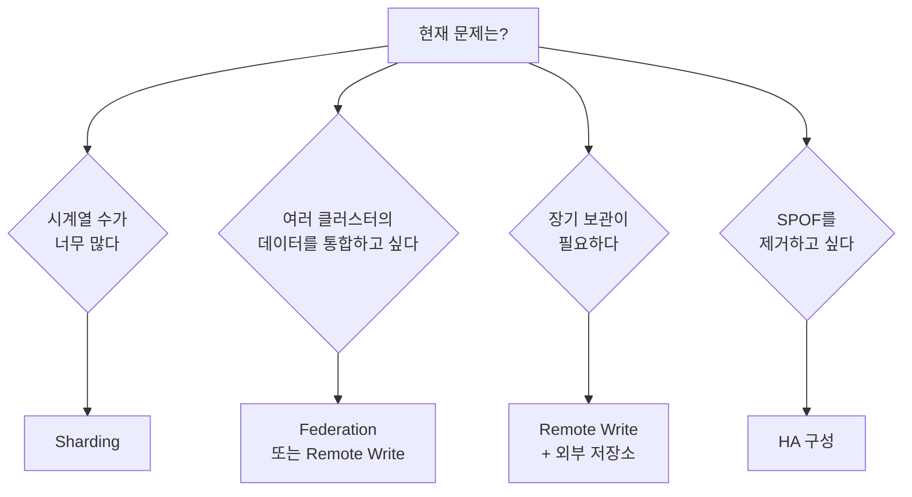
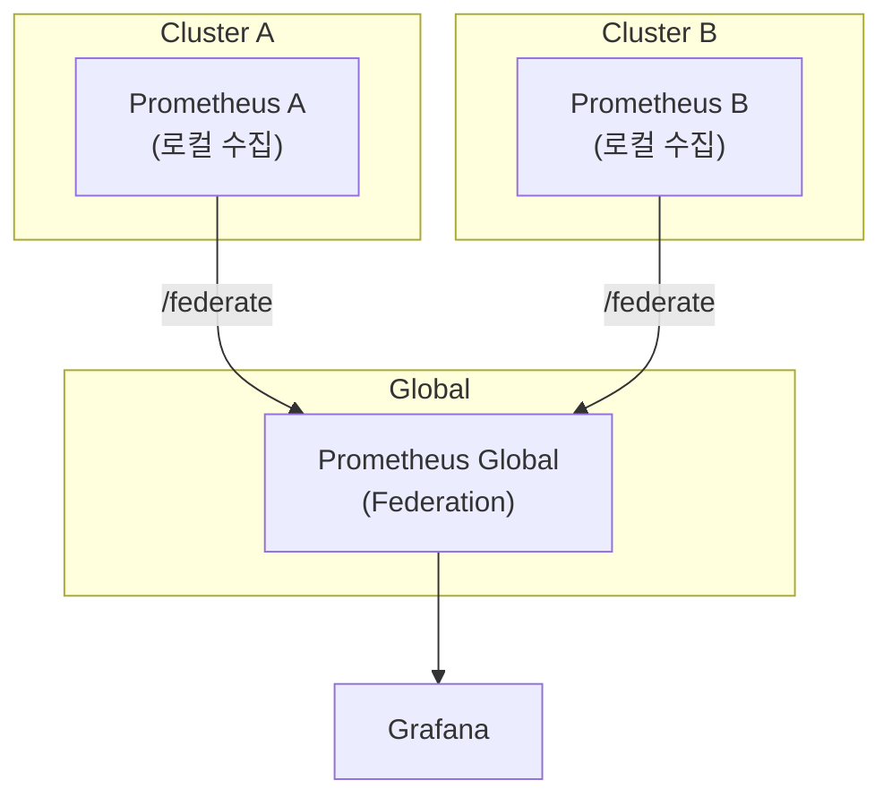
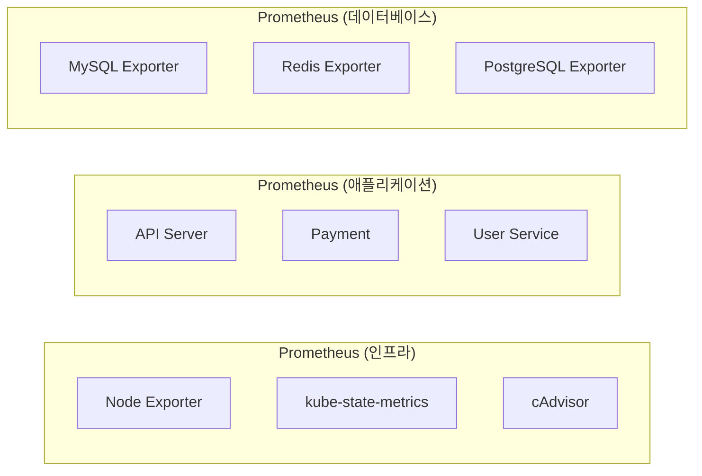
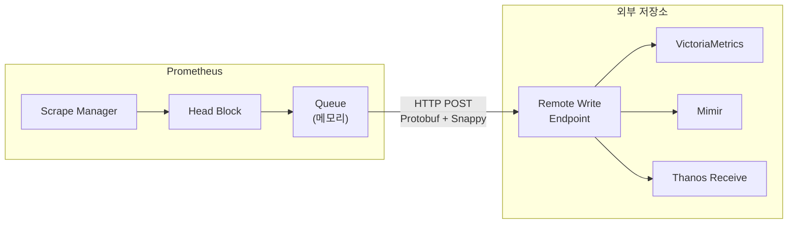
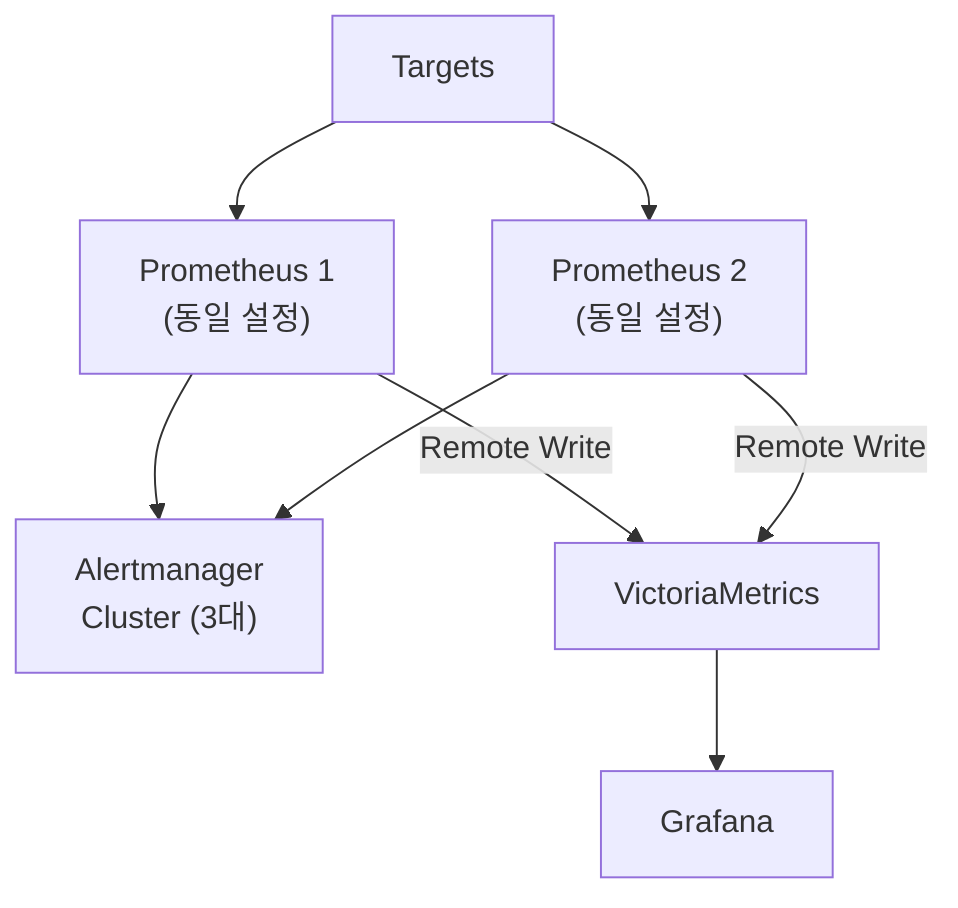
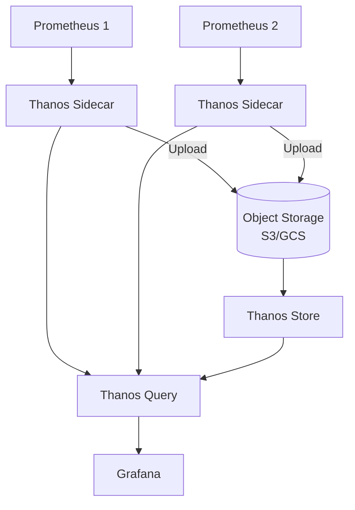
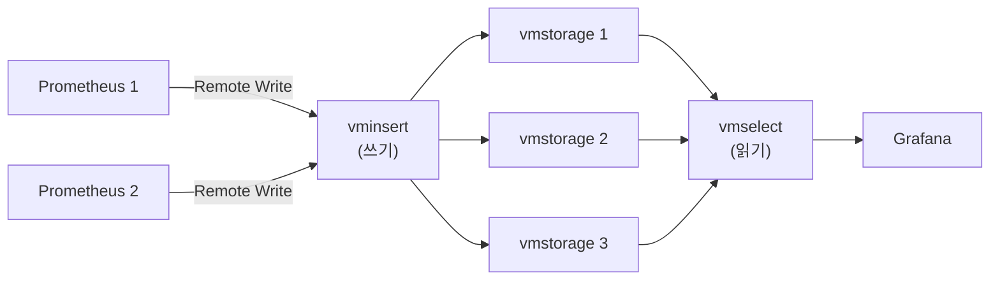

# 11장. 확장 전략

## 학습 목표

- 단일 Prometheus의 한계와 확장이 필요한 시점을 판단할 수 있다
- Federation, Sharding, Remote Write/Read의 동작 원리와 트레이드오프를 이해한다
- HA 구성의 패턴과 각각의 적합한 환경을 안다
- 실습 환경에서 Remote Write를 구성할 수 있다

---

## 11.1 언제 확장이 필요한가

[7장](7.Prometheus-아키텍처.md)에서 Prometheus 아키텍처를 배웠다. 단일 Prometheus는 놀라울 정도로 강력하지만, 한계가 있다.

### 단일 Prometheus의 실질적 한계

| 지표 | 실질 한계 | 증상 |
|------|----------|------|
| 활성 시계열 | ~1,000만 | 메모리 부족, OOM Kill |
| 초당 수집 sample | ~100만/s | scrape 지연, 타겟 누락 |
| 메모리 | ~64GB | Head Block이 메모리를 독점 |
| 디스크 I/O | 고부하 Compaction | 쿼리 응답 지연 |
| 쿼리 범위 | 로컬 데이터만 | 멀티 클러스터 통합 뷰 불가 |
| Retention | 로컬 디스크 용량 의존 | 장기 보관 비용 증가 |

### 확장 전략 선택 가이드



---

## 11.2 Federation

**Federation은 상위 Prometheus가 하위 Prometheus의 데이터를 scrape하는 계층적 수집 방식이다.**



### Federation 설정

Global Prometheus의 설정:

```yaml
scrape_configs:
  - job_name: 'federate-cluster-a'
    honor_labels: true    # 원본 Label 유지
    metrics_path: '/federate'
    params:
      'match[]':
        # 수집할 메트릭을 지정 (모두 가져오면 부하 폭발)
        - '{job="api-server"}'
        - 'job:http_requests:rate5m'      # Recording Rule 결과만
        - 'job:http_errors:ratio5m'
    static_configs:
      - targets: ['prometheus-cluster-a:9090']
        labels:
          cluster: 'cluster-a'

  - job_name: 'federate-cluster-b'
    honor_labels: true
    metrics_path: '/federate'
    params:
      'match[]':
        - '{job="api-server"}'
        - 'job:http_requests:rate5m'
        - 'job:http_errors:ratio5m'
    static_configs:
      - targets: ['prometheus-cluster-b:9090']
        labels:
          cluster: 'cluster-b'
```

### Federation의 한계


Federation은 다음과 같은 문제가 있어 **신규 구성에서는 권장하지 않는다**:

1. **데이터 손실**: scrape 실패 시 해당 구간의 데이터가 영구 유실
2. **지연**: scrape_interval 만큼의 데이터 지연
3. **부하**: 전체 시계열을 가져오면 하위 Prometheus에 과부하
4. **스케일링 한계**: Global Prometheus도 결국 단일 인스턴스의 한계에 도달


### Federation이 적합한 경우

- **Recording Rule 결과만** 상위로 올리는 경우 (시계열 수가 제한적)
- 이미 Federation으로 운영 중이어서 마이그레이션 비용이 큰 경우
- 간단한 멀티 클러스터 요약 뷰가 필요한 경우

---

## 11.3 Sharding

**Sharding은 수집 부하를 여러 Prometheus 인스턴스에 분산하는 전략이다.**

### 기능별 Sharding

가장 직관적인 방식. 각 Prometheus가 특정 영역만 담당한다.



**장점:**
- 설정이 직관적
- 장애 격리 (인프라 Prometheus가 죽어도 애플리케이션 메트릭은 정상)
- 팀별로 관리 분리 가능

**단점:**
- 영역 간 상관관계 쿼리 불가 (인프라 + 애플리케이션 메트릭 조합)
- 부하가 불균등할 수 있음

### 해시 기반 Sharding

[9장](9.Relabeling.md)에서 배운 `hashmod` relabeling으로 타겟을 균등 분배한다.

```yaml
# Prometheus Shard 0 (총 3개 중)
scrape_configs:
  - job_name: 'api-server'
    relabel_configs:
      - source_labels: [__address__]
        modulus: 3
        target_label: __tmp_hash
        action: hashmod
      - source_labels: [__tmp_hash]
        regex: ^0$
        action: keep
```

```yaml
# Prometheus Shard 1
      - source_labels: [__tmp_hash]
        regex: ^1$
        action: keep
```

```yaml
# Prometheus Shard 2
      - source_labels: [__tmp_hash]
        regex: ^2$
        action: keep
```

**장점:**
- 부하가 균등하게 분산
- Shard 추가/제거가 상대적으로 용이

**단점:**
- 동일 서비스의 Pod가 다른 Shard에 분산될 수 있음
- Shard 수 변경 시 타겟 재분배 발생

### Sharding + 통합 쿼리

Sharding된 데이터를 하나의 뷰로 통합하려면 추가 컴포넌트가 필요하다:

| 방식 | 동작 |
|------|------|
| **Thanos Query** | 여러 Prometheus Shard에 동시 쿼리 → 결과 병합 |
| **VictoriaMetrics** | 각 Shard가 Remote Write → VictoriaMetrics에서 통합 쿼리 |
| **Mimir** | 각 Shard가 Remote Write → Mimir에서 통합 쿼리 |

---

## 11.4 Remote Write

**Remote Write는 Prometheus가 수집한 데이터를 외부 저장소에 실시간으로 복제하는 메커니즘이다.** 현재 가장 권장되는 확장 패턴이다.



### Queue 동작

Remote Write는 **비동기 큐**를 통해 동작한다. Prometheus가 죽지 않는 한 데이터 유실이 없다.

```yaml
remote_write:
  - url: "http://victoriametrics:8428/api/v1/write"
    queue_config:
      capacity: 10000           # 큐에 보관할 최대 sample 수
      max_shards: 30            # 병렬 전송 goroutine 수
      min_shards: 1             # 최소 병렬 수
      max_samples_per_send: 5000  # 한 번에 보낼 최대 sample 수
      batch_send_deadline: 5s   # 최대 대기 시간
      min_backoff: 30ms         # 재시도 최소 간격
      max_backoff: 5s           # 재시도 최대 간격
```

### Remote Write 필터링

모든 메트릭을 보내면 비용과 부하가 크다. `write_relabel_configs`로 필요한 것만 전송한다:

```yaml
remote_write:
  - url: "http://victoriametrics:8428/api/v1/write"

    write_relabel_configs:
      # Recording Rule 결과만 전송
      - source_labels: [__name__]
        regex: '(job|instance|namespace):.*'
        action: keep

      # 또는 특정 메트릭만 전송
      - source_labels: [__name__]
        regex: '(http_requests_total|http_request_duration_seconds_.*|up|node_.*)'
        action: keep

      # debug_ 접두사 메트릭 제외
      - source_labels: [__name__]
        regex: 'debug_.*'
        action: drop
```

### Remote Write 모니터링

```promql
# 전송 성공률
rate(prometheus_remote_storage_succeeded_samples_total[5m])

# 전송 실패률 (0이 아니면 문제)
rate(prometheus_remote_storage_failed_samples_total[5m])

# 큐에 대기 중인 sample 수 (계속 증가하면 문제)
prometheus_remote_storage_pending_samples

# 전송 지연 시간
prometheus_remote_storage_queue_highest_sent_timestamp_seconds
  - prometheus_remote_storage_queue_lowest_sent_timestamp_seconds
```


`prometheus_remote_storage_pending_samples`가 지속적으로 증가하면, 외부 저장소가 쓰기 속도를 따라잡지 못하는 것이다. `max_shards`를 늘리거나 외부 저장소의 쓰기 성능을 개선해야 한다.


### 해보기: Remote Write로 VictoriaMetrics 연동

7장에서 만든 환경에 VictoriaMetrics를 추가하여, Prometheus가 수집한 데이터를 실시간으로 복제하는 것을 직접 확인해본다.

**docker-compose.yml에 VictoriaMetrics 추가**

기존 `docker-compose.yml`의 `services` 블록에 다음을 추가한다:

```yaml
  victoriametrics:
    image: victoriametrics/victoria-metrics:latest
    container_name: victoriametrics
    ports:
      - "8428:8428"
    volumes:
      - vm-data:/victoria-metrics-data
    command:
      - '-retentionPeriod=30d'
      - '-httpListenAddr=:8428'
```

`volumes` 블록에도 `vm-data:`를 추가한다.

**prometheus.yml에 Remote Write 추가**

`prometheus.yml`의 최상위에 `remote_write` 섹션을 추가한다:

```yaml
remote_write:
  - url: "http://victoriametrics:8428/api/v1/write"
    queue_config:
      max_shards: 5
      max_samples_per_send: 1000
```

VictoriaMetrics를 먼저 띄우고 Prometheus를 재시작한다:

```bash
docker compose up -d victoriametrics
docker compose restart prometheus
```

**VictoriaMetrics에서 쿼리 확인**

`http://localhost:8428/vmui/`에 접속한다. VictoriaMetrics 자체 UI가 열린다. 쿼리 입력란에 `up`을 입력하고 실행하면, Prometheus에서 수집된 데이터가 그대로 나타나야 한다.

`rate(node_cpu_seconds_total[5m])`도 실행해보자. Prometheus UI에서 같은 쿼리를 실행한 결과와 동일하다면, Remote Write가 정상 동작하고 있는 것이다.

**Grafana에 두 번째 Data Source 추가**

Grafana에서 Data Source를 하나 더 추가한다:

1. Connections → Data Sources → Add data source → Prometheus
2. Name: `VictoriaMetrics`
3. URL: `http://victoriametrics:8428`
4. Save & Test

이제 Grafana에서 대시보드를 만들 때 Data Source를 선택할 수 있다. Prometheus는 최근 7일(로컬 Retention), VictoriaMetrics는 30일(`-retentionPeriod=30d`) 데이터를 보관한다. 장기 데이터 조회는 VictoriaMetrics에서 하면 된다.

**Remote Write 상태 확인**

Prometheus UI에서 다음 쿼리로 Remote Write가 잘 동작하는지 확인한다:

```promql
rate(prometheus_remote_storage_succeeded_samples_total[5m])
```

이 값이 0보다 크면 정상이다. `prometheus_remote_storage_pending_samples`가 지속적으로 증가한다면 VictoriaMetrics가 쓰기 속도를 따라잡지 못하는 것이므로 `max_shards`를 늘려야 한다.

---

## 11.5 Remote Read

**Remote Read는 외부 저장소의 데이터를 Prometheus PromQL로 쿼리할 수 있게 하는 메커니즘이다.**

```yaml
remote_read:
  - url: "http://victoriametrics:8428/api/v1/read"
    read_recent: false    # 최근 데이터는 로컬 TSDB에서 읽기
```

### Remote Read의 트레이드오프




- Prometheus PromQL/Grafana에서 장기 데이터를 투명하게 조회
- 로컬 Retention 이후의 데이터도 접근 가능
- 기존 대시보드/알림 변경 없이 장기 데이터 활용




- 쿼리마다 외부 저장소에 HTTP 요청 → Latency 추가
- 대량 데이터 조회 시 Prometheus 메모리 사용량 증가
- 외부 저장소 장애 시 쿼리 실패 또는 지연





**실전 권장**: Remote Read 대신, Grafana에서 VictoriaMetrics를 **별도 Data Source**로 직접 연결하는 것이 더 효율적이다. Remote Read는 "기존 알림 규칙에서 장기 데이터를 참조해야 하는 경우"에만 사용한다.


---

## 11.6 HA 구성

### 패턴 1: 이중화 (Active-Active)



- 두 Prometheus가 **동일한 타겟을 동시에 scrape**
- Alertmanager Cluster가 **중복 Alert을 deduplicate**
- VictoriaMetrics가 **중복 데이터를 deduplicate** (`-dedup.minScrapeInterval=15s`)
- Grafana는 VictoriaMetrics만 바라봄

**이 패턴이 가장 일반적이고 운영이 쉽다.**

### 패턴 2: Thanos Sidecar



- 각 Prometheus에 Thanos Sidecar를 붙여 Block을 Object Storage로 업로드
- Thanos Query가 실시간 데이터(Sidecar)와 장기 데이터(Store)를 통합 쿼리
- 글로벌 쿼리와 장기 저장을 모두 해결

### 패턴 3: VictoriaMetrics Cluster



- Prometheus는 수집만 담당, 저장과 쿼리는 VictoriaMetrics Cluster가 담당
- 수평 확장 가능 (vmstorage 노드 추가)
- 내장 deduplication, downsampling

### HA 패턴 비교

| 구분 | 이중화 | Thanos Sidecar | VM Cluster |
|------|--------|---------------|------------|
| **복잡도** | 낮음 | 중간 | 중간 |
| **글로벌 쿼리** | VM으로 해결 | ✅ 내장 | ✅ 내장 |
| **장기 저장** | VM | Object Storage | VM Storage |
| **Deduplication** | VM에서 처리 | Thanos Query | VM에서 처리 |
| **추가 컴포넌트** | VM 1대 | Sidecar, Query, Store | vminsert, vmselect, vmstorage |
| **권장 규모** | 소~중규모 | 중~대규모 | 중~대규모 |
| **비용** | 낮음 | 중간 (Object Storage) | 낮음~중간 |


**실전 권장**: 소~중규모는 **이중화 + VictoriaMetrics Single Node**로 시작한다. 대규모(시계열 1,000만+, 멀티 클러스터)에서 VictoriaMetrics Cluster 또는 Thanos로 전환한다. 처음부터 복잡한 구성을 도입하면 운영 부담이 크다.


---

## 11.7 Alertmanager HA

Prometheus HA와 함께 Alertmanager도 HA 구성이 필요하다. 두 Prometheus에서 동일한 Alert이 발생하므로, Alertmanager가 중복을 제거해야 한다.

```yaml
# alertmanager.yml
# Alertmanager Cluster 설정은 CLI 플래그로 지정
# alertmanager --cluster.listen-address=0.0.0.0:9094
#              --cluster.peer=alertmanager-1:9094
#              --cluster.peer=alertmanager-2:9094
```

```yaml
# docker-compose.yml (Alertmanager Cluster)
services:
  alertmanager-1:
    image: prom/alertmanager:latest
    command:
      - '--config.file=/etc/alertmanager/alertmanager.yml'
      - '--cluster.listen-address=0.0.0.0:9094'
      - '--cluster.peer=alertmanager-2:9094'

  alertmanager-2:
    image: prom/alertmanager:latest
    command:
      - '--config.file=/etc/alertmanager/alertmanager.yml'
      - '--cluster.listen-address=0.0.0.0:9094'
      - '--cluster.peer=alertmanager-1:9094'
```

Alertmanager Cluster는 **Gossip 프로토콜**로 상태를 동기화하며, 동일한 Alert에 대해 하나의 알림만 전송한다.

---

## 핵심 정리

1. **Federation**은 상위 Prometheus가 하위를 scrape하는 방식이다. 데이터 손실 가능성이 있어 Recording Rule 결과만 올리는 용도로 제한한다.

2. **Sharding**은 기능별 또는 해시 기반으로 수집 부하를 분산한다. 통합 쿼리를 위해 추가 컴포넌트(Thanos, VictoriaMetrics)가 필요하다.

3. **Remote Write**는 현재 가장 권장되는 확장 패턴이다. 비동기 큐로 동작하며, `write_relabel_configs`로 전송 대상을 필터링할 수 있다.

4. **Remote Read**는 외부 저장소를 PromQL로 투명하게 쿼리할 수 있게 하지만, Latency 추가와 메모리 사용 증가가 단점이다.

5. **HA**는 이중화 + VictoriaMetrics로 시작하는 것이 가장 실용적이다. 대규모에서 Thanos 또는 VictoriaMetrics Cluster로 전환한다.

6. **Alertmanager**도 Cluster 구성으로 HA를 확보하며, Gossip 프로토콜로 중복 Alert을 제거한다.

---

## 다음 장 예고

[12장](../part4/12.PromQL-기초.md)에서는 **PromQL 기초**를 다룬다. 이 장까지 구성한 Prometheus 스택에 저장된 데이터를 효과적으로 쿼리하는 방법 — Selector, Instant Vector, Range Vector — 을 학습한다.
