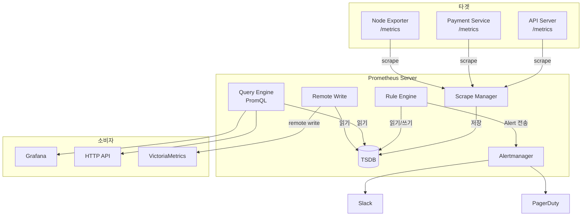
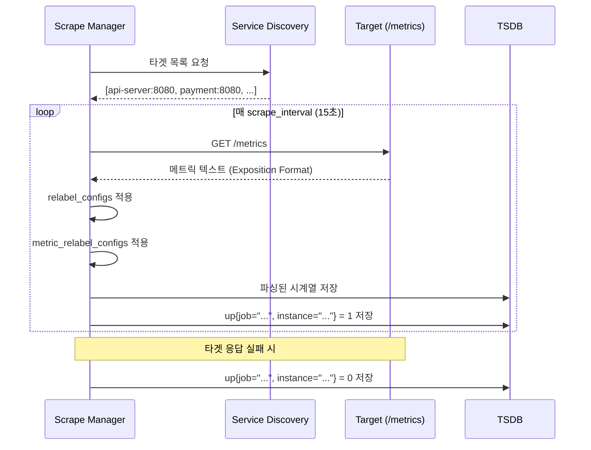
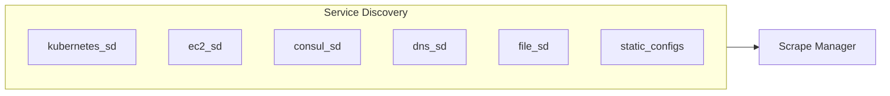
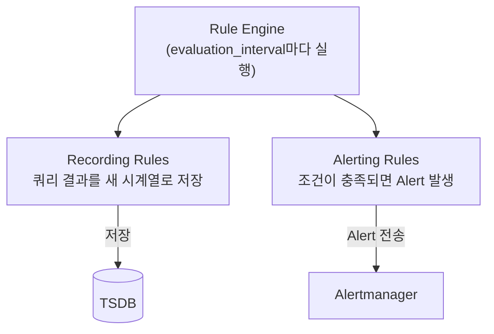
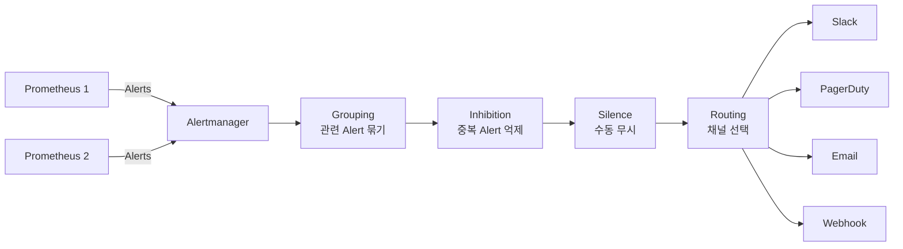
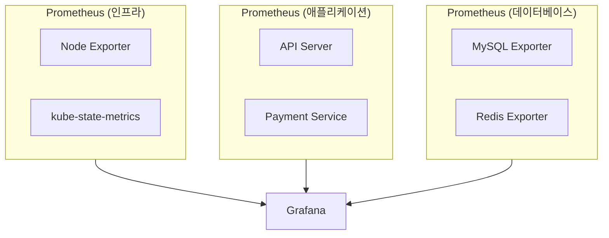
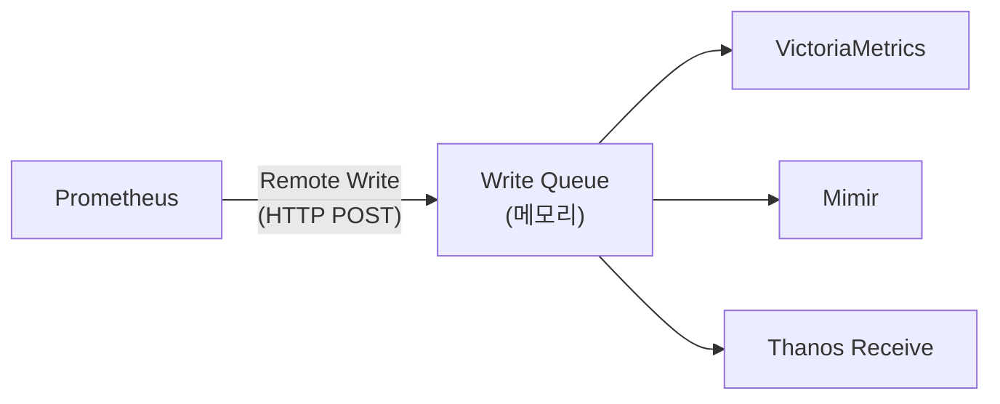
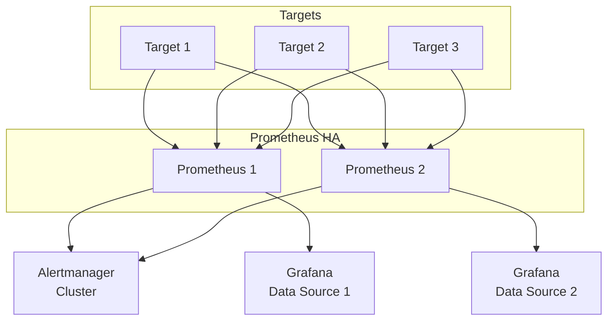
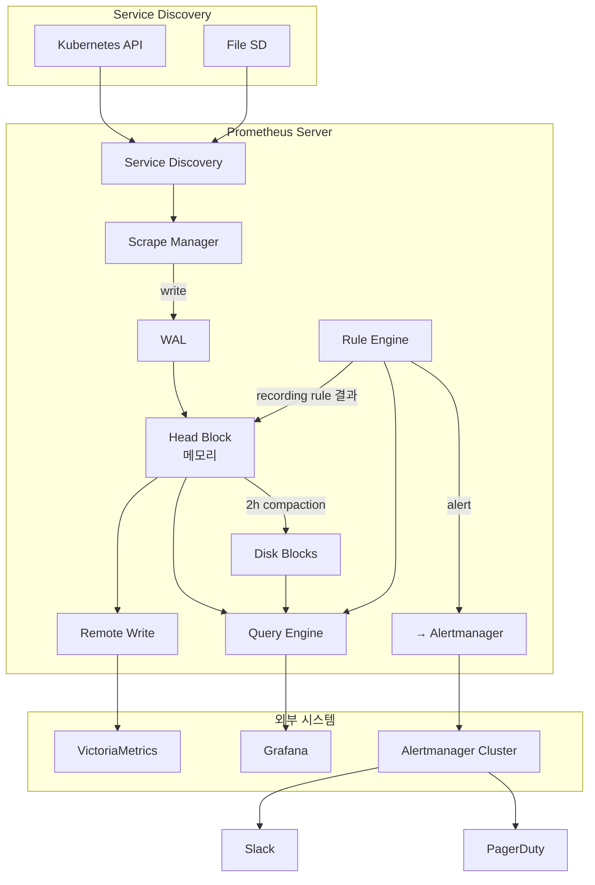

# 7장. Prometheus 아키텍처

## 학습 목표

- Prometheus Server의 내부 구성 요소와 데이터 흐름을 이해한다
- Scrape Manager의 동작 원리와 Service Discovery를 설명할 수 있다
- Rule Engine의 Recording Rule과 Alerting Rule의 차이를 안다
- Sharding, Remote Write/Read, HA 구성의 전략과 트레이드오프를 이해한다

---

## 7.1 Prometheus Server 개요

Prometheus는 **Pull 기반 메트릭 수집 시스템**이다. 타겟 애플리케이션이 메트릭을 노출(`/metrics` 엔드포인트)하면, Prometheus가 주기적으로 HTTP GET 요청을 보내 수집(scrape)한다.



### Pull vs Push 모델




Prometheus가 타겟에게 직접 데이터를 가져온다.

**장점:**
- 타겟이 Prometheus의 존재를 몰라도 됨 (느슨한 결합)
- Prometheus가 죽어도 타겟에 영향 없음
- `up` 메트릭으로 타겟 생존 여부를 자동 감지
- 로컬 개발 시 브라우저에서 `/metrics`를 직접 확인 가능

**단점:**
- 방화벽/NAT 뒤의 타겟 접근이 어려움
- 짧은 수명의 Job(배치, 크론)은 scrape 타이밍을 놓칠 수 있음




타겟이 수집 서버에 데이터를 직접 보낸다.

**장점:**
- 방화벽 뒤의 타겟도 데이터 전송 가능
- 짧은 수명의 Job도 종료 전에 데이터를 push 가능
- 이벤트 기반 데이터에 적합

**단점:**
- 타겟이 수집 서버의 주소를 알아야 함 (강한 결합)
- 수집 서버가 죽으면 데이터 유실
- 타겟이 살아있는지 판단하기 어려움





Prometheus는 Pull 기반이지만, 짧은 수명의 Job을 위해 **Pushgateway**라는 중간 컴포넌트를 제공한다. 배치 Job이 Pushgateway에 메트릭을 push하면, Prometheus가 Pushgateway를 scrape한다. 단, Pushgateway의 남용은 안티 패턴이다 — 장시간 실행되는 서비스에는 사용하지 않는다.


---

## 7.2 Scrape Manager

Scrape Manager는 Prometheus의 데이터 수집 엔진이다. 어떤 타겟을, 얼마나 자주, 어떤 방식으로 scrape할지를 관리한다.

### Scrape 동작 흐름



### Scrape 설정

```yaml
global:
  scrape_interval: 15s      # 기본 scrape 주기
  scrape_timeout: 10s       # scrape 타임아웃
  evaluation_interval: 15s  # Rule 평가 주기

scrape_configs:
  - job_name: 'api-server'
    scrape_interval: 10s    # job별 override 가능
    metrics_path: '/metrics'
    scheme: 'http'

    static_configs:
      - targets:
          - 'api-server-1:8080'
          - 'api-server-2:8080'

    # scrape 전에 타겟 Label 조작
    relabel_configs:
      - source_labels: [__address__]
        regex: '(.+):(\d+)'
        target_label: instance
        replacement: '${1}'

    # scrape 후에 메트릭 Label 조작
    metric_relabel_configs:
      - source_labels: [__name__]
        regex: 'go_.*'
        action: drop          # Go 런타임 메트릭 제거
```

### `up` 메트릭

Prometheus는 모든 scrape 결과에 대해 자동으로 `up` 메트릭을 생성한다.

```promql
# 타겟이 살아있으면 1, 죽었거나 scrape 실패면 0
up{job="api-server", instance="api-server-1:8080"}

# 죽은 타겟 찾기
up == 0

# job별 타겟 생존율
avg by (job) (up)
```


`up` 메트릭은 **무료 Health Check**다. Prometheus가 scrape하는 모든 타겟에 대해 자동으로 생존 여부를 추적한다. 별도의 Health Check 시스템 없이도 기본적인 서비스 가용성 모니터링이 가능하다.


---

## 7.3 Service Discovery

실제 운영 환경에서는 타겟 IP가 동적으로 변한다. Kubernetes에서 Pod가 재시작되면 IP가 바뀌고, Auto Scaling으로 인스턴스가 추가/제거된다. Service Discovery는 이런 동적 환경에서 타겟 목록을 자동으로 유지한다.

### 지원하는 Service Discovery



| 방식 | 환경 | 설명 |
|------|------|------|
| `kubernetes_sd_configs` | Kubernetes | API Server에서 Pod, Service, Node, Endpoint 정보 자동 수집 |
| `ec2_sd_configs` | AWS | EC2 인스턴스 태그 기반 자동 검색 |
| `consul_sd_configs` | Consul | Consul 서비스 레지스트리 연동 |
| `dns_sd_configs` | DNS | SRV 레코드 기반 검색 |
| `file_sd_configs` | 범용 | JSON/YAML 파일로 타겟 관리 |
| `static_configs` | 개발/테스트 | 고정 IP 수동 지정 |

### Kubernetes Service Discovery 예시

```yaml
scrape_configs:
  - job_name: 'kubernetes-pods'
    kubernetes_sd_configs:
      - role: pod

    relabel_configs:
      # prometheus.io/scrape: "true" 어노테이션이 있는 Pod만 수집
      - source_labels: [__meta_kubernetes_pod_annotation_prometheus_io_scrape]
        action: keep
        regex: true

      # 커스텀 메트릭 path 지정
      - source_labels: [__meta_kubernetes_pod_annotation_prometheus_io_path]
        action: replace
        target_label: __metrics_path__
        regex: (.+)

      # 커스텀 포트 지정
      - source_labels: [__address__, __meta_kubernetes_pod_annotation_prometheus_io_port]
        action: replace
        regex: ([^:]+)(?::\d+)?;(\d+)
        replacement: $1:$2
        target_label: __address__

      # Pod Label을 Prometheus Label로 전달
      - action: labelmap
        regex: __meta_kubernetes_pod_label_(.+)

      # namespace, pod 이름을 Label로 추가
      - source_labels: [__meta_kubernetes_namespace]
        target_label: namespace
      - source_labels: [__meta_kubernetes_pod_name]
        target_label: pod
```

이 설정을 사용하면 Pod에 다음 어노테이션만 추가하면 자동으로 scrape 대상이 된다:

```yaml
apiVersion: v1
kind: Pod
metadata:
  annotations:
    prometheus.io/scrape: "true"
    prometheus.io/port: "8080"
    prometheus.io/path: "/metrics"
```

---

## 7.4 Rule Engine

Rule Engine은 두 가지 종류의 규칙을 주기적으로 평가한다.



### Recording Rules

자주 사용하는 복잡한 PromQL 쿼리를 미리 계산하여 새로운 시계열로 저장한다. 대시보드 로딩 속도를 크게 개선한다.

```yaml
groups:
  - name: api_server_rules
    interval: 15s
    rules:
      # 서비스별 초당 요청 수 (5분 평균)
      - record: job:http_requests:rate5m
        expr: sum by (job) (rate(http_requests_total[5m]))

      # 서비스별 에러율
      - record: job:http_errors:ratio5m
        expr: |
          sum by (job) (rate(http_requests_total{status=~"5.."}[5m]))
          /
          sum by (job) (rate(http_requests_total[5m]))

      # 서비스별 p99 응답 시간
      - record: job:http_request_duration_seconds:p99_5m
        expr: |
          histogram_quantile(0.99,
            sum by (job, le) (rate(http_request_duration_seconds_bucket[5m]))
          )
```


**Recording Rule 네이밍 규칙**: `level:metric:operations` 형식을 따른다.
- `level`: 집계 수준 (job, instance, namespace 등)
- `metric`: 원본 메트릭 이름
- `operations`: 적용된 연산 (rate5m, ratio, p99 등)

예: `job:http_requests:rate5m` = job 수준으로 집계한 http_requests의 5분 rate


### Alerting Rules

조건이 일정 시간 이상 충족되면 Alertmanager로 Alert을 보낸다.

```yaml
groups:
  - name: api_server_alerts
    rules:
      # 에러율 5% 초과가 5분 이상 지속
      - alert: HighErrorRate
        expr: job:http_errors:ratio5m > 0.05
        for: 5m
        labels:
          severity: critical
        annotations:
          summary: "High error rate on {{ $labels.job }}"
          description: "Error rate is {{ $value | humanizePercentage }} (threshold: 5%)"

      # 타겟 다운
      - alert: TargetDown
        expr: up == 0
        for: 3m
        labels:
          severity: warning
        annotations:
          summary: "Target {{ $labels.instance }} is down"

      # p99 응답 시간 SLO 초과
      - alert: HighLatency
        expr: job:http_request_duration_seconds:p99_5m > 0.5
        for: 10m
        labels:
          severity: warning
        annotations:
          summary: "p99 latency on {{ $labels.job }} exceeds 500ms"
```

### `for` 절의 중요성


**`for`를 생략하면 순간적인 spike에도 Alert이 발생한다.** 이는 Alert Fatigue의 주요 원인이다. 최소 3~5분의 `for` 기간을 설정하여 일시적인 변동을 무시해야 한다. 단, 전면 장애(에러율 > 50%)는 `for: 1m`으로 짧게 설정한다.


---

## 7.5 Alertmanager

Alertmanager는 Prometheus에서 받은 Alert을 **그룹핑, 억제(inhibition), 라우팅**하여 적절한 채널로 전달한다.



```yaml
# alertmanager.yml
route:
  receiver: 'slack-default'
  group_by: ['alertname', 'job']
  group_wait: 30s       # 같은 그룹의 Alert을 30초 모음
  group_interval: 5m    # 같은 그룹의 새 Alert을 5분마다 전송
  repeat_interval: 4h   # 동일 Alert 반복 알림 주기

  routes:
    - match:
        severity: critical
      receiver: 'pagerduty-critical'
      continue: true    # critical도 Slack에 보내기 위해 계속 진행

    - match:
        severity: critical
      receiver: 'slack-critical'

    - match:
        severity: warning
      receiver: 'slack-warning'

receivers:
  - name: 'pagerduty-critical'
    pagerduty_configs:
      - service_key: '<PD_SERVICE_KEY>'

  - name: 'slack-critical'
    slack_configs:
      - channel: '#alerts-critical'
        title: '{{ .GroupLabels.alertname }}'
        text: '{{ range .Alerts }}{{ .Annotations.description }}{{ end }}'

  - name: 'slack-warning'
    slack_configs:
      - channel: '#alerts-warning'

  - name: 'slack-default'
    slack_configs:
      - channel: '#alerts'

# 상위 Alert이 발생하면 하위 Alert 억제
inhibit_rules:
  - source_match:
      severity: critical
    target_match:
      severity: warning
    equal: ['alertname', 'job']
```

---

## 7.6 Sharding

단일 Prometheus로 처리할 수 없는 규모가 되면 Sharding이 필요하다.

### 언제 Sharding이 필요한가

| 지표 | 단일 Prometheus 한계 | Sharding 필요 |
|------|---------------------|--------------|
| 활성 시계열 | ~1,000만 | 1,000만+ |
| 초당 수집 샘플 | ~100만 samples/s | 100만+ |
| 메모리 | 64GB | 64GB+ |
| scrape 타겟 | ~10,000 | 10,000+ |

### Sharding 전략






- 각 Prometheus가 특정 영역의 메트릭만 담당
- 가장 직관적이고 운영이 쉬움
- 영역 간 상관관계 쿼리가 어려움




```yaml
# Prometheus 1: 해시 모듈로가 0인 타겟만 수집
scrape_configs:
  - job_name: 'api-server'
    relabel_configs:
      - source_labels: [__address__]
        modulus: 2
        target_label: __tmp_hash
        action: hashmod
      - source_labels: [__tmp_hash]
        regex: ^0$
        action: keep
```

- `hashmod` relabeling으로 타겟을 N개 Prometheus에 분산
- 부하가 균등하게 분산됨
- 설정 관리가 복잡해질 수 있음




---

## 7.7 Remote Write / Remote Read

Prometheus의 로컬 TSDB는 단기 저장(기본 15일)에 적합하다. 장기 보관과 글로벌 쿼리를 위해 외부 저장소와 연동한다.

### Remote Write

Prometheus가 수집한 데이터를 외부 저장소에 **실시간으로 복제**한다.



```yaml
# prometheus.yml
remote_write:
  - url: "http://victoriametrics:8428/api/v1/write"
    queue_config:
      capacity: 10000        # 큐 크기
      max_shards: 30         # 병렬 전송 수
      max_samples_per_send: 5000
    write_relabel_configs:
      # 특정 메트릭만 Remote Write
      - source_labels: [__name__]
        regex: '(http_requests_total|http_request_duration_seconds_.*)'
        action: keep
```

### Remote Read

외부 저장소의 데이터를 Prometheus PromQL로 쿼리할 수 있게 한다.

```yaml
remote_read:
  - url: "http://victoriametrics:8428/api/v1/read"
    read_recent: false  # 최근 데이터는 로컬 TSDB에서 읽기
```


Remote Read는 쿼리마다 외부 저장소에 HTTP 요청을 보내므로 **Latency가 추가된다**. 최근 데이터(Head Block에 있는 데이터)는 로컬에서 읽도록 `read_recent: false`를 설정하는 것이 일반적이다.


### Remote Write vs Federation

| 구분 | Remote Write | Federation |
|------|-------------|------------|
| **방향** | Push (Prometheus → 외부) | Pull (상위 Prometheus → 하위) |
| **데이터 범위** | 전체 또는 필터링된 시계열 | 선택된 메트릭만 |
| **실시간성** | 거의 실시간 (수 초 지연) | scrape_interval 의존 |
| **데이터 손실** | 큐로 재시도 | scrape 실패 시 손실 |
| **용도** | 장기 저장, 글로벌 뷰 | 계층적 수집 |


**현재 권장 패턴**: Remote Write를 사용한다. Federation은 레거시 접근 방식으로, 데이터 손실 가능성과 성능 문제로 인해 신규 구성에서는 Remote Write를 선호한다.


---

## 7.8 HA (High Availability) 구성

Prometheus 단일 인스턴스는 SPOF(Single Point of Failure)다. HA를 위한 전략을 알아본다.

### 기본 HA: 이중화 (Active-Active)

가장 단순한 방법. 동일한 설정의 Prometheus 2대를 운영한다.



**특징:**
- 두 Prometheus가 동일한 타겟을 scrape
- 데이터가 약간 다를 수 있음 (scrape 타이밍 차이)
- 한 대가 죽어도 다른 한 대가 계속 수집
- Alertmanager는 Cluster 모드로 중복 Alert을 deduplicate


이 구성의 한계는 **장기 저장과 글로벌 쿼리**가 어렵다는 점이다. 두 Prometheus의 데이터를 통합해서 보려면 Thanos, VictoriaMetrics, Mimir와 같은 솔루션이 필요하다. 이 내용은 [Part 9. VictoriaMetrics](../part9/37.VictoriaMetrics-개요.md)에서 다룬다.


### HA 아키텍처 비교

| 구성 | 복잡도 | 글로벌 쿼리 | 장기 저장 | 적합한 규모 |
|------|--------|------------|----------|------------|
| **이중화 (2x Prometheus)** | 낮음 | ❌ | ❌ | 소규모 |
| **Thanos Sidecar** | 중간 | ✅ | ✅ (Object Storage) | 중~대규모 |
| **VictoriaMetrics Cluster** | 중간 | ✅ | ✅ | 중~대규모 |
| **Mimir** | 높음 | ✅ | ✅ (Object Storage) | 대규모 SaaS |

---

## 7.9 Prometheus 데이터 흐름 전체 그림



---

## 7.10 실습: Docker Compose로 Prometheus 스택 구성하기

이론으로 배운 Prometheus 아키텍처를 직접 구성해본다. Scrape, Rule Engine, Alertmanager의 동작을 눈으로 확인하는 것이 목표다.


**사전 준비**: Docker와 Docker Compose가 설치되어 있어야 한다.


### 디렉토리 구조

이 실습이 끝나면 다음과 같은 구조가 만들어진다. 적당한 위치에 작업 디렉토리를 만들고 시작하자.

```
prometheus-lab/
├── docker-compose.yml
├── prometheus/
│   ├── prometheus.yml
│   └── rules.yml
└── alertmanager/
    └── alertmanager.yml
```

```bash
mkdir -p prometheus-lab/prometheus prometheus-lab/alertmanager
cd prometheus-lab
```

### docker-compose.yml

Prometheus, Node Exporter, Alertmanager, Grafana 4개 컨테이너를 한 번에 띄운다.

```yaml
version: '3.8'

services:
  # 메트릭을 노출하는 샘플 타겟
  node-exporter:
    image: prom/node-exporter:latest
    container_name: node-exporter
    ports:
      - "9100:9100"

  # Prometheus Server
  prometheus:
    image: prom/prometheus:latest
    container_name: prometheus
    ports:
      - "9090:9090"
    volumes:
      - ./prometheus/prometheus.yml:/etc/prometheus/prometheus.yml
      - ./prometheus/rules.yml:/etc/prometheus/rules.yml
      - prometheus-data:/prometheus
    command:
      - '--config.file=/etc/prometheus/prometheus.yml'
      - '--storage.tsdb.retention.time=7d'
      - '--web.enable-lifecycle'    # /-/reload 활성화

  # Alertmanager
  alertmanager:
    image: prom/alertmanager:latest
    container_name: alertmanager
    ports:
      - "9093:9093"
    volumes:
      - ./alertmanager/alertmanager.yml:/etc/alertmanager/alertmanager.yml

  # Grafana
  grafana:
    image: grafana/grafana:latest
    container_name: grafana
    ports:
      - "3000:3000"
    environment:
      - GF_SECURITY_ADMIN_PASSWORD=admin

volumes:
  prometheus-data:
```

### prometheus/prometheus.yml

Prometheus의 핵심 설정 파일이다. scrape 주기, 알림 대상, Rule 파일 경로, 수집 타겟을 정의한다.

```yaml
global:
  scrape_interval: 15s
  evaluation_interval: 15s

alerting:
  alertmanagers:
    - static_configs:
        - targets: ['alertmanager:9093']

rule_files:
  - 'rules.yml'

scrape_configs:
  # Prometheus 자기 자신을 모니터링
  - job_name: 'prometheus'
    static_configs:
      - targets: ['localhost:9090']

  # Node Exporter
  - job_name: 'node-exporter'
    static_configs:
      - targets: ['node-exporter:9100']
```

### prometheus/rules.yml

Recording Rule과 Alerting Rule을 정의한다. Recording Rule은 자주 사용하는 PromQL을 미리 계산해두고, Alerting Rule은 조건이 충족되면 Alertmanager로 알림을 보낸다.

```yaml
groups:
  - name: node_rules
    interval: 15s
    rules:
      # Recording Rule: CPU 사용률
      - record: instance:node_cpu_utilization:ratio
        expr: |
          1 - avg by (instance) (
            rate(node_cpu_seconds_total{mode="idle"}[5m])
          )

      # Recording Rule: 메모리 사용률
      - record: instance:node_memory_utilization:ratio
        expr: |
          1 - (
            node_memory_MemAvailable_bytes
            / node_memory_MemTotal_bytes
          )

  - name: node_alerts
    rules:
      # 타겟 다운 알림
      - alert: TargetDown
        expr: up == 0
        for: 1m
        labels:
          severity: critical
        annotations:
          summary: "{{ $labels.instance }} is down"
          description: "{{ $labels.job }}/{{ $labels.instance }} has been down for 1 minute."

      # CPU 사용률 80% 초과
      - alert: HighCpuUsage
        expr: instance:node_cpu_utilization:ratio > 0.8
        for: 5m
        labels:
          severity: warning
        annotations:
          summary: "High CPU usage on {{ $labels.instance }}"
          description: "CPU utilization is {{ $value | humanizePercentage }}"
```

### alertmanager/alertmanager.yml

Alertmanager의 라우팅과 수신자(receiver)를 정의한다. 실습에서는 외부 서비스 연동 없이 Alertmanager UI에서 직접 확인한다.

```yaml
global:
  resolve_timeout: 5m

route:
  receiver: 'log-receiver'
  group_by: ['alertname']
  group_wait: 10s
  group_interval: 10s
  repeat_interval: 1h

receivers:
  # 실습용: webhook.site나 로그로 확인
  - name: 'log-receiver'
    webhook_configs:
      - url: 'http://alertmanager:9093/api/v2/alerts'
        send_resolved: true
```

### 실행

```bash
docker compose up -d
```

모든 컨테이너가 뜨는 데 10~20초 정도 걸린다. `docker compose ps`로 4개 서비스가 모두 Running인지 확인한다.

### 동작 확인

**Targets 확인**

브라우저에서 `http://localhost:9090`에 접속한다. 상단 메뉴에서 **Status → Targets**로 이동하면 `prometheus`와 `node-exporter` 두 개의 job이 보인다. 둘 다 State가 **UP**이면 정상이다.

만약 UP이 아니라면 `docker compose logs prometheus`로 에러 로그를 확인한다. 대부분 YAML 문법 오류다.

**PromQL 쿼리 실행**

Prometheus UI 상단의 **Graph** 탭으로 이동한다. Expression 입력란에 다음 쿼리를 하나씩 입력하고 **Execute**를 누른다.

```promql
up
```

결과에 `up{instance="localhost:9090", job="prometheus"} 1`과 `up{instance="node-exporter:9100", job="node-exporter"} 1`이 보여야 한다. 값이 1이면 살아있고, 0이면 죽어있다는 뜻이다.

이번에는 Recording Rule이 제대로 동작하는지 확인한다:

```promql
instance:node_cpu_utilization:ratio
```

`rules.yml`에서 정의한 Recording Rule의 결과가 나온다. 이 값은 `1 - avg(rate(node_cpu_seconds_total{mode="idle"}[5m]))`를 미리 계산한 것이다. 매번 이 복잡한 쿼리를 쓸 필요 없이, Recording Rule 이름만으로 조회할 수 있다.

TSDB 내부 상태도 확인해보자:

```promql
prometheus_tsdb_head_series
```

현재 Prometheus가 메모리에 들고 있는 시계열 수다. Node Exporter 하나만 있어도 수백 개가 나온다. 이 숫자가 [3장](../part1/3.시계열-데이터-이해.md)에서 배운 Cardinality다.

**Alert 동작 확인**

이제 의도적으로 장애를 만들어본다. Node Exporter를 중단시킨다:

```bash
docker compose stop node-exporter
```

Prometheus UI → **Alerts** 페이지로 이동한다. 약 30초 후 `TargetDown` Alert이 **PENDING** 상태로 나타난다. `rules.yml`에서 `for: 1m`으로 설정했으므로, 1분이 지나면 **FIRING**으로 변한다.

`http://localhost:9093`에서 Alertmanager UI를 열면, Prometheus가 보낸 Alert을 확인할 수 있다.

확인했으면 다시 살려놓는다:

```bash
docker compose start node-exporter
```

잠시 후 Prometheus Alerts 페이지에서 Alert이 사라지는 것을 확인한다.

**Grafana 연결**

`http://localhost:3000`에 접속한다. 초기 계정은 `admin` / `admin`이다.

1. 좌측 메뉴 → **Connections** → **Data Sources** → **Add data source**
2. **Prometheus** 선택
3. URL에 `http://prometheus:9090` 입력 (Docker 네트워크 내부 주소)
4. 하단 **Save & Test** 클릭 → "Successfully queried the Prometheus API" 메시지 확인

이제 Grafana에서 PromQL 쿼리를 실행하고 대시보드를 만들 수 있다. **Explore** 메뉴에서 `rate(node_cpu_seconds_total{mode="idle"}[5m])`을 실행해보자. 그래프가 나오면 성공이다.

### 해보기

기본 구성이 동작하는 것을 확인했다. 다음은 직접 실험해볼 과제다.

**과제 1: scrape_interval을 바꿔보자**

`prometheus.yml`의 `scrape_interval`을 `15s`에서 `5s`로 변경한다. 변경 후 Prometheus를 재시작하지 않고도 설정을 반영할 수 있다:

```bash
curl -X POST http://localhost:9090/-/reload
```

`docker-compose.yml`에서 `--web.enable-lifecycle` 옵션을 넣어둔 이유가 이것이다. Reload 후 `prometheus_tsdb_head_series`와 `rate(prometheus_tsdb_head_samples_appended_total[5m])`를 다시 확인해보자. 시계열 수는 변하지 않지만, 초당 수집 sample 수가 3배로 늘어난 것을 확인할 수 있다.

확인했으면 다시 `15s`로 돌려놓는다.

**과제 2: 불필요한 메트릭을 제거해보자**

`prometheus.yml`의 `node-exporter` job에 `metric_relabel_configs`를 추가한다:

```yaml
  - job_name: 'node-exporter'
    static_configs:
      - targets: ['node-exporter:9100']
    metric_relabel_configs:
      - source_labels: [__name__]
        regex: 'node_netstat_.*'
        action: drop
```

Reload 후 `count({job="node-exporter"})`로 시계열 수가 줄어든 것을 확인한다. 이것이 [9장](9.Relabeling.md)에서 배울 Metric Relabeling이다.

**과제 3: Recording Rule을 추가해보자**

`rules.yml`의 `node_rules` 그룹에 네트워크 수신 바이트의 rate를 계산하는 Recording Rule을 직접 만들어보자:

```yaml
      - record: instance:node_network_receive_bytes:rate5m
        expr: rate(node_network_receive_bytes_total[5m])
```

Reload 후 Prometheus UI에서 `instance:node_network_receive_bytes:rate5m`을 쿼리해본다.

**과제 4: Alertmanager Silence를 사용해보자**

`http://localhost:9093` → **Silences** → **New Silence**에서 `alertname=TargetDown`에 대한 Silence를 1시간 동안 설정해본다. 이후 Node Exporter를 다시 중단해도 알림이 발생하지 않는 것을 확인한다.


이 환경은 이후 장의 실습에서 계속 확장한다. 정리할 때는 `docker compose down`을 사용한다. 데이터를 보존하려면 `-v` 플래그를 붙이지 않는다.


---

## 핵심 정리

1. **Prometheus는 Pull 기반** 수집 시스템이다. 타겟이 `/metrics`를 노출하면 Prometheus가 가져간다. `up` 메트릭으로 타겟 생존 여부를 자동 감지한다.

2. **Service Discovery**는 동적 환경에서 타겟을 자동 관리한다. Kubernetes 환경에서는 `kubernetes_sd_configs`와 Pod 어노테이션 조합이 표준이다.

3. **Recording Rules**는 복잡한 쿼리를 사전 계산하여 대시보드 성능을 개선한다. **Alerting Rules**는 조건 충족 시 Alertmanager로 알림을 보낸다.

4. **Alertmanager**는 Alert을 그룹핑, 억제, 라우팅한다. severity 기반으로 critical은 PagerDuty, warning은 Slack으로 분기하는 것이 일반적이다.

5. **Sharding**은 기능별 또는 해시 기반으로 부하를 분산한다. 활성 시계열 1,000만 개가 단일 인스턴스의 실질적 한계다.

6. **Remote Write**가 장기 저장의 권장 패턴이다. Federation은 레거시로, 신규 구성에서는 Remote Write를 선호한다.

7. **HA**는 이중화(2x Prometheus)로 시작하고, 글로벌 쿼리와 장기 저장이 필요하면 Thanos, VictoriaMetrics, Mimir를 도입한다.

---

## 다음 장 예고

[8장](8.Service-Discovery.md)에서는 **Service Discovery**를 다룬다. 이 장의 실습에서 사용한 `static_configs` 외에 File SD, DNS SD, Kubernetes SD, Consul SD의 동작 원리와 실전 설정을 학습한다.
