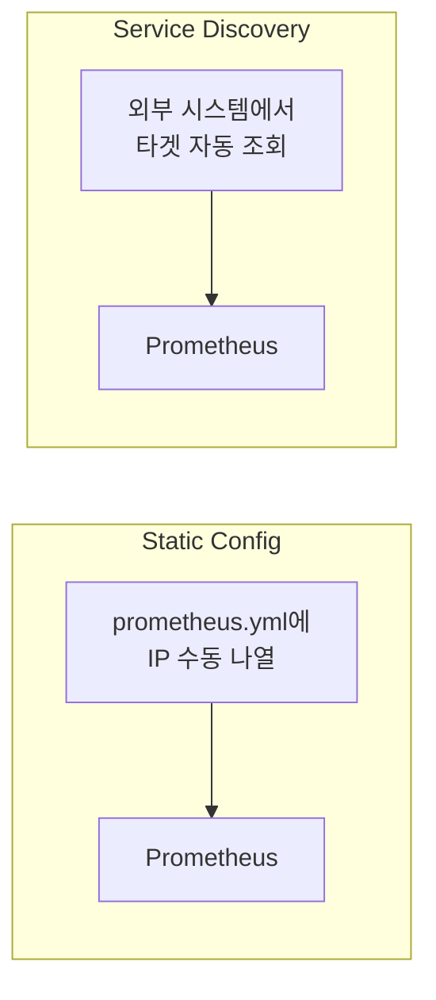
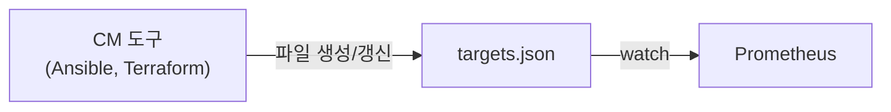
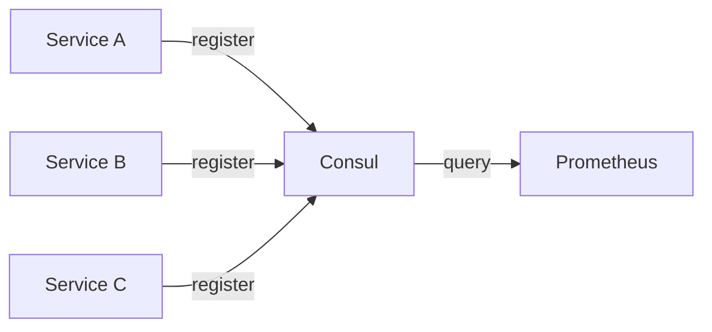
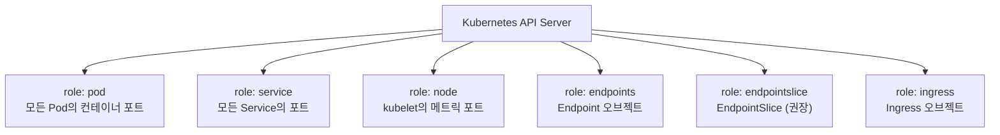
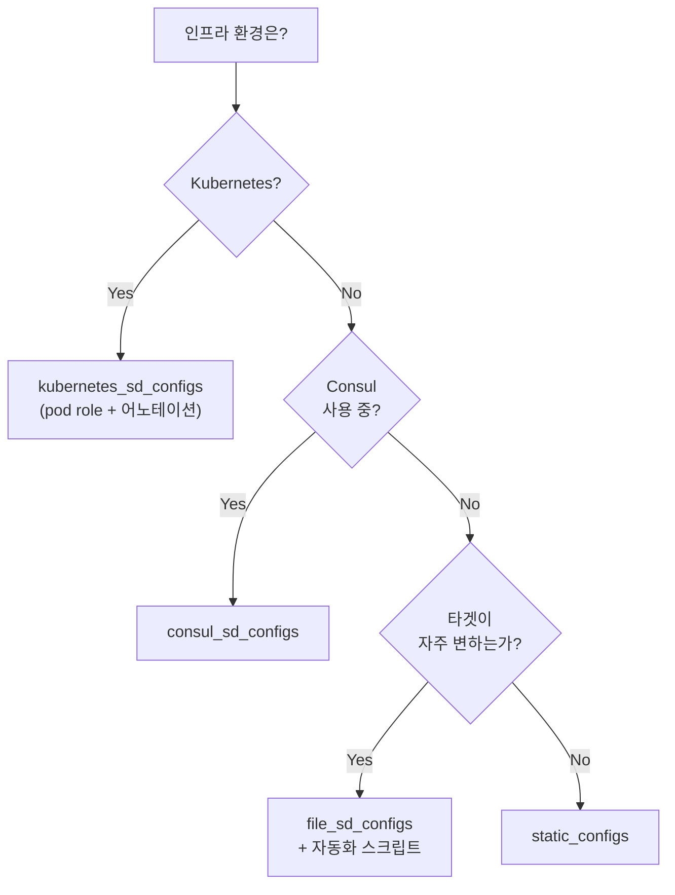

# 8장. Service Discovery

## 학습 목표

- Prometheus가 타겟을 자동으로 발견하는 메커니즘을 이해한다
- Static Config, File SD, DNS SD, Kubernetes SD, Consul SD의 차이와 적합한 환경을 안다
- 각 SD 방식의 설정을 작성하고 동작을 검증할 수 있다

---

## 8.1 왜 Service Discovery가 필요한가

[7장](7.Prometheus-아키텍처.md)의 실습에서는 `static_configs`로 타겟을 지정했다:

```yaml
static_configs:
  - targets: ['node-exporter:9100']
```

이 방식은 타겟이 고정된 환경에서는 충분하지만, 현대 인프라에서는 한계가 있다:

| 상황 | static_configs | Service Discovery |
|------|---------------|-------------------|
| Pod가 재시작되어 IP가 변경 | 수동으로 설정 변경 필요 | 자동으로 새 IP 반영 |
| Auto Scaling으로 인스턴스 추가 | 수동 추가 | 자동 감지 |
| 인스턴스가 축소되어 제거 | 수동 제거 (안 하면 scrape 실패) | 자동 제거 |
| 배포로 인스턴스 교체 | 다운타임 중 설정 변경 | 무중단 반영 |



---

## 8.2 Static Config

가장 단순한 방식. 타겟을 설정 파일에 직접 나열한다.

```yaml
scrape_configs:
  - job_name: 'api-server'
    static_configs:
      - targets:
          - '10.0.1.10:8080'
          - '10.0.1.11:8080'
          - '10.0.1.12:8080'
        labels:
          env: production
          team: backend

      - targets:
          - '10.0.2.10:8080'
        labels:
          env: staging
          team: backend
```

### 적합한 경우

- 개발/테스트 환경
- 타겟 수가 적고 변경이 드문 환경 (베어메탈 서버 3~5대)
- 빠르게 프로토타이핑할 때

### 한계

- 타겟 변경 시 `prometheus.yml` 수정 + reload 필요
- 수십 대 이상이면 관리가 어려움
- 자동화 불가

---

## 8.3 File SD

타겟 목록을 **별도 JSON/YAML 파일**에 관리하고, Prometheus가 이 파일의 변경을 감지하여 자동으로 타겟을 갱신한다.



### 설정

```yaml
# prometheus.yml
scrape_configs:
  - job_name: 'api-server'
    file_sd_configs:
      - files:
          - '/etc/prometheus/targets/*.json'
        refresh_interval: 30s   # 파일 변경 감지 주기
```

타겟 파일(`/etc/prometheus/targets/api-servers.json`):

```json
[
  {
    "targets": ["10.0.1.10:8080", "10.0.1.11:8080"],
    "labels": {
      "env": "production",
      "team": "backend"
    }
  },
  {
    "targets": ["10.0.2.10:8080"],
    "labels": {
      "env": "staging",
      "team": "backend"
    }
  }
]
```

### 실습: File SD 적용

[7장 실습](7.Prometheus-아키텍처.md) 환경에서 이어서 진행한다.

**1) 타겟 파일 생성**

```bash
mkdir -p labs/ch07-prometheus/prometheus/targets
```

`prometheus/targets/exporters.json`:

```json
[
  {
    "targets": ["node-exporter:9100"],
    "labels": {
      "env": "lab",
      "type": "infra"
    }
  }
]
```

**2) prometheus.yml 수정**

`node-exporter` job의 `static_configs`를 `file_sd_configs`로 교체:

```yaml
scrape_configs:
  - job_name: 'prometheus'
    static_configs:
      - targets: ['localhost:9090']

  - job_name: 'node-exporter'
    file_sd_configs:
      - files:
          - '/etc/prometheus/targets/*.json'
        refresh_interval: 10s
```

**3) docker-compose.yml 볼륨 추가**

```yaml
prometheus:
  volumes:
    - ./prometheus/prometheus.yml:/etc/prometheus/prometheus.yml
    - ./prometheus/rules.yml:/etc/prometheus/rules.yml
    - ./prometheus/targets:/etc/prometheus/targets    # 추가
    - prometheus-data:/prometheus
```

**4) 재시작 및 확인**

```bash
docker compose restart prometheus
```

Prometheus UI → Status → Targets에서 `node-exporter` job의 Discovered Labels에 `env="lab"`, `type="infra"`가 추가된 것을 확인한다.

**5) 동적 변경 테스트**

타겟 파일에 Prometheus 자체를 추가해본다:

```json
[
  {
    "targets": ["node-exporter:9100"],
    "labels": { "env": "lab", "type": "infra" }
  },
  {
    "targets": ["prometheus:9090"],
    "labels": { "env": "lab", "type": "monitoring" }
  }
]
```

파일 저장 후 **Prometheus 재시작 없이** 10초 이내에 Targets 페이지에 새 타겟이 나타나는 것을 확인한다.


**File SD의 핵심 가치**: `prometheus.yml`을 수정하지 않고도 타겟을 추가/제거할 수 있다. Ansible, Terraform, 자체 스크립트 등이 타겟 파일만 갱신하면 Prometheus가 자동으로 반영한다.


---

## 8.4 DNS SD

DNS SRV 레코드 또는 A 레코드로 타겟을 발견한다. 별도의 Service Discovery 시스템 없이 DNS만으로 동작한다.

```yaml
scrape_configs:
  - job_name: 'api-server'
    dns_sd_configs:
      - names:
          - 'api-server.service.consul'    # Consul DNS
          # 또는
          - '_prometheus._tcp.api-server.svc.cluster.local'  # K8s SRV
        type: SRV    # SRV 레코드 (포트 포함)
        refresh_interval: 30s

  - job_name: 'web-server'
    dns_sd_configs:
      - names:
          - 'web.example.com'
        type: A      # A 레코드 (포트는 별도 지정)
        port: 8080
```

### SRV vs A 레코드

| 타입 | 반환 정보 | 포트 지정 |
|------|----------|----------|
| **SRV** | 호스트 + 포트 + 우선순위 | DNS 레코드에 포함 |
| **A** | IP 주소만 | `port` 필드로 별도 지정 필요 |

### 적합한 경우

- Consul, CoreDNS 등 DNS 기반 서비스 디스커버리를 이미 사용 중인 환경
- Kubernetes Headless Service (SRV 레코드 자동 생성)
- 인프라에 추가 컴포넌트를 도입하고 싶지 않은 경우

---

## 8.5 Consul SD

HashiCorp Consul의 서비스 카탈로그에서 타겟을 자동으로 발견한다.



```yaml
scrape_configs:
  - job_name: 'consul-services'
    consul_sd_configs:
      - server: 'consul:8500'
        services: []    # 빈 배열 = 모든 서비스

    relabel_configs:
      # Consul 메타데이터를 Prometheus Label로 변환
      - source_labels: [__meta_consul_service]
        target_label: service

      - source_labels: [__meta_consul_dc]
        target_label: datacenter

      - source_labels: [__meta_consul_tags]
        regex: '.*,prometheus,.*'
        action: keep    # "prometheus" 태그가 있는 서비스만 수집
```

### Consul에서 제공하는 메타 Label

| 메타 Label | 설명 |
|-----------|------|
| `__meta_consul_service` | 서비스 이름 |
| `__meta_consul_service_id` | 서비스 인스턴스 ID |
| `__meta_consul_dc` | 데이터센터 |
| `__meta_consul_tags` | 서비스 태그 (쉼표 구분) |
| `__meta_consul_node` | 노드 이름 |
| `__meta_consul_service_address` | 서비스 주소 |
| `__meta_consul_service_port` | 서비스 포트 |

### 적합한 경우

- Consul을 서비스 메시로 이미 사용 중인 환경
- VM 기반 인프라에서 동적 서비스 등록이 필요한 경우
- 멀티 데이터센터 환경

---

## 8.6 Kubernetes SD

Kubernetes API Server에서 Pod, Service, Node, Endpoint 등의 정보를 자동으로 수집한다. **Kubernetes 환경에서는 사실상 표준**이다.

### Role 종류



| Role | 대상 | 주요 용도 |
|------|------|----------|
| **pod** | 모든 Pod | 어노테이션 기반 자동 수집 (가장 범용) |
| **service** | 모든 Service | Blackbox monitoring (probe) |
| **node** | 모든 Node | kubelet 메트릭, cAdvisor |
| **endpoints** | Endpoint 오브젝트 | ServiceMonitor 방식 (Prometheus Operator) |
| **endpointslice** | EndpointSlice | endpoints의 개선 버전 (대규모 클러스터) |
| **ingress** | Ingress | 외부 엔드포인트 probe |

### Pod Role 상세 설정

가장 범용적인 패턴. Pod 어노테이션으로 scrape 대상을 지정한다:

```yaml
scrape_configs:
  - job_name: 'kubernetes-pods'
    kubernetes_sd_configs:
      - role: pod

    relabel_configs:
      # prometheus.io/scrape: "true"가 있는 Pod만 수집
      - source_labels: [__meta_kubernetes_pod_annotation_prometheus_io_scrape]
        action: keep
        regex: true

      # 커스텀 path 지원
      - source_labels: [__meta_kubernetes_pod_annotation_prometheus_io_path]
        action: replace
        target_label: __metrics_path__
        regex: (.+)

      # 커스텀 port 지원
      - source_labels: [__address__, __meta_kubernetes_pod_annotation_prometheus_io_port]
        action: replace
        regex: ([^:]+)(?::\d+)?;(\d+)
        replacement: $1:$2
        target_label: __address__

      # scheme 지원 (https)
      - source_labels: [__meta_kubernetes_pod_annotation_prometheus_io_scheme]
        action: replace
        target_label: __scheme__
        regex: (https?)

      # namespace → Label
      - source_labels: [__meta_kubernetes_namespace]
        target_label: namespace

      # Pod 이름 → Label
      - source_labels: [__meta_kubernetes_pod_name]
        target_label: pod

      # Pod의 Label을 Prometheus Label로 전달
      - action: labelmap
        regex: __meta_kubernetes_pod_label_(.+)
```

이 설정이 적용되면 다음 어노테이션이 있는 Pod는 자동으로 scrape 대상이 된다:

```yaml
apiVersion: apps/v1
kind: Deployment
metadata:
  name: api-server
spec:
  template:
    metadata:
      annotations:
        prometheus.io/scrape: "true"
        prometheus.io/port: "8080"
        prometheus.io/path: "/metrics"
    spec:
      containers:
        - name: api-server
          image: api-server:latest
          ports:
            - containerPort: 8080
```

### Kubernetes SD에서 제공하는 주요 메타 Label

| 메타 Label | 설명 |
|-----------|------|
| `__meta_kubernetes_namespace` | Pod의 namespace |
| `__meta_kubernetes_pod_name` | Pod 이름 |
| `__meta_kubernetes_pod_ip` | Pod IP |
| `__meta_kubernetes_pod_label_<name>` | Pod의 Label |
| `__meta_kubernetes_pod_annotation_<name>` | Pod의 Annotation |
| `__meta_kubernetes_pod_container_name` | 컨테이너 이름 |
| `__meta_kubernetes_pod_container_port_number` | 컨테이너 포트 |
| `__meta_kubernetes_pod_ready` | Pod Ready 상태 |
| `__meta_kubernetes_pod_phase` | Pod Phase (Running 등) |
| `__meta_kubernetes_pod_node_name` | Pod가 실행 중인 Node |


어노테이션 기반 방식은 **Prometheus Operator 없이도** 동작한다. 하지만 대규모 환경에서는 Prometheus Operator의 **ServiceMonitor** CRD가 더 체계적인 관리를 제공한다. 이 내용은 [77장](../part16/77.Prometheus-Operator.md)에서 다룬다.


---

## 8.7 SD 방식 선택 가이드



| SD 방식 | 환경 | 복잡도 | 동적 대응 |
|---------|------|--------|----------|
| `static_configs` | 개발/테스트, 소규모 고정 | 매우 낮음 | ❌ |
| `file_sd_configs` | VM 기반, 범용 | 낮음 | ✅ (파일 변경 시) |
| `dns_sd_configs` | DNS 기반 환경 | 낮음 | ✅ (DNS TTL 의존) |
| `consul_sd_configs` | Consul 환경 | 중간 | ✅ (실시간) |
| `kubernetes_sd_configs` | Kubernetes | 중간 | ✅ (실시간) |

---

## 핵심 정리

1. **Static Config**은 가장 단순하지만 타겟 변경 시 수동 개입이 필요하다. 개발/테스트 환경에 적합하다.

2. **File SD**는 별도 인프라 없이 동적 타겟을 관리할 수 있다. Ansible, Terraform 등 CM 도구와 조합하기 좋다.

3. **DNS SD**는 SRV/A 레코드로 타겟을 발견한다. 추가 컴포넌트 없이 기존 DNS 인프라를 활용한다.

4. **Consul SD**는 Consul 서비스 카탈로그와 연동한다. VM 기반 멀티 데이터센터 환경에 적합하다.

5. **Kubernetes SD**는 Kubernetes 환경의 사실상 표준이다. Pod 어노테이션으로 scrape 대상을 선언하는 패턴이 가장 범용적이다.

---

## 다음 장 예고

[9장](9.Relabeling.md)에서는 **Relabeling**을 다룬다. Service Discovery가 제공하는 메타 Label을 어떻게 가공하여 최종 Label로 만드는지, 불필요한 메트릭을 어떻게 걸러내는지를 학습한다. SD와 Relabeling은 항상 함께 사용된다.
