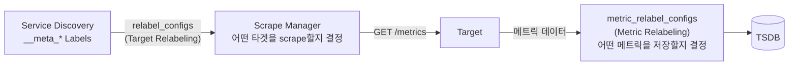
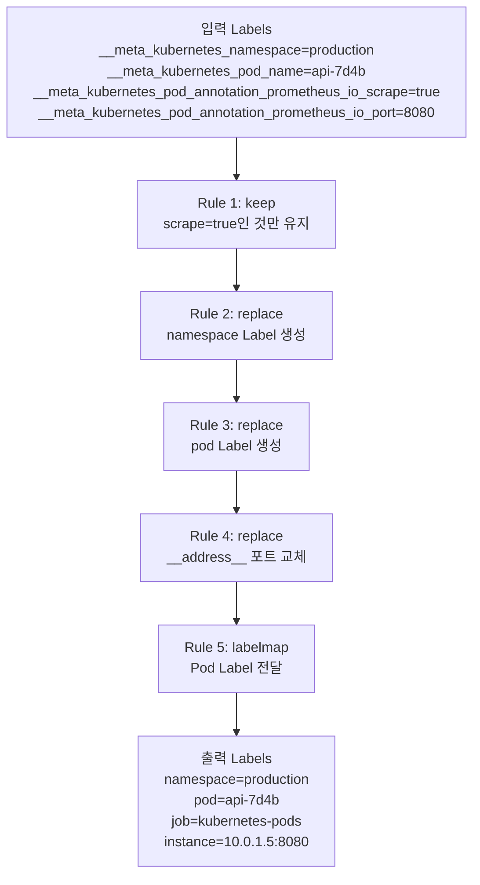

# 9장. Relabeling

## 학습 목표

- Relabeling의 동작 시점과 두 가지 종류(Target / Metric)를 구분할 수 있다
- replace, keep, drop, labelmap, labeldrop, labelkeep 액션을 이해한다
- 실전에서 자주 사용하는 Relabeling 패턴을 적용할 수 있다

---

## 9.1 Relabeling이란

**Relabeling은 Label을 조작하는 파이프라인이다.** Service Discovery가 제공하는 메타 Label(`__meta_*`)을 최종 Label로 변환하거나, 불필요한 메트릭을 필터링하는 데 사용한다.

### 두 가지 Relabeling



| 구분 | `relabel_configs` | `metric_relabel_configs` |
|------|-------------------|-------------------------|
| **실행 시점** | scrape **전** | scrape **후**, 저장 **전** |
| **대상** | 타겟 (인스턴스) | 개별 메트릭 (시계열) |
| **용도** | 타겟 필터링, Label 변환 | 메트릭 필터링, Label 변환 |
| **접근 가능 Label** | `__meta_*`, `__address__` 등 | 메트릭의 모든 Label |


**가장 흔한 실수**: `relabel_configs`에서 메트릭 이름(`__name__`)으로 필터링하려는 것. 메트릭 이름은 scrape 후에야 알 수 있으므로, `metric_relabel_configs`에서 처리해야 한다.


---

## 9.2 Relabeling 액션

### 전체 액션 목록

| 액션 | 동작 | 사용 빈도 |
|------|------|----------|
| **replace** | source_labels의 값을 정규식으로 매칭 → target_label에 대입 | 매우 높음 |
| **keep** | 정규식에 매칭되는 타겟/메트릭만 유지 | 높음 |
| **drop** | 정규식에 매칭되는 타겟/메트릭을 제거 | 높음 |
| **labelmap** | 정규식에 매칭되는 Label 이름을 새 이름으로 복사 | 중간 |
| **labeldrop** | 정규식에 매칭되는 Label을 제거 | 중간 |
| **labelkeep** | 정규식에 매칭되는 Label만 유지 | 낮음 |
| **hashmod** | source_labels를 해시하여 modulus 적용 | 낮음 (Sharding용) |

### replace (기본 액션)

`source_labels`의 값을 `regex`로 캡처하여 `target_label`에 `replacement`를 대입한다. 액션을 생략하면 기본값이 `replace`다.

```yaml
relabel_configs:
  # __meta_kubernetes_namespace → namespace Label로 복사
  - source_labels: [__meta_kubernetes_namespace]
    target_label: namespace
    # action: replace   (기본값이므로 생략 가능)
    # regex: (.*)        (기본값이므로 생략 가능)
    # replacement: $1    (기본값이므로 생략 가능)
```

여러 source_labels를 조합할 수도 있다 (기본 구분자: `;`):

```yaml
relabel_configs:
  # namespace + pod_name을 합쳐서 하나의 Label로
  - source_labels: [__meta_kubernetes_namespace, __meta_kubernetes_pod_name]
    separator: '/'
    target_label: namespace_pod
    # 결과: "production/api-server-7d4b8c-x2k4m"
```

### keep / drop

```yaml
relabel_configs:
  # prometheus.io/scrape: "true"인 Pod만 유지
  - source_labels: [__meta_kubernetes_pod_annotation_prometheus_io_scrape]
    action: keep
    regex: true

  # kube-system namespace는 제외
  - source_labels: [__meta_kubernetes_namespace]
    action: drop
    regex: kube-system
```

```yaml
metric_relabel_configs:
  # go_ 접두사 메트릭 제거 (Go 런타임 메트릭 불필요 시)
  - source_labels: [__name__]
    action: drop
    regex: 'go_.*'

  # 특정 메트릭만 유지
  - source_labels: [__name__]
    action: keep
    regex: '(http_requests_total|http_request_duration_seconds_.*|up)'
```


`keep`과 `drop`은 **순서가 중요하다**. Relabeling 규칙은 위에서 아래로 순서대로 적용된다. `drop`으로 먼저 제거한 타겟은 이후 `keep` 규칙의 대상이 되지 않는다.


### labelmap

메타 Label의 이름 패턴을 매칭하여 새 Label로 복사한다. Kubernetes Pod의 Label을 Prometheus Label로 전달할 때 사용한다.

```yaml
relabel_configs:
  # __meta_kubernetes_pod_label_app → app
  # __meta_kubernetes_pod_label_version → version
  - action: labelmap
    regex: __meta_kubernetes_pod_label_(.+)
```

### labeldrop / labelkeep

최종 저장되는 메트릭에서 불필요한 Label을 제거한다.

```yaml
metric_relabel_configs:
  # id, name 같은 불필요한 Label 제거
  - action: labeldrop
    regex: '(id|name|container_id)'

  # 또는 필요한 Label만 유지
  - action: labelkeep
    regex: '(job|instance|namespace|pod|method|status|path)'
```

---

## 9.3 Relabeling 파이프라인 이해

Relabeling 규칙은 **순서대로** 적용된다. 이전 규칙의 결과가 다음 규칙의 입력이 된다.




**디버깅 팁**: Prometheus UI → Status → Targets에서 각 타겟의 **Discovered Labels**(SD가 제공한 원본)와 **Target Labels**(relabel 결과)를 비교할 수 있다. 예상과 다른 결과가 나오면 여기서 확인한다.


---

## 9.4 실습: Relabeling으로 메트릭 필터링

[7장 실습](7.Prometheus-아키텍처.md) 환경에서 이어서 진행한다.

### 불필요한 메트릭 제거

Node Exporter는 수백 개의 메트릭을 노출한다. 실습 환경에서 필요한 것만 남겨본다.

**1) 현재 시계열 수 확인**

Prometheus UI에서:

```promql
count({job="node-exporter"})
```

결과를 기록해둔다 (보통 500~1000개).

**2) metric_relabel_configs 추가**

`prometheus/prometheus.yml`의 `node-exporter` job:

```yaml
  - job_name: 'node-exporter'
    file_sd_configs:
      - files:
          - '/etc/prometheus/targets/*.json'
        refresh_interval: 10s

    metric_relabel_configs:
      # 필요한 메트릭만 유지
      - source_labels: [__name__]
        action: keep
        regex: '(node_cpu_seconds_total|node_memory_.*|node_filesystem_.*|node_disk_.*|node_network_.*|up)'

      # filesystem에서 tmpfs, overlay 제외
      - source_labels: [fstype]
        action: drop
        regex: '(tmpfs|overlay)'
```

**3) Reload 및 확인**

```bash
curl -X POST http://localhost:9090/-/reload
```

1분 후 다시 시계열 수를 확인:

```promql
count({job="node-exporter"})
```

시계열 수가 크게 줄어든 것을 확인한다.

### Label 변환 실험

**4) 커스텀 Label 추가**

```yaml
    relabel_configs:
      # 모든 타겟에 region Label 추가
      - target_label: region
        replacement: ap-northeast-2
```

Reload 후 Targets 페이지에서 `region="ap-northeast-2"` Label이 추가된 것을 확인한다.

**5) instance Label 정리**

기본적으로 `instance` Label은 `host:port` 형태다. 포트를 제거하고 호스트 이름만 남겨본다:

```yaml
    relabel_configs:
      - source_labels: [__address__]
        regex: '([^:]+)(:\d+)?'
        target_label: instance
        replacement: '${1}'
```

---

## 9.5 실전 패턴 모음

### 패턴 1: 동적 URL path 정규화

```yaml
metric_relabel_configs:
  # /users/123 → /users/:id
  - source_labels: [path]
    regex: '/users/[0-9]+'
    target_label: path
    replacement: '/users/:id'

  # /orders/abc-def-123 → /orders/:id
  - source_labels: [path]
    regex: '/orders/[a-zA-Z0-9-]+'
    target_label: path
    replacement: '/orders/:id'
```

### 패턴 2: High Cardinality 메트릭 제거

```yaml
metric_relabel_configs:
  # 시계열 수가 많은 것으로 알려진 메트릭 제거
  - source_labels: [__name__]
    action: drop
    regex: '(etcd_debugging_.*|apiserver_admission_.*)'
```

### 패턴 3: Kubernetes 메타데이터 정리

```yaml
metric_relabel_configs:
  # 불필요한 Kubernetes Label 제거
  - action: labeldrop
    regex: '(pod_template_hash|controller_revision_hash|helm_sh_chart)'
```

### 패턴 4: 해시 기반 Sharding

```yaml
relabel_configs:
  # 타겟을 2개의 Prometheus에 분배
  - source_labels: [__address__]
    modulus: 2
    target_label: __tmp_hash
    action: hashmod
  - source_labels: [__tmp_hash]
    regex: ^0$          # Prometheus 1은 0, Prometheus 2는 1
    action: keep
```

---

## 9.6 `__` 접두사 Label의 의미

`__`(더블 언더스코어)로 시작하는 Label은 **내부 Label**이다. Relabeling 과정에서 사용되지만, 최종 TSDB에는 저장되지 않는다.

| 내부 Label | 설명 |
|-----------|------|
| `__address__` | 타겟의 `host:port`. scrape 대상 주소 |
| `__metrics_path__` | 메트릭 엔드포인트 경로 (기본: `/metrics`) |
| `__scheme__` | HTTP or HTTPS |
| `__meta_*` | Service Discovery가 제공하는 메타데이터 |
| `__tmp_*` | 임시 계산용 (hashmod 등) |
| `__name__` | 메트릭 이름 (metric_relabel에서 접근) |


`__` Label을 일반 Label로 복사하지 않으면 TSDB에 저장되지 않고 사라진다. `__meta_kubernetes_namespace`를 `namespace` Label로 남기고 싶으면 반드시 `replace` 액션으로 복사해야 한다.


---

## 핵심 정리

1. **Target Relabeling** (`relabel_configs`)은 scrape 전에 동작하며, 어떤 타겟을 scrape할지 결정한다.

2. **Metric Relabeling** (`metric_relabel_configs`)은 scrape 후에 동작하며, 어떤 메트릭을 저장할지 결정한다.

3. **keep/drop**으로 타겟과 메트릭을 필터링하여 Cardinality를 통제한다.

4. **labelmap**으로 Kubernetes Pod Label을 Prometheus Label로 전달한다.

5. **`__` 접두사 Label**은 내부 전용이며, 명시적으로 복사하지 않으면 TSDB에 저장되지 않는다.

6. Relabeling 규칙은 **순서대로** 적용된다. Prometheus UI의 Targets 페이지에서 결과를 확인할 수 있다.

---

## 다음 장 예고

[10장](10.TSDB-내부-구조.md)에서는 Prometheus의 **TSDB 내부 구조**를 다룬다. 데이터가 메모리에서 디스크로 어떻게 이동하는지, WAL, Head Block, Chunk, Compaction의 동작 원리를 학습한다.
